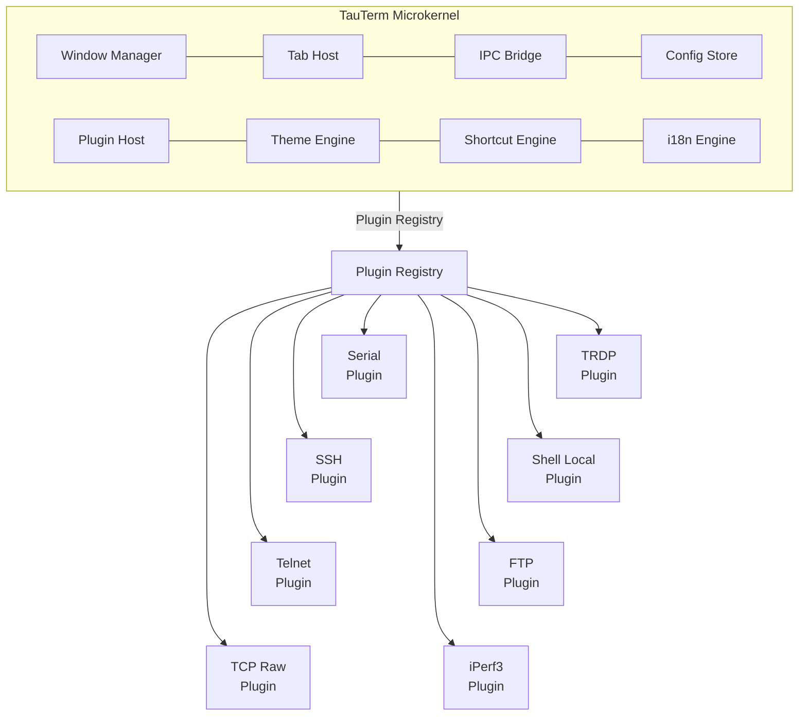
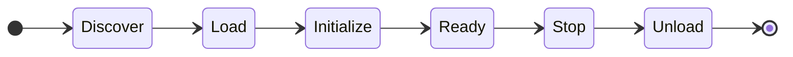
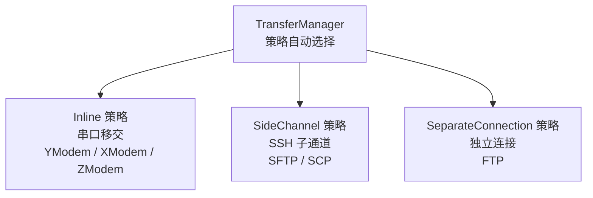
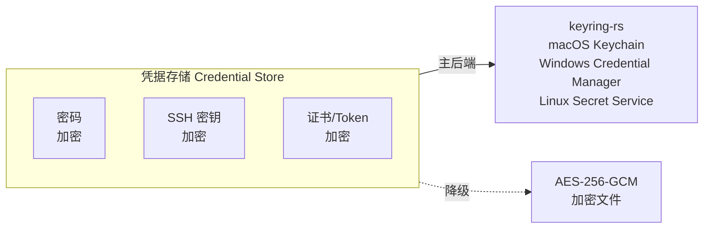

# TauTerm — 跨平台全功能终端模拟器

> **精致、快速、无限扩展** — 面向未来的下一代跨平台全功能终端模拟器。

基于 **Tauri v2**（Rust + React + TypeScript）构建的微内核架构跨平台终端模拟器。内核不包含任何协议实现——所有会话类型（串口、SSH、Telnet、TCP Raw、TRDP、本地 Shell、FTP、iPerf3 等）均作为**独立插件**注册到内核，实现真正的协议无关架构。

---

## 架构总览



### 设计原则

| 原则 | 说明 |
|------|------|
| **内核不含协议** | 8 个内核模块提供平台能力（窗口、标签页、IPC、配置、插件、主题、快捷键、国际化），不包含任何会话类型逻辑 |
| **一切皆插件** | 每个协议和功能都是独立插件，通过 `ProtocolAdapter` trait 和 `registerPlugin()` API 注册 |
| **统一标签页** | 所有会话类型共享同一套标签栏，通过 `content_type` 适配器动态切换内容视图 |
| **策略自适应** | 传输、I/O、安全策略根据会话协议自动选择，无需用户干预 |

---

## 插件架构

### 插件清单

每个插件通过 `manifest.json` 声明元数据：

```json
{
  "id": "ssh",
  "name": "SSH",
  "version": "1.0.0",
  "category": "terminal",
  "icon": "ssh",
  "content_type": "terminal",
  "capabilities": ["connection", "transfer", "authentication", "credential_store", "network_outbound"],
  "transfer_protocols": ["sftp", "scp"],
  "config_schema": { /* JSON Schema */ }
}
```

### 后端核心 Trait

```rust
/// 任何协议插件必须实现此 trait
pub trait ProtocolAdapter: Send + Sync {
    fn connect(&self, endpoint: &str, params: &Value) -> Result<Box<dyn Channel>, SessionError>;
    fn disconnect(&self, channel: &mut Box<dyn Channel>) -> Result<(), SessionError>;
    fn discover_endpoints(&self) -> Result<Vec<EndpointInfo>, SessionError>;
    fn content_type(&self) -> ContentType;
    fn transfer_protocols(&self) -> Vec<TransferProtocol>;
    fn io_strategy(&self) -> IoStrategy;
}

/// 统一 I/O 通道 —— 所有传输类型实现此 trait
pub trait Channel: Read + Write + Send {
    fn is_connected(&self) -> bool;
    fn set_timeout(&mut self, dur: Duration) -> Result<(), SessionError>;
    fn try_handoff(&mut self) -> Option<Box<dyn Any>>;
}
```

### 前端注册 API

```typescript
registerPlugin({
  id: 'ssh',
  manifest: { /* manifest.json */ },
  connectForm: SshConnectForm,         // 连接配置组件
  toolbarItems: [...],                 // 活跃时工具栏注入
  contextMenuItems: [...],             // 右键菜单扩展
  bottomPanels: [...],                 // 底部面板标签页
  statusBarItems: [...],               // 状态栏注入
  locales: { 'zh-CN': {...}, 'en-US': {...} },
});
```

### 能力声明

| 能力 | 描述 |
|------|------|
| `connection` | 可建立/断开连接 |
| `transfer` | 支持文件传输 |
| `endpoint_discovery` | 可枚举可用端点 |
| `stream` | 提供二进制数据流 |
| `authentication` | 需要认证（密码/密钥/证书） |
| `credential_store` | 需要访问凭据存储 |
| `filesystem_access` | 需要访问本地文件系统 |
| `network_outbound` | 需要出站网络连接 |
| `network_listen` | 需要监听端口（如 FTP active mode / iPerf3 server） |

### 生命周期



---

## I/O 架构

### 双模 I/O 策略

不是所有协议都需要 async runtime。内核提供两种 I/O 执行器，插件声明自己需要的模式：

| 模式 | 运行时 | 适用协议 | 特点 |
|------|--------|---------|------|
| **Sync** | `std::thread` | Serial, TCP Raw, Pipe | 低延迟，无 runtime 开销 |
| **Async** | `tokio` | SSH, Telnet, HTTP, TRDP | 高并发，天然适合网络协议 |

### 传输子系统

根据会话协议自动选择传输策略：



---

## 内容适配器

统一标签栏根据 `content_type` 动态渲染内容区域：

| content_type | 渲染器 | 典型插件 |
|-------------|--------|---------|
| `terminal` | xterm.js 实例池（CSS opacity 切换） | Serial, SSH, Telnet, TCP Raw, TRDP, Shell Local |
| `file_browser` | 双栏文件树 + 传输进度 | FTP, NFS |
| `stats_dashboard` | 实时图表/仪表盘 | iPerf3, UDP Monitor |
| `custom` | 插件自定义组件 | 任意 |

---

## 安全模型



- **主机密钥验证**: SSH `known_hosts` 管理，首次连接指纹确认，密钥变更安全警告
- **TLS 证书固定**: TRDP / Telnet TLS 连接证书校验
- **日志脱敏**: 自动过滤密码、私钥、Token，输出 `[REDACTED]`
- **代理转发控制**: SSH Agent Forwarding 默认禁用，需要显式确认

---

## 协议支持矩阵

| 协议 | 状态 | 内容类型 | 传输支持 | I/O 模式 |
|------|------|---------|---------|---------|
| **Serial** (RS-232/485) | ✅ 已实现 | terminal | YModem / XModem / ZModem (Inline) | Sync |
| **SSH** | 🔨 开发中 | terminal | SFTP / SCP (SideChannel) | Async |
| **Telnet** | 📋 计划中 | terminal | — | Async |
| **TCP Raw** | 📋 计划中 | terminal | — | Async |
| **TRDP** | 📋 计划中 | terminal | — | Async |
| **Shell Local** (PTY) | 📋 计划中 | terminal | — | Sync |
| **FTP** | 📋 计划中 | file_browser | FTP (SeparateConnection) | Async |
| **iPerf3** | 📋 计划中 | stats_dashboard | — | Async |
| **NFS** | 🔮 远期 | file_browser | NFS (SeparateConnection) | Async |
| **UDP Monitor** | 🔮 远期 | stats_dashboard | — | Async |

---

## 功能特性

- 🔌 **微内核插件架构** — 所有协议作为独立插件，新协议无需修改内核代码
- 🗂️ **统一标签页管理** — 串口、SSH、FTP、iPerf 共享同一标签栏，拖拽排序，右键菜单
- 🖥️ **终端仿真** — 基于 xterm.js，多实例池管理，CSS opacity 无重建切换
- 📁 **多策略文件传输** — Inline / SideChannel / SeparateConnection 自适应，YModem/XModem/ZModem + SFTP/SCP + FTP
- 🔐 **凭据存储** — OS 原生 keyring + AES-256-GCM 降级，密码/密钥/证书/Token 类型安全
- 🎨 **Liquid Glass v2 设计系统** — 磨砂玻璃面板、霓虹发光边框、Framer Motion 动画、Neon Dark / Ocean / Sunset 三主题
- 🌐 **多语言** — i18next 命名空间隔离，插件自带翻译，运行时切换
- ⚡ **命令面板** — `Ctrl+Shift+P` 模糊搜索所有命令，键盘驱动操作
- 🔍 **终端搜索** — `Ctrl+F` 搜索 buffer，大小写切换，上下导航
- 🎹 **快捷键系统** — 全局/插件作用域，冲突检测，作用域分发
- 💾 **会话持久化** — Config Store 类型安全存储，Schema 校验，断开会话保留重连
- 🚀 **跨平台** — Windows / Linux / macOS，原生体验

---

## 技术栈

| 层级 | 技术 |
|------|------|
| 应用框架 | Tauri v2 (Rust) |
| 前端框架 | React 18 + TypeScript |
| 构建工具 | Vite |
| 终端引擎 | xterm.js |
| 动画引擎 | Framer Motion |
| 异步运行时 | tokio |
| 国际化 | i18next + react-i18next |
| 样式方案 | CSS Modules + CSS 自定义属性 |
| 安全存储 | keyring-rs + AES-256-GCM |
| 网络协议 | ssh2 (SSH/SFTP) |

---

## 项目结构

```
TauTerm/
├── src-tauri/src/
│   ├── kernel/                 # 微内核模块
│   │   ├── mod.rs
│   │   ├── window_manager.rs   # 窗口生命周期、分屏、布局持久化
│   │   ├── tab_host.rs         # 标签页 CRUD、会话关联
│   │   ├── ipc_bridge.rs       # Tauri 命令路由、事件总线、Stream 通道
│   │   ├── config_store.rs     # 类型安全 KV 存储、Schema 校验
│   │   ├── plugin_host.rs      # 插件发现、加载、生命周期
│   │   ├── theme_engine.rs     # CSS 变量生成、主题切换
│   │   ├── shortcut_engine.rs  # 快捷键注册、冲突检测、作用域分发
│   │   └── i18n_engine.rs      # 命名空间翻译、动态语言切换
│   │
│   ├── channel/                # I/O 通道抽象层
│   │   ├── mod.rs              # Channel trait 定义
│   │   ├── serial_channel.rs   # 串口 Channel 实现
│   │   ├── tcp_channel.rs      # TCP Channel 实现
│   │   ├── io_loop.rs          # 协议无关 I/O 循环引擎（sync + async）
│   │   └── error.rs            # SessionError 结构化错误
│   │
│   ├── transfer/               # 传输子系统
│   │   ├── mod.rs              # TransferManager + 策略选择
│   │   ├── strategy_inline.rs  # Inline 策略（端口移交）
│   │   ├── strategy_sidechannel.rs  # SideChannel 策略（SSH SFTP）
│   │   ├── strategy_separate.rs     # SeparateConnection 策略（FTP）
│   │   └── protocols/          # 传输协议实现
│   │       ├── ymodem.rs
│   │       ├── xmodem.rs
│   │       ├── zmodem.rs
│   │       └── sftp.rs
│   │
│   ├── security/               # 安全模块
│   │   ├── credential_store.rs # 凭据存储（keyring + AES 降级）
│   │   ├── known_hosts.rs      # SSH 主机密钥管理
│   │   └── log_sanitizer.rs    # 日志脱敏
│   │
│   └── plugins/                # 内建协议插件
│       ├── serial/             # 串口插件（ProtocolAdapter + Channel）
│       ├── ssh/                # SSH 插件
│       ├── telnet/             # Telnet 插件
│       ├── tcp_raw/            # TCP Raw 插件
│       ├── trdp/               # TRDP 插件
│       ├── shell_local/        # 本地 Shell 插件
│       ├── ftp/                # FTP 插件
│       └── iperf3/             # iPerf3 插件
│
├── src/                        # React 前端
│   ├── core/                   # 内核前端 API
│   │   ├── plugin-registry.ts  # registerPlugin() + PluginRegistry
│   │   ├── tab-host.ts         # useTabHost() hook
│   │   ├── config-store.ts     # useConfigStore() hook
│   │   └── event-bus.ts        # 类型事件订阅
│   │
│   ├── renderers/              # 内容适配器
│   │   ├── TerminalRenderer.tsx    # xterm.js 实例池
│   │   ├── FileBrowserRenderer.tsx # 双栏文件树
│   │   ├── StatsDashboard.tsx      # 图表仪表盘
│   │   └── CustomRenderer.tsx      # 插件自定义委托
│   │
│   ├── components/             # UI 组件
│   │   ├── Layout/             # AppShell, Toolbar, Sidebar, TabBar, BottomPanel, StatusBar
│   │   ├── ConnectDialog/      # 统一连接对话框（动态协议选择 + 插件 ConnectForm）
│   │   ├── CommandPalette/     # 命令面板
│   │   ├── FileTransfer/       # 文件传输面板
│   │   └── common/             # GlassPanel, GlassButton, ContextMenu, Toast
│   │
│   └── plugins/                # 插件前端
│       ├── serial/             # SerialConnectForm, 工具栏, 状态栏
│       ├── ssh/                # SshConnectForm, 端口转发面板
│       ├── telnet/
│       ├── ftp/
│       └── iperf3/
│
└── package.json
```

---

## 快捷键

| 快捷键 | 操作 | 作用域 |
|--------|------|--------|
| `Ctrl+N` | 新建会话 | 全局 |
| `Ctrl+Shift+W` | 关闭当前标签页 | 全局 |
| `Ctrl+Tab` / `Ctrl+Shift+Tab` | 切换标签页 | 全局 |
| `Alt+1` ~ `Alt+9` | 快速切换到标签页 N | 全局 |
| `Ctrl+F` | 终端搜索 | Terminal 作用域 |
| `Ctrl+Shift+P` | 命令面板 | 全局 |
| `Ctrl+Shift+B` | 切换侧边栏 | 全局 |
| `Ctrl+Shift+R` | 刷新端口列表 | Serial 作用域 |
| `Ctrl+Shift+F` | 切换文件传输面板 | 全局 |

---

## 构建与运行

### 环境要求

| 组件 | 版本要求 | 说明 |
|------|---------|------|
| **Node.js** | >= 18 | 前端运行时与包管理器 |
| **Rust** | >= 1.96 (推荐) / >= 1.75 (最低) | 后端编译工具链 |
| **npm** | >= 9 | 随 Node.js 附带 |

> **注意**: Rust 1.96+ 内置 `rust-lld` 链接器，在 Windows 上**无需额外安装 Visual Studio Build Tools**。如果使用较低版本 Rust，则需要安装 VS Build Tools 提供 MSVC 链接器。

---

### Windows 环境安装

#### 1. 安装 Node.js

从 [nodejs.org](https://nodejs.org/) 下载 LTS 版本安装，或使用 winget：

```powershell
winget install --id OpenJS.NodeJS.LTS --source winget
```

验证安装：

```powershell
node --version   # 应输出 >= v18.0.0
npm --version    # 应输出 >= 9.0.0
```

#### 2. 安装 Rust

使用 winget 安装 rustup（Rust 官方工具链管理器）：

```powershell
winget install --id Rustlang.Rustup --source winget
```

安装完成后，**重新打开终端**使环境变量生效，然后设置默认工具链：

```powershell
rustup default stable
```

> **下载慢？** 可设置国内镜像源加速：
> ```powershell
> $env:RUSTUP_DIST_SERVER = "https://mirrors.ustc.edu.cn/rust-static"
> rustup default stable
> ```

验证安装：

```powershell
rustc --version   # 应输出 >= rustc 1.75.0
cargo --version   # 应输出 >= cargo 1.75.0
```

#### 3. 链接器（二选一）

**方案 A（推荐）：使用 Rust 内置的 rust-lld**

Rust 1.96+ 自带 LLVM 链接器 `rust-lld`，无需额外安装。项目已配置 `.cargo/config.toml` 自动使用。

**方案 B：安装 Visual Studio Build Tools**

如果使用较低版本 Rust，或遇到链接器错误，可使用 winget 安装：

```powershell
# VS 2022 Build Tools（Windows 10 / Windows 11 早期版本）
winget install --id Microsoft.VisualStudio.2022.BuildTools --source winget

# VS 2026 Build Tools（Windows 11 最新版本，推荐）
winget install --id Microsoft.VisualStudio.BuildTools --source winget
```

安装后运行 VS Installer 添加 C++ 工作负载：

```powershell
& "C:\Program Files (x86)\Microsoft Visual Studio\Installer\vs_installer.exe" `
  modify --add Microsoft.VisualStudio.Workload.VCTools --includeRecommended --quiet --wait
```

---

### Linux 环境安装

#### Ubuntu / Debian

```bash
# 安装系统依赖
sudo apt update
sudo apt install -y \
  libwebkit2gtk-4.1-dev \
  libappindicator3-dev \
  librsvg2-dev \
  patchelf \
  libssl-dev \
  libssh2-dev \
  libkeyring-dev

# 安装 Node.js（使用 NodeSource）
curl -fsSL https://deb.nodesource.com/setup_22.x | sudo -E bash -
sudo apt install -y nodejs

# 安装 Rust
curl --proto '=https' --tlsv1.2 -sSf https://sh.rustup.rs | sh -s -- -y
source "$HOME/.cargo/env"
```

#### Fedora / RHEL

```bash
sudo dnf install -y \
  webkit2gtk4.1-devel \
  libappindicator-gtk3-devel \
  librsvg2-devel \
  patchelf \
  openssl-devel \
  libssh2-devel

# Node.js 和 Rust 安装同上
```

#### Arch Linux

```bash
sudo pacman -S --needed \
  webkit2gtk-4.1 \
  libappindicator-gtk3 \
  librsvg \
  patchelf \
  openssl \
  libssh2
```

---

### macOS 环境安装

```bash
# 安装 Xcode Command Line Tools
xcode-select --install

# 安装 Node.js（使用 Homebrew）
brew install node

# 安装 Rust
curl --proto '=https' --tlsv1.2 -sSf https://sh.rustup.rs | sh -s -- -y
source "$HOME/.cargo/env"
```

---

### 环境验证

运行以下命令确认所有组件正确安装：

```powershell
# Windows (PowerShell)
node --version   # >= 18
npm --version    # >= 9
rustc --version  # >= 1.75
cargo --version  # >= 1.75

# Linux / macOS
node --version && npm --version && rustc --version && cargo --version
```

---

### 开发模式

```bash
# 克隆仓库
git clone https://github.com/your-org/TauTerm.git
cd TauTerm

# 安装前端依赖
npm install

# 启动开发模式（同时启动 Vite 开发服务器和 Tauri 桌面窗口）
npm run tauri dev
```

- Vite 开发服务器运行在 `http://localhost:1420`
- Tauri 窗口自动打开，支持热更新（前端）和热重载（Rust）

> **首次运行**：`npm run tauri dev` 会编译所有 Rust 依赖（约 200+ crates），需要 **5-15 分钟**（视网络和 CPU 而定）。后续编译将利用缓存，通常只需几秒。

---

### 生产构建

```bash
# 构建生产版本
npm run tauri build
```

构建产物位于 `src-tauri/target/release/bundle/`：
- **Windows**: `.msi` / `.exe` 安装包
- **Linux**: `.deb` / `.rpm` / `.AppImage`
- **macOS**: `.dmg` / `.app` 包

---

### 常见问题

#### Windows: `error: linker 'link.exe' not found`

**原因**: 缺少 MSVC 链接器。

**解决方案**:
1. 确保 Rust 版本 >= 1.96，使用内置 `rust-lld` 链接器
2. 或安装 Visual Studio Build Tools（见上方「方案 B」）
3. 或手动指定链接器：`rustup component add llvm-tools-preview`

#### Windows: `winget` 安装 VS Build Tools 后 `rustc` 仍报链接器错误

VS Build Tools 安装后需**重新打开终端**以加载环境变量。或手动激活：

```powershell
& "C:\Program Files\Microsoft Visual Studio\2022\BuildTools\VC\Auxiliary\Build\vcvars64.bat"
```

#### Linux: `libwebkit2gtk-4.1-dev` 未找到

Ubuntu 20.04 及更早版本可能需要添加 PPA 或升级到 22.04+。

#### macOS: 打开应用时提示「无法验证开发者」

```bash
sudo xattr -r -d com.apple.quarantine /path/to/TauTerm.app
```

#### 下载 Rust 依赖缓慢

设置国内镜像：

```powershell
# Windows (PowerShell) - 设置环境变量
[System.Environment]::SetEnvironmentVariable('RUSTUP_DIST_SERVER', 'https://mirrors.ustc.edu.cn/rust-static', 'User')
[System.Environment]::SetEnvironmentVariable('RUSTUP_UPDATE_ROOT', 'https://mirrors.ustc.edu.cn/rust-static/rustup', 'User')
```

---

## 发展路线图

### v0.3 — 微内核重构
- [x] 8 模块微内核架构
- [x] `Channel` trait I/O 抽象
- [x] Plugin Host + `ProtocolAdapter` trait
- [x] Serial 插件化重构
- [x] 统一标签页渲染 + 内容适配器
- [x] 三策略传输子系统

### v0.4 — 网络协议
- [ ] SSH 插件（密码/密钥/agent 认证、known_hosts）
- [ ] Telnet 插件（RFC 854 选项协商）
- [ ] TCP Raw 插件
- [ ] SFTP/SCP 文件传输（SideChannel 策略）

### v0.5 — 凭据 & 安全
- [ ] Credential Store（keyring + AES 降级）
- [ ] 日志脱敏
- [ ] 权限提升确认

### v0.6 — 本地 Shell & 工具
- [ ] Shell Local 插件（PTY）
- [ ] TRDP 插件
- [ ] 终端分屏

### v0.7 — 文件管理 & 网络诊断
- [ ] FTP 插件（Active/Passive 模式、文件浏览器视图）
- [ ] iPerf3 插件（客户端/服务器、实时统计仪表盘）
- [ ] 终端会话录制

### v1.0 — 正式版
- [ ] 全平台测试通过
- [ ] 性能优化（启动时间、内存占用、I/O 吞吐）
- [ ] 插件 SDK 文档
- [ ] 安装包签名与分发

### v1.x+ — 生态扩展
- [ ] 动态插件加载（无需重新编译）
- [ ] 插件市场
- [ ] NFS 客户端
- [ ] 多窗口支持
- [ ] 云端会话同步

---

## 与竞品对比

| 特性 | TauTerm | WindTerm | MobaXterm |
|------|---------|----------|-----------|
| 架构 | **微内核插件** | 单体 | 单体 |
| 协议扩展 | `ProtocolAdapter` trait（5 个方法） | 修改源码 | 修改源码 |
| 多会话管理 | 统一标签栏 + 内容适配器 | 标签页 | 标签页 + 侧栏 |
| 传输策略 | Inline / SideChannel / SeparateConn | 有限 | FTP/SFTP 内置 |
| 安全存储 | keyring + AES-256-GCM | 内置加密 | 内置加密 |
| 主题系统 | Liquid Glass v2 + 插件 token 注入 | 有限主题 | 有限主题 |
| 跨平台 | Windows / Linux / macOS | Windows / Linux / macOS | Windows |
| UI 框架 | React 18 + Framer Motion | Qt | 原生 Win32 |
| 插件生态 | 计划中 | 无 | 有限（插件） |
| 开源协议 | MIT | Apache 2.0 | 部分开源 |

---

## 贡献指南

TauTerm 处于活跃开发阶段，欢迎贡献。

### 开发新插件

1. 在 `src-tauri/src/plugins/` 创建插件目录
2. 实现 `ProtocolAdapter` trait
3. 编写 `manifest.json` 和 `capabilities.json`
4. 在 `registerPlugin()` 中注册前端组件
5. 在 Plugin Host 中注册插件

详细指南见 `docs/architecture/plugin-development.md`。

---

## 许可证

MIT License

---

**TauTerm** — 微内核架构驱动的下一代跨平台全功能终端模拟器。
