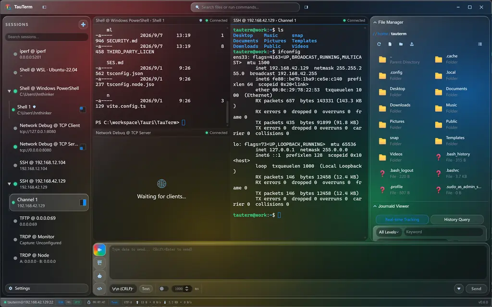

<p align="center">
  
</p>

<h1 align="center">TauTerm</h1>

<p align="center"><strong>Local-first engineering workbench for connected systems.</strong></p>

<p align="center">
  SSH/SFTP · Serial · Local Shell · TCP/UDP · TFTP · Telnet · iPerf · TRDP
</p>

<p align="center">
  <a href="https://github.com/hamburger-os/TauTerm/actions/workflows/ci.yml"></a>
  <a href="https://github.com/hamburger-os/TauTerm/releases"></a>
  <a href="LICENSE"></a>
  
</p>

<p align="center">
  <a href="https://github.com/hamburger-os/TauTerm/releases"><strong>Download</strong></a>
  · <a href="docs/community/BUILDING.md">Build</a>
  · <a href="CONTRIBUTING.md">Contribute</a>
  · <a href="README.zh-CN.md">中文</a>
</p>

TauTerm brings remote systems, embedded devices, and network-debugging workflows into one desktop workspace. It is designed for engineers who move between servers, lab devices, and industrial networks and want those contexts to share sessions, logging, automation, and a consistent UI.

Core engineering workflows are **local-first**: they are intended to remain useful without an account or cloud dependency, including in isolated lab and industrial networks.

> This README describes the current `master` branch. Packaged releases may lag behind `master`; see [CHANGELOG.md](CHANGELOG.md) for the canonical change history.



## Why TauTerm?

- **One engineering workspace** — terminal, device, file, network, and analysis workflows share one session-oriented desktop model.
- **Remote + embedded together** — SSH/SFTP and local shells live beside Serial, TCP/UDP, TFTP, Telnet, iPerf, and TRDP.
- **Local-first by design** — core debugging does not require a cloud account.
- **Extensible architecture** — protocol-specific behavior stays in modules while common session, workspace, logging, and automation capabilities are shared.
- **Cross-platform targets** — Windows, Linux, and macOS packages are produced with platform-specific capability notes.

## What it supports

| Workflow | Current `master` |
|---|---|
| SSH terminal + SFTP + remote journald | ✅ |
| Serial RS-232/485 + Text/HEX/Dual + X/Y/ZModem | ✅ |
| Local Shell with native PTY/ConPTY | ✅ |
| TCP/UDP Network Debug | ✅ |
| TFTP client/server | ✅ |
| Telnet terminal | ✅ |
| iPerf2 / iPerf3 testing | ✅ |
| TRDP Node + passive live/offline Monitor | ✅ |
| Lua scripting and auto-reply for supported sessions | ✅ |
| Persistent 1–4-pane Workspace | ✅ |

TRDP includes active PD/MD Node workflows and passive Monitor/capture analysis. It does **not** claim SDTv2/SDTv4 safety validation or certification.

## Install

Download packaged builds from [GitHub Releases](https://github.com/hamburger-os/TauTerm/releases).

Current release targets include Windows x86_64, Linux x86_64, and macOS Apple Silicon. Packaging, signing status, and platform-specific runtime requirements are maintained in [Supported Platforms](docs/community/SUPPORTED_PLATFORMS.md).

## Build from source

The normal development entry is:

```bash
git clone https://github.com/hamburger-os/TauTerm.git
cd TauTerm
npm install
npm run tauri dev
```

Node.js 22, the Rust toolchain pinned by `rust-toolchain.toml`, and platform build dependencies are required. See [Building TauTerm](docs/community/BUILDING.md) for the authoritative setup guide.

## Documentation

Documentation is organized by audience instead of duplicating the same facts in several files:

- **Users and contributors:** this README, [CONTRIBUTING.md](CONTRIBUTING.md), and [docs/community/](docs/community/).
- **Architecture/design review:** [docs/README.md](docs/README.md) and [docs/modules/](docs/modules/), maintained in Chinese for the project maintainer.
- **Maintainer workflow:** [docs/maintainer/DEVELOPMENT.md](docs/maintainer/DEVELOPMENT.md) provides the Chinese daily-development and command guide.
- **Standards & authoritative references:** [docs/knowledge/](docs/knowledge/) indexes the primary specifications and upstream documentation used to validate implementations.
- **AI coding agents:** [AGENTS.md](AGENTS.md) and [`.agents/skills/`](.agents/skills/).
- **Product direction:** [docs/product/](docs/product/) describes future direction and does not imply shipped status.
- **Release history:** [CHANGELOG.md](CHANGELOG.md) is the single canonical source.

## Contributing

Contributions are welcome. Start with [CONTRIBUTING.md](CONTRIBUTING.md), then use the platform setup in [docs/community/BUILDING.md](docs/community/BUILDING.md).

Architecture or behavior changes must update the corresponding design document in the same pull request; the repository enforces documentation consistency in CI.

## Security

Please report security issues through the process described in [SECURITY.md](SECURITY.md). Do not publish credentials, private keys, vulnerable endpoints, or sensitive logs in public issues.

## License

TauTerm source code is available under **MIT OR Apache-2.0** at your option. See [LICENSE](LICENSE) and [LICENSE-APACHE](LICENSE-APACHE).

Bundled or vendored third-party components keep their own licenses; see [THIRD_PARTY_LICENSES.md](THIRD_PARTY_LICENSES.md).
