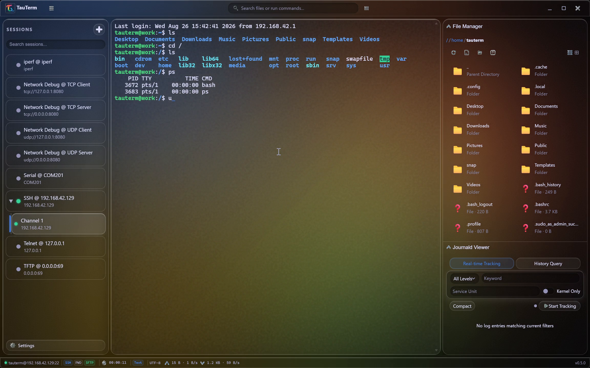
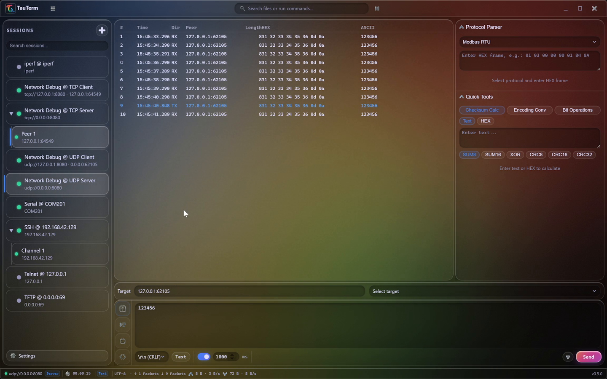
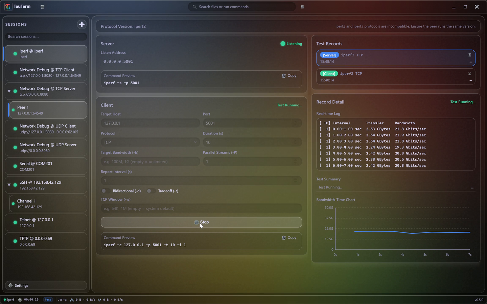
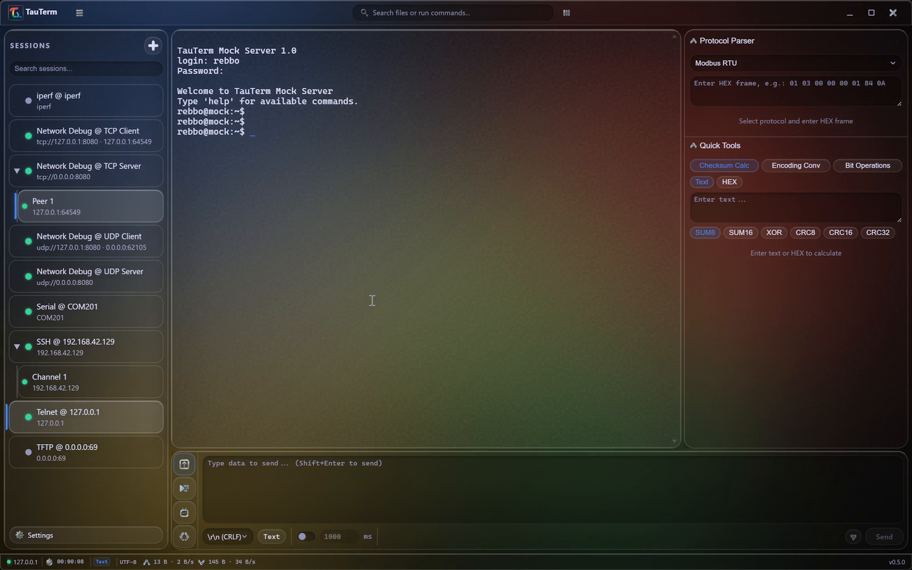
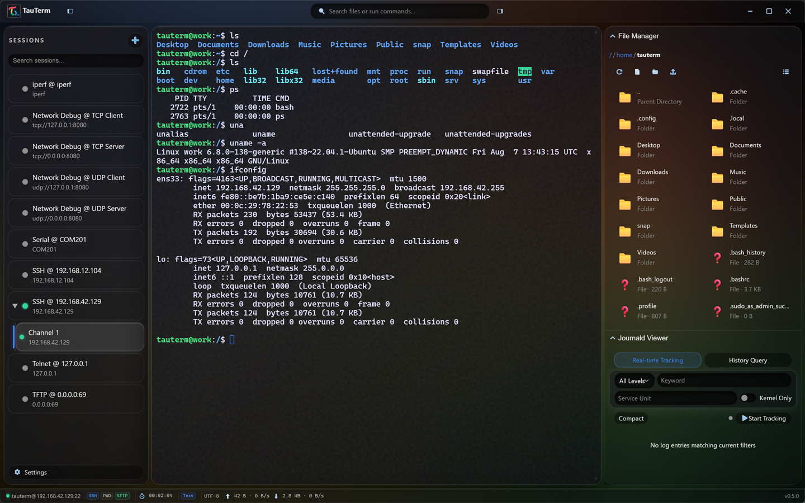
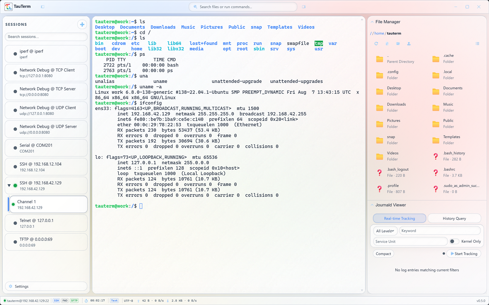

# TauTerm

> **One terminal for the server room and the lab bench.**  
> Open-source SSH/SFTP, serial and network-debugging workspace built with Rust + Tauri.

[](LICENSE)
[](https://github.com/hamburger-os/TauTerm/releases)
[](https://github.com/hamburger-os/TauTerm/releases)
[](https://github.com/hamburger-os/TauTerm/releases)
[](https://github.com/hamburger-os/TauTerm/releases)
[](https://tauri.app)
[](https://www.rust-lang.org/)

**[Download](https://github.com/hamburger-os/TauTerm/releases)** — Windows · Linux · macOS · **[Build from source](docs/BUILDING.md)** · **[中文 README](README.zh-CN.md)**

TauTerm is for engineers who are tired of switching between an SSH client, an SFTP client, a serial terminal and separate TCP/UDP debugging tools. It brings those workflows into one lightweight desktop app with a microkernel plugin architecture.

> **Release status:** Windows (NSIS/MSI), Linux (deb/rpm/AppImage) and macOS (Apple Silicon and Intel dmg/app) installers are published on GitHub Releases. Feature descriptions below track the current `master` branch; the latest packaged release may lag behind `master`.



---

## Real workflows


### SSH and SFTP, side by side


One authenticated SSH session keeps the terminal, remote files and journald viewer together.

### RT-Thread over serial


Inspect live RT-Thread output while keeping file transfer, protocol parsing and quick tools close at hand.

### TCP, UDP and throughput tests






Run client and server workflows in the same app, then inspect live traffic and iPerf results without a separate tool.

### Telnet



Use the same workspace for legacy Telnet hosts.

### Themes






Choose a workspace appearance that fits the environment.

## Why TauTerm?

| If you need… | TauTerm gives you… |
|---|---|
| Server access | SSH terminal + SFTP in one connection |
| Embedded bring-up | Serial RS-232/485, HEX/Text/Dual views, X/Y/ZModem |
| Network debugging | TCP/UDP client & server, TFTP, Telnet, iPerf |
| Automation | Per-session Lua 5.4 scripting and auto-reply rules |
| One consistent workspace | Unified sessions, logging, command palette and shortcuts |
| Extensibility | Microkernel architecture with protocol plugins |

**Small footprint.** The v0.4.0 Windows installer is about **8 MB** (including the bundled com0com virtual serial driver).

**Built for two worlds.** TauTerm deliberately serves both network engineers and embedded developers instead of treating serial communication as an afterthought.

**Open by default.** TauTerm is dual-licensed under MIT / Apache-2.0 and is designed to grow through independent protocol plugins.

---

## Highlights

### 🖥️ Network engineering

- **SSH + SFTP in one session** — terminal and file transfer share a single authenticated connection.
- **SFTP file manager** — browse, upload/download, rename, batch delete and inspect remote files, with list and grid views switched from an inline toolbar.
- **Network Debug (TCP/UDP)** — TCP client/server and UDP client/server with multi-peer handling, TEXT/HEX views, target selection and per-peer statistics.
- **TFTP** — server/client workflows with RFC 7440 windowing, CRC32 verification and retry controls.
- **Telnet** — RFC 854 negotiation, live window-size sync and keepalive.
- **iPerf2 / iPerf3** — TCP/UDP testing, bidirectional modes, live rate curves and history.
- **Remote journald viewer** — stream or query logs over SSH with filters and JSON export.

### 🔌 Embedded development

- **Serial RS-232/485** with an optional **virtual serial bridge** — com0com on Windows, `socat` on Linux/macOS. On Windows the app itself runs as a standard (non-admin) user; privileged virtual-port operations are handled by a background service.
- **XModem / YModem / ZModem** transfers directly from an active serial session.
- **Text / HEX / Dual display** with timestamps, framing and TX/RX differentiation.
- **Character-set transcoding** — UTF-8, GBK, GB18030, Big5, Shift-JIS, EUC-JP, EUC-KR and ISO-8859-1.
- **Four-mode send bar** — manual send, command panel, auto-reply rules and scripts.
- **Embedded Lua 5.4** — isolated per-session VMs with raw-byte and encoding-aware send APIs.
- **Developer toolbox** — CRC, Base64/HEX, float/endianness conversion, bit operations, C `sizeof`, Modbus and AT-command parsers.

### ⚡ Everyday workflow

- Unified tabbed sessions and offline connection profiles.
- OS-native credential storage with encrypted fallback.
- SSH host-key verification and log redaction.
- Searchable terminal, command palette and fully rebindable shortcuts.
- Session logging with rotation/expiry cleanup.
- zh-CN / en-US runtime language switching.
- Three Liquid Glass themes with a native-feeling Tauri v2 shell.

---

## Install

### Windows

Download the newest installer from **[GitHub Releases](https://github.com/hamburger-os/TauTerm/releases)**.

The Windows installer bundles the open-source [com0com](https://com0com.sourceforge.net/) virtual serial driver so TauTerm's virtual COM bridge works out of the box. The driver is a separate GPL component.

### Linux

Pick from **[GitHub Releases](https://github.com/hamburger-os/TauTerm/releases)**: `.deb` (Debian/Ubuntu), `.rpm` (Fedora/RHEL) or `.AppImage` (portable).

The Linux virtual serial bridge uses `socat` — install it with `sudo apt install socat` (the `.deb` package already declares this dependency).

### macOS

Download the `.dmg` or `.app` bundle for **Apple Silicon** or **Intel (x86_64)** from **[GitHub Releases](https://github.com/hamburger-os/TauTerm/releases)**.

The macOS virtual serial bridge also uses `socat` — install it with `brew install socat`. The macOS build is a tech preview and is not notarized, so Gatekeeper may require a one-time right-click → Open to launch it.

---

## What is released vs. what is on `master`?

TauTerm moves quickly. The packaged release is the safest way to try the project; `master` contains newer work that may not have shipped yet.

- **v0.5.0 — Networking & least-privilege security:** TCP/UDP Network Debug session, Telnet, iPerf2/iPerf3, session-level character-set transcoding and a remote journald viewer. On Windows the app now runs as a standard (non-admin) user with privileged virtual-port operations delegated to a LocalSystem service.
- **v0.4.0 — First Public Tech Preview:** serial, SSH/SFTP, transfer subsystem, Lua/auto-reply workflow, terminal/search, logging, settings, i18n and the core microkernel/plugin architecture.
- **Current `master`:** continues expanding networking, security and workflow features beyond v0.5.
- **Roadmap:** local shell, SSH tunnels/jump hosts, session grouping, FTP, recording/split panes, plugin SDK work and more.

See **[CHANGELOG.md](CHANGELOG.md)** for release-by-release details.

---

## Protocol matrix

| Protocol | Current `master` | Content | Transfer / role |
|---|---:|---|---|
| **Serial** (RS-232/485) | ✅ | terminal | X/Y/ZModem inline |
| **SSH** | ✅ | terminal | SFTP side-channel |
| **TFTP** | ✅ | custom | client + server |
| **Telnet** | ✅ | terminal | RFC 854 |
| **iPerf2 / iPerf3** | ✅ | custom | network benchmark |
| **Network Debug** (TCP/UDP) | ✅ | custom | client + server |
| **Local Shell** (PTY) | 📋 planned | terminal | v0.6 target |
| **FTP** | 📋 planned | file browser | v0.7 target |
| **TRDP** | 📋 planned | terminal | v1.0 target |

---

## Roadmap

```text
v0.5  Shipped: TCP/UDP network debugging, Telnet, iPerf2/3,
      character-set transcoding, remote journald, least-privilege
      Windows virtual-port service
v0.6  Credential/security hardening (keyring + AES-256-GCM fallback),
      local shell, session groups, SSH tunnels + jump hosts
v0.7  Network-debug polish, FTP, recording, split panes
v1.0  GA: Windows validation, macOS/Linux core availability,
      performance budget, plugin SDK docs, TRDP
v1.1  "Terminal + oscilloscope": WebGL plotting, FFT,
      FireWater/JustFloat compatibility
```

Roadmap versions are targets, not promises; priorities may change based on real user feedback.

---

## Contributing & feedback

TauTerm is still early, which makes feedback especially valuable.

- Found a reproducible bug? **[Open a bug report](https://github.com/hamburger-os/TauTerm/issues/new/choose)**.
- Missing the one feature that keeps you on another terminal? **[Request it](https://github.com/hamburger-os/TauTerm/issues/new/choose)**.
- Want to contribute code? Read **[CONTRIBUTING.md](CONTRIBUTING.md)** and **[docs/BUILDING.md](docs/BUILDING.md)**.
- Interested in the internals? See **[docs/ARCHITECTURE.md](docs/ARCHITECTURE.md)**.

If TauTerm is useful to you, starring the repository helps other network and embedded engineers discover it.

---

## For maintainers: launching TauTerm

A reusable release/promotion checklist lives in **[docs/LAUNCH.md](docs/LAUNCH.md)**. It covers screenshots, release notes, GitHub metadata, Show HN, Reddit, V2EX and post-launch feedback loops.

---

## License

TauTerm is available under either the **MIT License** or **Apache License 2.0**, at your option.

The Windows installer bundles [com0com](https://com0com.sourceforge.net/) as a separate third-party GPL component; its license is unaffected by TauTerm's dual licensing.

---

**TauTerm — one terminal for the server room and the lab bench.**
