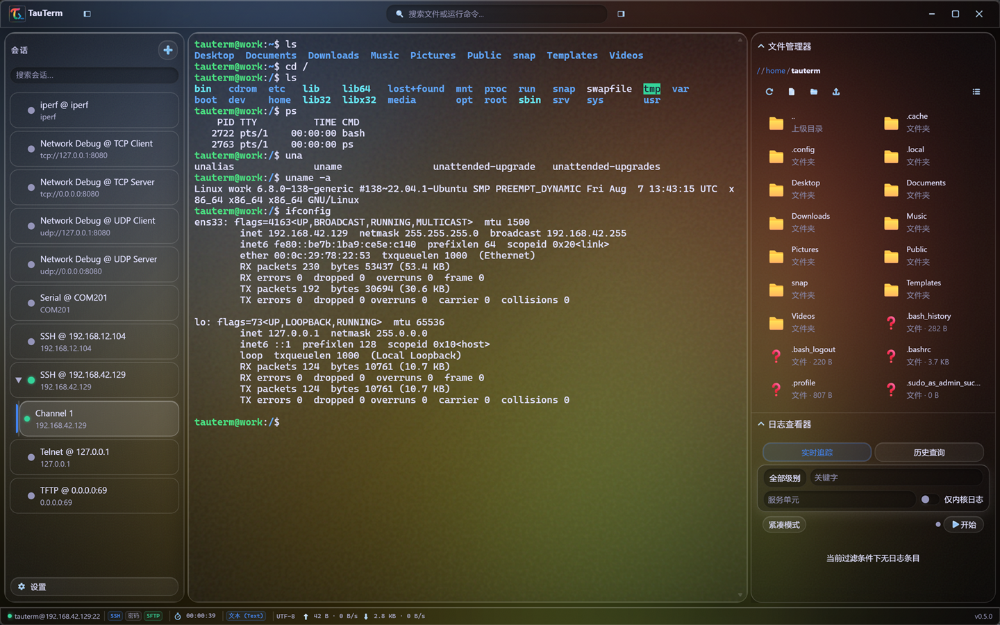
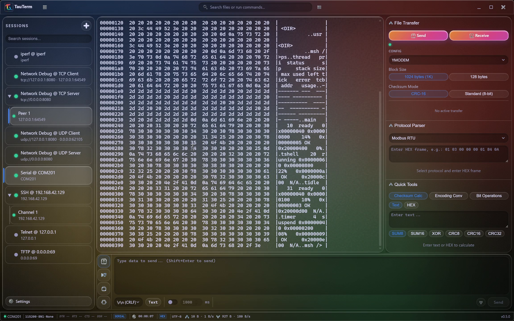
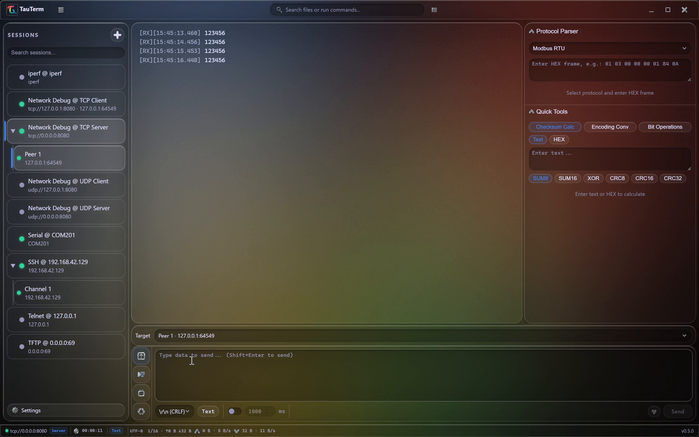

  

<h1 align="center">TauTerm</h1>

<strong>一台终端，服务机房与实验台。</strong>

  面向连接系统工程师的本地优先开源工程工作台：SSH/SFTP、串口、TCP/UDP 与设备/网络调试，基于 Rust + Tauri 构建。

  
  
  
  

  <a href="https://github.com/hamburger-os/TauTerm/releases"><strong>下载</strong></a>
  · <a href="docs/README.md">文档</a>
  · <a href="docs/SUPPORTED_PLATFORMS.md">支持平台</a>
  · <a href="docs/BUILDING.md">从源码构建</a>
  · <a href="docs/ARCHITECTURE.md">架构设计</a>
  · <a href="README.md">English</a>

TauTerm 把**远程系统、嵌入式设备和网络调试工作流**放进同一个轻量桌面应用。它面向那些同时工作在机房与实验台、不希望把工程上下文拆散在 SSH 客户端、SFTP、串口助手、TCP/UDP 调试器和独立分析工具之间的工程师。

TauTerm 坚持**本地优先（Local-first）**：核心工程能力应当不依赖账号和云服务，在实验室、工厂、铁路网络和隔离环境中也能够正常工作。

> **版本说明：** 本 README 描述当前 `master` 分支。GitHub Releases 是面向终端用户的打包快照，功能可能落后于 `master`。某个版本究竟已经发布了什么，请以 [CHANGELOG.md](CHANGELOG.md) 和对应 Release 页面为准。

---

## 为什么是 TauTerm？

| 你的需求 | TauTerm 提供 |
|---|---|
| 管理服务器 | SSH 终端 + 同一认证连接上的 SFTP |
| 调试嵌入式设备 | RS-232/485 串口、Text/HEX/Dual、X/Y/ZModem |
| 做网络联调 | TCP/UDP 客户端与服务端、TFTP、Telnet、iPerf |
| 铁路 / 工业 TRDP | 主动 Node 多角色 + 被动实时/离线 Monitor |
| 自动化重复操作 | 每会话 Lua 5.4 脚本与自动应答规则 |
| 少开几个工具 | 统一会话、日志、命令面板与快捷键 |
| 后续扩展协议 | 面向协议插件的微内核架构 |

TauTerm 从产品根基上服务**嵌入式/设备研发工程师**，同时覆盖设备周围的网络与远程系统。串口不是附属功能，而是与 SSH/SFTP、网络调试并列的一等工作流；不同通信方式共享同一套会话化桌面体验。

更长期的方向不是不断收集协议，而是演进成一个**工程工作台**：让会话以及未来的物理分析仪共享结构化录制/回放、统一时间线、实时信号分析、结构化数据解码和自动化能力。铁路和工业是重点纵向场景，但 TauTerm 本身仍面向更广泛的连接系统工程。

当前产品战略、硬件生态方向、商业化、架构、构建和发布文档统一从 [文档索引](docs/README.md) 进入。方向性文档描述目标，不代表相关能力已经发布。

---

## 核心工作流

### SSH + SFTP

一条已认证的 SSH 连接即可同时承载终端、远程文件和 journald 工作流。SFTP 文件管理器支持浏览、上传/下载、重命名、批量删除和远端文件信息查看。

### 本地 Shell

在 Windows、Linux 或 macOS 上，将原生 PTY Shell 打开在同一套终端工作区中。TauTerm 可以自动探测平台 Shell，也可以用独立参数列表和工作目录启动自定义可执行文件。Windows 选择器会发现已安装的 PowerShell、CMD、WSL 发行版、Git Bash、MSYS2/Cygwin Bash 与 NuShell；WSL 会话使用 Linux 工作目录语义并默认进入 `~`。一个已保存配置可以承载多个相互独立的终端，父子卡片交互与 SSH 保持一致。Windows 原生 Shell 还可按单个终端选择“新建(以管理员身份)”；TauTerm 主进程保持普通权限，仅管理员子终端显示盾牌。会话卡片直接显示 `Shell @ <类型>` 和解析后的初始路径。本地 Shell 保留终端搜索、尺寸同步和日志，同时明确不提供仅适用于远端协议的传输与协议工具。

### 串口与嵌入式开发

使用 RS-232/485 串口完成 Text、HEX 或 Dual 显示，支持时间戳、TX/RX 区分、字符集转码、X/Y/ZModem 传输、Lua 自动化、自动应答，以及常用二进制/协议开发工具。

Windows 可通过安装包自带的 com0com 建立虚拟 COM 对；Linux/macOS 使用 TauTerm 进程内 POSIX PTY 桥接，不依赖 `socat` 或其他外部 helper。

### TCP/UDP 与吞吐测试

在同一个应用内运行 TCP 客户端/服务端与 UDP 客户端/服务端工作流，支持对端选择、逐对端统计、Text/HEX 查看和脚本发送。TFTP、Telnet 与 iPerf2/iPerf3 则补齐同一套网络调试环境。

### TRDP Node 与 Monitor

TRDP 现在是 TauTerm 的一方工业协议会话。**Node** 可同时配置 PD Publisher、PD Subscriber、PD Request、MD Notify、MD Request 与 MD Listener/Replier；**Monitor** 提供单/双网卡被动实时抓包和 pcap/pcapng 离线分析，并保留 A/B Link 来源、支持 MD/TCP 流重组。

TCNOpen TRDP 3.0.0.0 以 MPL-2.0 源码固定 vendoring，并构建为独立 TauTerm sidecar。Windows 实时 Monitor 需要用户自行安装 Npcap；Linux/macOS 动态加载系统 libpcap。离线 pcap/pcapng 分析不依赖这些实时抓包运行库。详见 [TRDP 会话指南](docs/TRDP.md)。

---

## 亮点功能

### 网络工程

- **SSH + SFTP 单会话** —— 终端与文件传输复用同一条已认证连接。
- **网络调试（TCP/UDP）** —— TCP 客户端/服务端、UDP 客户端/服务端，多对端处理、发送目标选择与统计。
- **TRDP Node + Monitor** —— PD/MD 主动角色、XML/Dataset 工具、Raw HEX/结构化 Payload 编辑、实时/离线抓包与 pcapng 导出。
- **TFTP** —— 客户端/服务端、RFC 7440 窗口、CRC32 校验和重试控制。
- **Telnet** —— RFC 854 协商、窗口大小同步和 keepalive。
- **iPerf2 / iPerf3** —— TCP/UDP 测试、双向模式、实时速率曲线与历史记录。
- **远程 journald 查看器** —— 通过 SSH 流式追踪或查询日志，支持过滤和 JSON 导出。

### 嵌入式开发

- **RS-232/485 串口**，支持可选虚拟串口桥接。
- **XModem / YModem / ZModem**，可直接从活动串口会话执行传输。
- **Text / HEX / Dual 显示**，支持时间戳、分帧与 TX/RX 区分。
- **字符集转码** —— UTF-8、GBK、GB18030、Big5、Shift-JIS、EUC-JP、EUC-KR、ISO-8859-1。
- **四模式发送栏** —— 手动发送、指令面板、自动应答、脚本。
- **嵌入式 Lua 5.4** —— 每会话独立 VM，支持原始字节与按会话编码发送。
- **开发工具箱** —— CRC、Base64/HEX、浮点/大小端、位操作、C `sizeof`、Modbus、AT 指令解析。

### 日常工作流

- 统一标签页会话与离线连接配置。
- 原生本地 Shell 会话，支持 Shell/WSL 探测、单配置多终端、按终端 Windows 管理员模式、自定义参数和工作目录。
- 终端搜索、命令面板、全快捷键重绑定。
- 会话日志分卷与过期清理。
- 中文 / 英文运行时切换。
- Google Glow、Obsidian、Frosted 三套 Liquid Glass 主题。
- 凭据存储优先使用 OS Keyring，不可用时回退到 Argon2id + AES-256-GCM 加密 vault。

当 TFTP 监听范围超出本机、同时允许远程写入和覆盖时，启动服务前必须显式确认该暴露配置。

---

## 协议支持矩阵

| 协议 | 当前 `master` | 内容 | 传输 / 角色 |
|---|---:|---|---|
| **Serial**（RS-232/485） | ✅ | terminal | X/Y/ZModem inline |
| **SSH** | ✅ | terminal | SFTP side-channel |
| **TFTP** | ✅ | custom | client + server |
| **Telnet** | ✅ | terminal | RFC 854 |
| **iPerf2 / iPerf3** | ✅ | custom | 网络测速 |
| **网络调试**（TCP/UDP） | ✅ | custom | client + server |
| **本地 Shell**（PTY） | ✅ | terminal | 原生 PTY |
| **TRDP** | ✅ | custom | Node（PD/MD）+ 被动 Monitor |

未来不会为了让这张表更长而不断把协议塞进核心路线图。除非能够提供明确的工程工作流或工业价值，新增协议应优先走插件/扩展路径。

---

## 安装

### Windows

从 [GitHub Releases](https://github.com/hamburger-os/TauTerm/releases) 下载最新 **x64 NSIS 安装包**。

安装包会附带开源 [com0com](https://com0com.sourceforge.net/) 虚拟串口驱动，使虚拟 COM 桥可以开箱即用。com0com 是独立第三方 GPL 组件。Windows ARM64 与 MSI 暂不属于当前发布目标。安装包尚未做 Authenticode 签名，因此首次安装可能触发 SmartScreen 提示。

TRDP Node 使用安装包内的 TCNOpen sidecar。TRDP **实时 Monitor** 额外需要用户自行安装 Npcap；TauTerm 不分发 Npcap。离线 pcap/pcapng 分析不需要 Npcap。

### Linux

从 [GitHub Releases](https://github.com/hamburger-os/TauTerm/releases) 选择 x86_64 的 `.deb`、`.rpm` 或 `.AppImage`。Linux 发行产物以 Ubuntu 22.04 为构建基线。

Linux 虚拟串口桥使用进程内 POSIX PTY，不需要 `socat` 或额外 helper 进程。

TRDP 实时 Monitor 动态加载系统 libpcap；系统未提供时需要单独安装。离线 pcap/pcapng 分析不依赖 libpcap。

### macOS

从 [GitHub Releases](https://github.com/hamburger-os/TauTerm/releases) 下载 **Apple Silicon** 的 `.dmg` / updater app archive。macOS Intel 暂不属于当前发布目标。

macOS 仍属于**技术预览**且尚未 notarize，若被 Gatekeeper 拦截，首次可右键 → 打开。

TRDP 实时 Monitor 动态加载系统 libpcap；离线 pcap/pcapng 分析不依赖 libpcap。

准确的平台、架构、安装包与签名状态请查看 [支持平台矩阵](docs/SUPPORTED_PLATFORMS.md)。

---

## 安全与可信度

TauTerm 会处理远程凭据、网络流量、串口设备、本地文件和软件更新，因此安全边界是产品设计的一部分，而不是发布前最后补上的功能。

- SSH 主机指纹确认与日志脱敏。
- 凭据存储优先使用 OS Keyring；不可用时可解锁 Argon2id + AES-256-GCM 加密 vault，并仅在当前应用会话中保持解锁。
- SSH 连接表单中输入的密码不会自动保存。
- Windows 下主程序以普通用户权限运行；虚拟端口等特权操作委托给后台服务，开发环境中服务不可用时才使用回退路径。
- Tauri updater 产物由发布流程进行密码学签名与校验。
- 最终发布文件在公开前经过校验，并生成 GitHub build provenance attestation。

发现疑似安全问题时，请按照 [SECURITY.md](SECURITY.md) 通过私密渠道报告。

---

## 路线图

TauTerm 的路线图按**能力**组织，而不是按“再支持几个协议”或者过早把每个想法绑定到某个版本号。

| 阶段 | 目标 |
|---|---|
| **Foundation** | 成为日常主力工具：分屏、SSH 隧道/跳板机、Workspace 基础、跨平台稳定性与性能 |
| **Engineering Memory** | 结构化 Recording/Replay、Marker、搜索，以及跨会话 Unified Timeline |
| **Signal Lab** | 高性能实时绘图、FFT/统计、FireWater/JustFloat 兼容和长时间数值数据工作流 |
| **Data Intelligence** | Framing/Decoder SDK、Data Lens、可复用字段、过滤、可视化和自动化触发 |
| **Industrial & Instruments** | 深入 TRDP 工作流、离线/长稳工业能力，以及硬件成熟后接入未来自研 CAN 分析仪等一方仪器 |
| **Automation & Teams** | Flow 自动化、Lua/CLI/MCP 演进、协作、治理、离线授权和企业部署 |

**Signal Lab** 与 **Data Lens** 刻意分开：Signal Lab 面向高速数值信号与实时曲线；Data Lens 面向把原始协议/设备字节解释成可复用的工程字段。

长期硬件方向是让 TauTerm 成为多种自研分析仪的统一上位机，而不是每做一种设备就再做一套独立桌面软件。未来 CAN 分析仪是首个明显候选，但硬件属于战略方向，不是当前版本承诺。

路线图阶段是目标而不是承诺；优先级会根据真实用户反馈和工程约束调整。已经发布的内容请以 [CHANGELOG.md](CHANGELOG.md) 与 [GitHub Releases](https://github.com/hamburger-os/TauTerm/releases) 为准。

---

## 架构与贡献

TauTerm 使用**微内核插件架构**。内核提供共享的平台能力，协议实现通过统一的 Adapter / Manifest 模型注册。当前设计详见 [docs/ARCHITECTURE.md](docs/ARCHITECTURE.md)。

未来产品战略会刻意区分“今天已经实现的协议架构”和“规划中的产品级概念”，例如物理仪器 Adapter、结构化 Recording、Signal Lab 与 Data Lens。它们应复用共同的会话/事件基础设施，但不会在尚未实现时伪装成当前 API 已经具备的能力。

欢迎参与：

- 发现可复现问题？[提交 Bug](https://github.com/hamburger-os/TauTerm/issues/new/choose)。
- 缺少一个会让连接系统工程工作流显著更好的能力？[提交功能建议](https://github.com/hamburger-os/TauTerm/issues/new/choose)。
- 想贡献代码？阅读 [CONTRIBUTING.md](CONTRIBUTING.md) 与 [docs/BUILDING.md](docs/BUILDING.md)。
- 对协议插件感兴趣？从 [docs/ARCHITECTURE.md](docs/ARCHITECTURE.md) 中的插件架构开始。

如果 TauTerm 对你有帮助，给仓库一个 Star 能帮助更多网络和嵌入式工程师发现它。

---

## 许可证

TauTerm 可由用户任选 **MIT License** 或 **Apache License 2.0** 使用。

开源许可证适用于本仓库。产品战略允许未来的可选商业模块、服务或一方硬件采用独立商业条款，同时不削弱开源 Core 本身的可用性。

Windows 安装包包含独立第三方 GPL 组件 [com0com](https://com0com.sourceforge.net/)；它的许可证不受 TauTerm 双许可证影响。

<strong>TauTerm —— 一台终端，服务机房与实验台。</strong>

