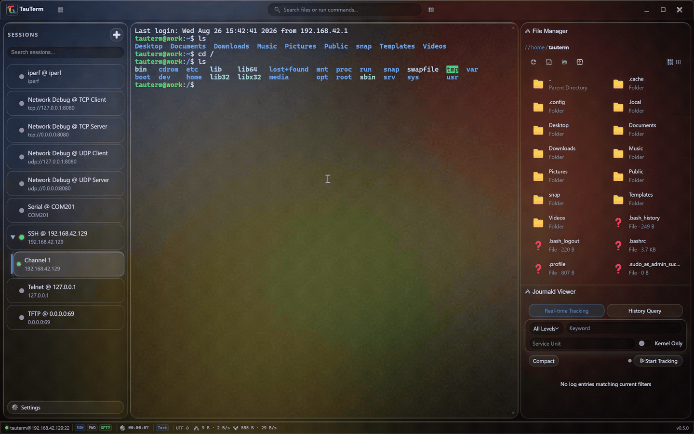
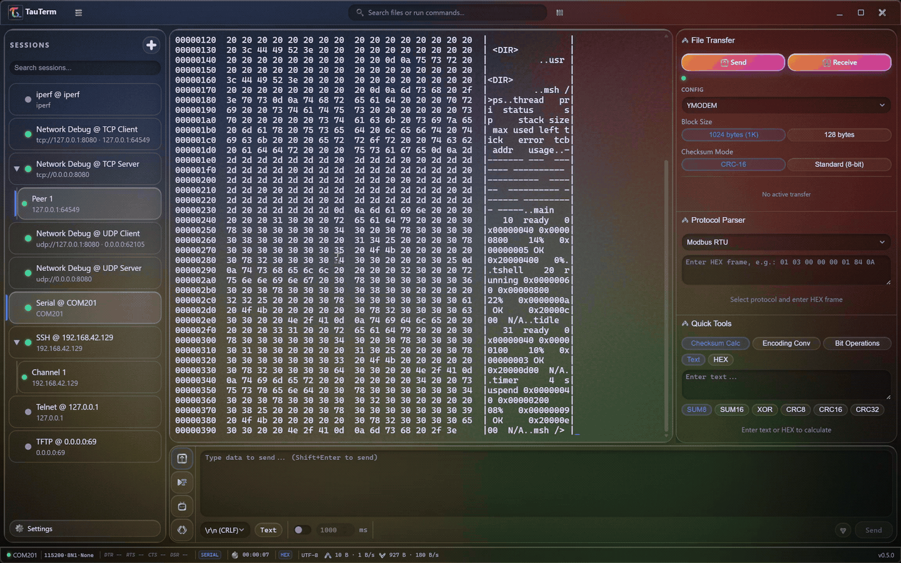

# TauTerm

> **一台终端，服务机房与实验台。**  
> 面向网络工程师与嵌入式开发者的开源 SSH/SFTP、串口与网络调试工作台，基于 Rust + Tauri 构建。

[](LICENSE)
[](https://github.com/hamburger-os/TauTerm/releases)
[](https://github.com/hamburger-os/TauTerm/releases)
[](https://github.com/hamburger-os/TauTerm/releases)
[](https://github.com/hamburger-os/TauTerm/releases)
[](https://tauri.app)
[](https://www.rust-lang.org/)

**[下载](https://github.com/hamburger-os/TauTerm/releases)** —— Windows · Linux · macOS · **[支持平台](docs/SUPPORTED_PLATFORMS.md)** · **[从源码构建](docs/BUILDING.md)** · **[English README](README.md)**

TauTerm 面向那些不想再在 SSH 客户端、SFTP、串口助手、TCP/UDP 调试器之间来回切换的工程师。它把这些工作流放进一个轻量桌面应用，并通过微内核插件架构持续扩展。

> **当前正式发布目标：** Windows 10/11 x86_64（NSIS）、Linux x86_64（`.deb` / `.rpm` / `.AppImage`，以 Ubuntu 22.04 为构建基线）以及 macOS Apple Silicon（技术预览）。Windows ARM64、Linux ARM64、macOS Intel 与 MSI 暂不属于发布目标。下方功能描述以当前 `master` 为准，最新打包版本可能会落后于 `master`。


---

## 实际工作流

[观看 64 秒静音演示视频](docs/assets/tauterm-demo.mp4)。

### SSH 与 SFTP 并排协作



一条已认证的 SSH 连接即可同时承载终端、远程文件与 journald 查看器。

### RT-Thread 串口工作流




查看实时 RT-Thread 输出时，文件传输、协议解析与快捷工具始终近在手边。

### TCP、UDP 与吞吐测试


在同一个应用中运行客户端和服务器工作流，并直接查看实时流量与 iPerf 结果。

### Telnet


使用同一工作区连接遗留 Telnet 主机。

### 主题


按环境选择合适的工作区外观。

## 为什么是 TauTerm？

| 你的需求 | TauTerm 提供 |
|---|---|
| 管理服务器 | SSH 终端 + 同连接 SFTP |
| 调试嵌入式设备 | 串口、HEX/Text/Dual、X/Y/ZModem |
| 做网络联调 | TCP/UDP 客户端与服务端、TFTP、Telnet、iPerf |
| 自动化重复操作 | 每会话 Lua 5.4 脚本、自动应答规则 |
| 少开几个工具 | 统一会话、日志、命令面板与快捷键 |
| 后续扩展协议 | 微内核 + 独立协议插件 |

**体积小。** v0.4.0 Windows 安装包约 **8 MB**，且已包含 com0com 虚拟串口驱动。

**同时服务两个场景。** TauTerm 不把串口当成附属功能，而是从一开始就同时面向网络工程与嵌入式开发。

**真正开源。** TauTerm 采用 MIT / Apache-2.0 双许可证，并围绕可独立扩展的协议插件设计。

---

## 亮点功能

### 🖥️ 网络工程

- **SSH + SFTP 单会话** —— 终端与文件传输复用同一条已认证连接。
- **SFTP 文件管理器** —— 浏览、上传/下载、重命名、批量删除、查看远端文件信息，支持列表与网格视图。
- **网络调试（TCP/UDP）** —— TCP 客户端/服务端、UDP 客户端/服务端，多对端处理、TEXT/HEX 视图、目标选择与统计。
- **TFTP** —— 客户端/服务端、RFC 7440 窗口、CRC32 校验和重试控制。
- **Telnet** —— RFC 854 协商、窗口大小同步和 keepalive。
- **iPerf2 / iPerf3** —— TCP/UDP 测试、双向模式、实时速率曲线和历史。
- **远程 journald 查看器** —— 通过 SSH 流式追踪或查询日志，支持过滤和 JSON 导出。

### 🔌 嵌入式开发

- **RS-232/485 串口**，可选 **虚拟串口桥接**——Windows 使用 com0com 虚拟 COM 对；Linux/macOS 使用 TauTerm 进程内创建的 POSIX PTY，不再依赖 `socat`、Homebrew、系统 PATH 或 `/tmp` 符号链接。Windows 下应用本身以普通用户权限运行，特权操作由后台服务代理执行。
- **XModem / YModem / ZModem**，可直接从活动串口会话执行传输。
- **Text / HEX / Dual 显示**，支持时间戳、分帧和 TX/RX 区分。
- **字符集转码** —— UTF-8、GBK、GB18030、Big5、Shift-JIS、EUC-JP、EUC-KR、ISO-8859-1。
- **四模式发送栏** —— 手动发送、指令面板、自动应答、脚本。
- **嵌入式 Lua 5.4** —— 每会话独立 VM，支持原始字节与按会话编码发送。
- **开发工具箱** —— CRC、Base64/HEX、浮点/大小端、位操作、C `sizeof`、Modbus、AT 指令解析。

### ⚡ 日常工作流

- 统一标签页会话与离线连接配置。
- SSH 主机指纹确认与日志脱敏。
- 终端搜索、命令面板、全快捷键重绑定。
- 会话日志分卷与过期清理。
- 中文 / 英文运行时切换。
- 三套 Liquid Glass 主题与 Tauri v2 原生级外壳。

> 凭据持久化正在进行安全强化。在真正的 OS 原生 Keyring + 认证加密降级方案落地之前，当前 `master` 不再宣称已经具备该能力。

---

## 安装

### Windows

从 **[GitHub Releases](https://github.com/hamburger-os/TauTerm/releases)** 下载最新 **x64 NSIS 安装包**。

Windows 安装包会附带并自动安装开源 [com0com](https://com0com.sourceforge.net/) 虚拟串口驱动，因此虚拟 COM 桥可以开箱即用。com0com 是独立第三方 GPL 组件。Windows ARM64 与 MSI 暂不作为发布目标。当前安装包尚未做 Authenticode 签名，首次安装可能触发 SmartScreen 提示。

### Linux

在 **[GitHub Releases](https://github.com/hamburger-os/TauTerm/releases)** 中选择 x86_64 的 `.deb`（Debian/Ubuntu）、`.rpm`（Fedora/RHEL）或 `.AppImage`。发行产物使用 Ubuntu 22.04 构建，以维持更保守的 glibc/ABI 基线。

Linux 虚拟串口桥由 Rust 进程内 POSIX PTY 实现，不需要安装 `socat`，也不需要任何额外命令行程序。

### macOS

在 **[GitHub Releases](https://github.com/hamburger-os/TauTerm/releases)** 下载 **Apple Silicon** 的 `.dmg` / updater app archive。macOS Intel 暂不作为发布目标。

macOS 虚拟串口桥同样使用进程内 POSIX PTY，不依赖 Homebrew。macOS 仍属于技术预览且尚未公证（notarization），若被 Gatekeeper 拦截，首次可右键 → 打开。

准确的平台、架构与签名状态请查看 **[支持平台矩阵](docs/SUPPORTED_PLATFORMS.md)**。

---

## 已发布功能与 `master` 有什么区别？

TauTerm 迭代较快。想稳定体验请优先使用打包版本；`master` 会包含尚未正式发布的新功能。

- **v0.5.0 目标 —— 网络与最小权限安全：** TCP/UDP 网络调试会话、Telnet、iPerf2/iPerf3、会话级字符集转码、远程 journald 日志查看器。Windows 下应用以普通用户权限运行，特权虚拟串口操作委托给 LocalSystem 服务；Unix 虚拟串口桥切换为进程内 PTY。
- **v0.4.0 —— First Public Tech Preview：** 串口、SSH/SFTP、传输子系统、Lua/自动应答工作流、终端搜索、日志、设置、国际化，以及核心微内核/插件架构。
- **当前 `master`：** 在 v0.5 基础上持续增加网络、安全与工作流能力。
- **路线图：** 本地 Shell、SSH 隧道/跳板机、会话分组、FTP、录制/分屏、插件 SDK 等。

每个版本的准确变化请查看 **[CHANGELOG.md](CHANGELOG.md)**。

---

## 协议支持矩阵

| 协议 | 当前 `master` | 内容 | 传输 / 角色 |
|---|---:|---|---|
| **Serial**（RS-232/485） | ✅ | terminal | X/Y/ZModem inline |
| **SSH** | ✅ | terminal | SFTP side-channel |
| **TFTP** | ✅ | custom | client + server |
| **Telnet** | ✅ | terminal | RFC 854 |
| **iPerf2 / iPerf3** | ✅ | custom | 网络测速 |
| **网络调试**（TCP/UDP） | ✅ | custom | client + server |
| **本地 Shell**（PTY） | 📋 规划中 | terminal | v0.6 目标 |
| **FTP** | 📋 规划中 | file browser | v0.7 目标 |
| **TRDP** | 📋 规划中 | terminal | v1.0 目标 |

---

## 路线图

```text
v0.5  TCP/UDP 网络调试、Telnet、iPerf2/3、字符集转码、
      远程 journald、Windows 最小权限虚拟串口服务、Unix 原生 PTY
v0.6  凭据与安全强化（原生 Keyring + 认证加密降级）、
      本地 Shell、会话分组、SSH 隧道 + 跳板机
v0.7  网络调试完善、FTP、录制、分屏
v1.0  GA：Windows/macOS/Linux 发布级验证、性能预算、
      插件 SDK 文档、TRDP
v1.1  「终端 + 示波器」：WebGL 绘图、FFT、
      FireWater/JustFloat 兼容
```

路线图版本是目标而不是承诺；会根据真实用户反馈调整优先级。

---

## 贡献与反馈

TauTerm 仍处在早期阶段，因此现在的用户反馈尤其有价值。

- 发现可复现问题？**[提交 Bug](https://github.com/hamburger-os/TauTerm/issues/new/choose)**。
- 缺少某个让你无法从现有工具迁移的功能？**[提交功能建议](https://github.com/hamburger-os/TauTerm/issues/new/choose)**。
- 想贡献代码？阅读 **[CONTRIBUTING.md](CONTRIBUTING.md)** 与 **[docs/BUILDING.md](docs/BUILDING.md)**。
- 想了解内部设计？查看 **[docs/ARCHITECTURE.md](docs/ARCHITECTURE.md)**。

如果 TauTerm 对你有用，给仓库点一个 Star 能帮助更多网络与嵌入式工程师发现它。

---

## 维护者：如何发布与宣传 TauTerm

可复用的版本发布/宣传清单见 **[docs/LAUNCH.md](docs/LAUNCH.md)**，包括截图、Release Notes、GitHub 元数据、Show HN、Reddit、V2EX 与发布后反馈闭环。

---

## 许可证

TauTerm 可按 **MIT License** 或 **Apache License 2.0** 任一许可证使用。

Windows 安装包附带 [com0com](https://com0com.sourceforge.net/) 作为独立第三方 GPL 组件，不影响 TauTerm 自身双许可证。

---

**TauTerm —— 一台终端，服务机房与实验台。**