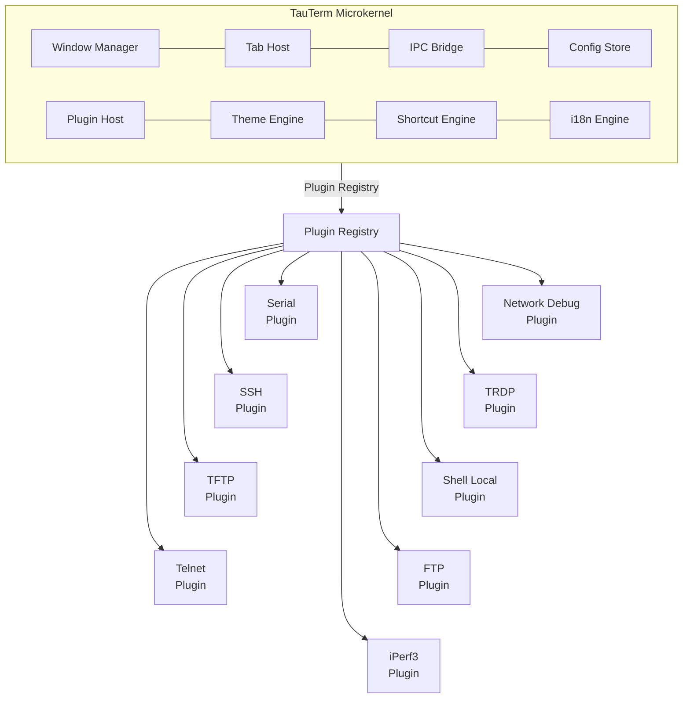
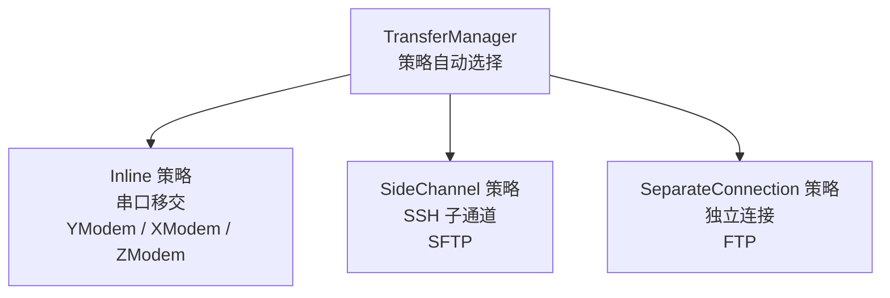
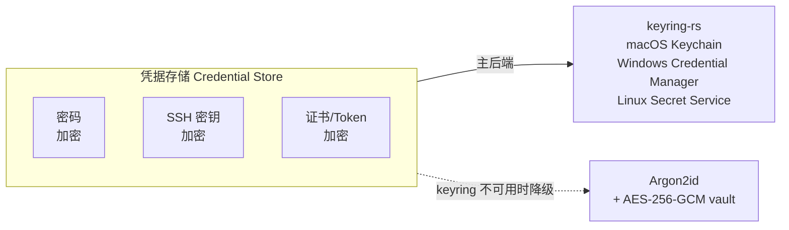

# TauTerm 架构文档

> 面向插件开发者与贡献者。终端用户的特性介绍见 [README.md](../README.md)。

TauTerm 基于 **Tauri v2**（Rust + React + TypeScript）构建的微内核架构跨平台终端模拟器。内核不包含任何协议实现——所有会话类型（串口、SSH、Telnet、网络调试、TRDP、本地 Shell、FTP、iPerf3 等）均作为**独立插件**注册到内核，实现真正的协议无关架构。

---

## 架构总览



### 设计原则

| 原则 | 说明 |
|------|------|
| **内核不含协议** | 12 个内核模块提供平台能力（窗口、标签页、IPC、配置、插件、主题、快捷键、国际化、插件适配、会话存储、日志引擎、日志写入），不包含任何会话类型逻辑 |
| **一切皆插件** | 每个协议和功能都是独立插件，通过 `ProtocolAdapter` trait 和 `registerPlugin()` API 注册 |
| **统一标签页** | 所有会话类型共享同一套标签栏，通过 `content_type` 适配器动态切换内容视图 |
| **策略自适应** | 传输、I/O、安全策略根据会话协议自动选择，无需用户干预 |

---

## 插件架构

### 插件清单

每个插件通过 `manifest.json` 声明元数据：

```json
{
  "id": "ssh",
  "name": "SSH",
  "version": "1.0.0",
  "category": "terminal",
  "icon": "ssh-shell",
  "content_type": "terminal",
  "capabilities": ["connection", "transfer", "authentication", "credential_store", "network_outbound"],
  "transfer_protocols": ["sftp"],
  "config_schema": { /* JSON Schema */ }
}
```

### 后端核心 Trait

```rust
/// 任何协议插件必须实现此 trait（async，基于 #[async_trait]）
#[async_trait]
pub trait ProtocolAdapter: Send + Sync {
    async fn connect(&self, endpoint: &str, params: &Value) -> Result<ProtocolConnection, SessionError>;
    fn content_type(&self) -> ContentType;
    fn io_strategy(&self) -> IoStrategy;
    fn transfer_protocols(&self) -> Vec<TransferProtocolType>;
    fn discover_endpoints(&self) -> Result<Vec<EndpointInfo>, SessionError>;
    // teardown_delay() 等其他方法
}

/// 同步 I/O 通道 —— 串口等阻塞式协议实现此 trait（由 spawn_sync_io_loop 驱动）
pub trait Channel: Read + Write + Send {
    fn is_connected(&self) -> bool;
    fn set_timeout(&mut self, dur: Duration) -> Result<(), ChannelError>;
    fn try_handoff(&mut self) -> Option<Box<dyn Any>>;  // Inline 传输所有权交出
    fn shutdown(&mut self) -> Result<(), ChannelError>; // 协议级有序关闭
    fn disconnect_info(&self, fallback: DisconnectInfo) -> DisconnectInfo;
}

/// 异步 I/O 通道 —— SSH 等 tokio 协议实现此 trait（由 spawn_async_io_loop 驱动）
#[async_trait]
pub trait AsyncChannel: Send {
    async fn read(&mut self, buf: &mut [u8]) -> std::io::Result<usize>;
    async fn write(&mut self, buf: &[u8]) -> std::io::Result<usize>;
    async fn flush(&mut self) -> std::io::Result<()>;
    fn is_connected(&self) -> bool;
    fn set_timeout(&mut self, dur: Duration) -> Result<(), ChannelError>;
    async fn resize_pty(&mut self, cols: u32, rows: u32) -> Result<(), ChannelError>;
    fn try_handoff(&mut self) -> Option<Box<dyn Any>>;  // 默认 None（SSH 用 SideChannel 策略）
    async fn shutdown(&mut self) -> Result<(), ChannelError>;
    fn disconnect_info(&self, fallback: DisconnectInfo) -> DisconnectInfo;
}
```

`ProtocolConnection` 返回 `ChannelKind::Sync(Box<dyn Channel>)` 或 `ChannelKind::Async(Box<dyn AsyncChannel>)`，
并可携带 `side_channel: Option<Arc<dyn SideChannel>>`（如 SSH 的 `SshSideChannel` 持有 russh Handle + SFTP 缓存）。
当 `channel` 为 `None` 时，`SessionStore` 使用容器会话模式（无终端 I/O loop），适用于纯侧通道协议（如 TFTP）。

需要“一个配置、多终端”的协议另行提供 `channel_factory: Option<Arc<dyn SessionChannelFactory>>`。工厂只暴露 `open_channel(ChannelOpenMode) -> ChannelKind`、能力判断和子会话名称前缀；`SessionStore` 统一负责父容器、子会话注册、32 个活动终端上限、单调编号、I/O/统计、异常现场保留与最后一个活动子会话退出后的父状态。SSH 工厂在同一条已认证连接上创建新的远端 PTY，Local Shell 工厂按已解析配置创建新的独立本地 PTY。管理员模式是单个子会话的运行时属性，不写回父配置。

`EndpointInfo` 除稳定的 `name` 与用户可读的 `description` 外，可携带可选 `params` 配置预设。内核只负责透传；插件连接表单决定如何应用。Local Shell 用它把 WSL 发行版、受管理启动参数和用户参数分离，Serial 等简单端点保持 `params = None`。

### 前端注册 API

```typescript
registerPlugin({
  id: 'ssh',
  manifest: { /* manifest.json */ },
  connectForm: SshConnectForm,         // 连接配置组件
  toolbarItems: [...],                 // 活跃时工具栏注入
  contextMenuItems: [...],             // 右键菜单扩展
  bottomPanels: [...],                 // 底部面板标签页
  statusBarItems: [...],               // 状态栏注入
  locales: { 'zh-CN': {...}, 'en-US': {...} },
});
```

### 能力声明

| 能力 | 描述 |
|------|------|
| `connection` | 可建立/断开连接 |
| `transfer` | 支持文件传输 |
| `endpoint_discovery` | 可枚举可用端点 |
| `stream` | 提供二进制数据流 |
| `authentication` | 需要认证（密码/密钥/证书） |
| `credential_store` | 需要访问凭据存储 |
| `filesystem_access` | 需要访问本地文件系统 |
| `network_outbound` | 需要出站网络连接 |
| `network_listen` | 需要监听端口（如 FTP active mode / iPerf3 server） |

### 生命周期


---

## I/O 架构

### 双模 I/O 策略

不是所有协议都需要 async runtime——有些甚至不需要终端 I/O。内核提供三种会话模式：

| 模式 | 运行时 | 适用协议 | 特点 |
|------|--------|---------|------|
| **Sync** | `std::thread` | Serial, Telnet, Local Shell | 低延迟，无 runtime 开销（阻塞式通道 API；串口支持 Inline 传输 `try_handoff`） |
| **Async** | `tokio` | SSH | 高并发，线程安全（russh 纯 Rust async SSH 库，SFTP 与终端 I/O 并发复用同一会话） |
| **Headless** | 无 I/O loop | TFTP, iPerf | 容器会话模式 — `ProtocolConnection.channel = None`，不创建 I/O loop/StatsCollector/CommHandle，所有数据传输通过 `SideChannel` 在独立线程中完成 |

### Local Shell PTY 与断连语义

Local Shell 是标准 `ProtocolAdapter + ChannelKind::Sync` 插件，不在前端直接启动子进程。后端使用 `portable-pty` 创建平台原生 PTY：Windows 走 ConPTY，Linux/macOS 走 Unix PTY。用户配置包含 Shell 模式（自动/已探测/自定义）、可执行文件、独立用户参数数组和工作目录；默认工作目录为用户主目录。Windows 的“自动”严格使用原生 `pwsh → powershell → cmd`，不会隐式进入 WSL；选择器另行发现 WSL 默认/各发行版、Git Bash、MSYS2/Cygwin Bash 与 NuShell，并按原生 → WSL → 开发环境排序。Unix 自动顺序为 `$SHELL → zsh → bash → sh`。进程环境固定补充 `TERM=xterm-256color` 与 `COLORTERM=truecolor`。

WSL 预设将发行版参数和 `--cd` 作为受管理参数，用户参数独立追加。空目录解析为 Linux 用户主目录 `~`，非空目录只接受绝对 Linux 路径或 `~/...`；保存阶段验证语法，连接阶段通过目标发行版验证目录存在性。WSL 命令输出按 UTF-8/UTF-16LE 自适应解码，发行版枚举失败不会阻断其他 Shell 的发现。

Local Shell 在保存会话配置时将空工作目录解析为实际用户主目录（WSL 为 `~`），并将该规范化目录同时保存为通用会话 `endpoint`。侧栏只渲染所有协议共有的 `name + endpoint`，不解析 Local Shell 的 `cwd`、Shell 类型或可执行文件。

Local Shell 与 SSH 统一采用“已保存配置父容器 + 运行时终端子会话”。父卡片默认名为 `Shell @ <解析后的 Shell 类型>`，用户自定义名称不被覆盖；子卡片按 `Shell N` 编号。父卡片进入第一个子会话，每个子会话拥有独立 PTY、统计、退出状态和可选管理员标记。最多同时存在 32 个活动子会话；编号在仍有活动或异常现场卡片时保持单调，全部子卡片清除后才重置。正常退出移除子卡片，异常退出保留终端现场；最后一个活动子会话结束时父运行时断开，但保存的配置仍可重新连接。

Windows 管理员终端不会提升 TauTerm 主进程，也不会复用面向 com0com 的 LocalSystem 服务。用户显式选择“新建(以管理员身份)”后，当前 `tauterm.exe` 通过 `runas` 以早期 helper 模式重新进入；每个 helper 只承载一个 ConPTY，并使用一对随机、拒绝远程客户端的本地逻辑单向命名管道：命令管道承载 `config/write/resize/shutdown`，事件管道承载 `data/exit/error`。分离同步读写方向可避免等待终端输出时阻塞输入和关闭命令。server 句柄以 `PIPE_ACCESS_DUPLEX` 创建，仅用于取得 `SetNamedPipeHandleState` 从 `PIPE_NOWAIT` 切回 `PIPE_WAIT` 所需的写属性权限；helper 端仍只按方向申请 `GENERIC_READ` 或 `GENERIC_WRITE`，协议不允许反向帧。helper 校验参数边界，连接具有 10 秒超时，GUI 或任一管道关闭时会关闭完整 PTY 进程树。UAC 取消不会创建子会话；WSL 和非 Windows 平台不暴露管理员入口。

PTY 的阻塞读取由专用线程隔离，再通过有界通道送入同步 I/O loop，以保持关闭信号和尺寸调整可响应。显式断开先关闭写端并等待子进程；超时后终止进程组（Unix）或关闭带 `KILL_ON_JOB_CLOSE` 的 Job Object（Windows），避免遗留子进程。

所有终端通道通过 `DisconnectInfo` 统一上报 `kind`、`reason`、可选 `exit_code` 与 `retain_terminal`。用户主动断开和 Local Shell 正常退出会清空终端；远端 EOF、I/O 错误、设备移除或非零进程退出保留当前终端缓冲区并显示原因。保留状态只存在于当前进程内，重新连接、删除会话或退出应用都会清除。

### 容器会话与对端通道（网络调试）

部分协议天然一对多（TCP Server 多客户端）。内核在"一会话一通道"之外提供**容器会话 + 对端通道**模型，供 TCP 使用；UDP 因无连接语义走单会话、无对端。

- **容器会话**：`ProtocolConnection.channel = None`（Headless），自身不承载 I/O；TCP 的监听器 / accept 循环、UDP 的 recv 循环由插件 `SideChannel` 在独立线程中驱动（`connect()` 同步初始化，`start()` 启动线程）。容器持有 `NetworkCommHandle`（路由 CommHandle）承载脚本/自动应答引擎，按「当前目标」把 `send()` 路由到 UDP 手动地址/固定远端，或经 TCP 对端写通道注册表（`peer_writers`）扇出到选中对端/全部客户端。
- **TCP 对端通道**：`SessionStore::register_peer_channel` 把每个客户端注册为 `SubConnection`（`tabbed = false`，不占标签页），获得与普通会话同级的独立 I/O loop、统计采集、CommHandle（文本转码 / 自动应答 / Lua 脚本按对端生效）、日志路由与 `session-data` 数据流（对端 UUID 即 session_id）。
- **UDP 无对端**：单 `UdpSocket` 直接 `recv_from`，每收到一个数据报即 emit `session-data`（session_id = 容器，payload 带 `source_addr`），不注册对端、不建 per-source 通道、无 `udp_max_peers`；UDP Client 不 connect，仅记录固定远端作为发送目标（`recv_from` 可接收任意来源含广播/组播）并记录本地绑定地址供前端展示；Server 发送走 `send_to`（手动目标 / 广播 / 组播）。
- **角色模型**：TCP Client 固定远端、单对端；TCP Server 本地监听、多对端；UDP Client 固定远端单会话；UDP Server 本地绑定、任意来源时间线。
- **事件契约**：`netdbg-peer-joined` / `netdbg-peer-left` / `session-stats`（对端 UUID）仅 TCP 触发，由 `SessionContext` 全局监听一次，维护 `networkPeers`（容器 → 对端条目）与 `selectedNetworkPeer`（容器 → 选中对端）；数据复用 `session-data`（TCP 按对端 UUID 路由，UDP 按容器 + source_addr 路由）。
- **前端导航**：TCP server 对端显示为左侧会话树（SessionSidebar）的非标签页子节点（状态圆点），点击路由到容器视图并选中、点击容器节点取消选择；右键提供断开 / 移除墓碑。TCP client 是单会话形态——无对端树，唯一对端自动选中，对端断开时前端将容器置为断开。UDP 无对端树，报文网格显示全部来源时间线。
- **视图形态**：网络会话为裸视图（与串口一致）——无自定义头部/工具条，身份信息在左侧树、TX/RX 统计在状态栏；TCP 数据模式（Dual/Text/Hex）来自连接参数 `params.data_mode`，会话内不可切换；UDP 恒为报文网格（序号/时间/方向/地址/长度/HEX/ASCII 双栏）。
- **发送栏**：全局底部位置渲染（App.tsx），跨四种发送模式（基础 / 指令 / 自动应答 / 脚本）共享统一**发送目标栏（`TargetBar`）**；目标栏按 transport/role 渲染——TCP Server 为对端下拉（含「全部客户端」群发伪目标）、UDP Server 为手动 `IP:port` 输入 + 最近来源快捷回发下拉，其余场景隐藏（单一固定目标）。前端主动发送统一走 `SessionContext.sendToTarget`（选中对端 / 全部扇出 / UDP 手动地址）；脚本引擎（auto-reply / script）绑定会话后，`send()`/`send_text()` 按同步到后端的「当前目标」路由（新增 `set_network_send_target` 命令），并提供 `send_to(target, data)` / `send_to_text(target, data)` 显式 UDP 目标发送。
- **生命周期**：TCP 对端断开不级联容器（监听器保持监听）；对端断开先在 `on_disconnect` 持锁落 `state=Disconnected`、停止统计采集，再 emit `netdbg-peer-left`（携带最终 TX/RX 字节）。父容器状态仅由显式 `close_session`（用户关闭会话）改变，与「对端断开/关闭均不级联」一致。
- **两段式关闭**：`close_sub_connection` 持锁阶段仅发信号并移除、返回 `SubConnectionCleanup` 句柄（类型级不变式：持有期间不得获取 session_store 锁），锁外 join——解除「I/O 回调等锁 × 持锁 join」的循环死锁。
- **背压与上限**：TCP Server `max_clients` 只统计 Connected 对端（断开墓碑不占名额）；UDP 无对端上限，逐数据报 emit 不背压（高频 UDP 由前端缓冲上限裁剪）。

> 标准依据：RFC 4254 Channel Mechanism——一个连接承载多个动态开/关的通道。`SubConnection` 由此泛化为通用对端注册 API，SSH 子通道与网络对端共用同一骨架。

### 传输子系统

根据会话协议自动选择传输策略：



---

## 内容适配器

统一标签栏根据 `content_type` 动态渲染内容区域：

| content_type | 渲染器 | 典型插件 |
|-------------|--------|---------|
| `terminal` | xterm.js 实例池（CSS opacity 切换） | Serial, SSH, Telnet, TRDP, Shell Local |
| `file_browser` | 双栏文件树 + 传输进度 | FTP, NFS |
| `custom` | 插件自定义组件 | TFTP, iPerf2/iPerf3, 网络调试, 任意 |

---

## 安全模型



- **凭据运行时语义**: `CredentialStore` 通过 `keyring::Entry::store_status()` 检测 OS 安全存储；可用时凭据与索引写入 Windows Credential Manager、macOS Keychain 或 Linux Secret Service。不可用时使用应用数据目录中的 `credentials.vault.json`，由 10 个字符以上主密码派生 Argon2id 密钥（64 MiB、3 次迭代、1 lane），再以 AES-256-GCM 认证加密；vault 密钥只保存在进程内，调用 lock 或进程退出即失效。SSH 连接表单没有自动写入凭据存储。
- **主机密钥验证**: SSH `known_hosts` 管理，首次连接指纹确认，密钥变更安全警告
- **TLS 证书固定**: TRDP / Telnet TLS 连接证书校验（规划中）
- **日志脱敏**: 自动过滤密码、私钥、Token，输出 `[REDACTED]`
- **代理转发控制**: SSH Agent Forwarding 默认禁用，需要显式确认
- **最小权限模型（Windows 虚拟串口）**: 主程序以 `asInvoker`（普通用户）运行，特权 com0com 操作委托给 `LocalSystem` 服务 `TauTermService`；命名管道采用 SDDL 安全描述符，并通过 `GetNamedPipeClientProcessId` + `QueryFullProcessImageNameW` 校验调用方必须为安装目录中的 `tauterm.exe`，且只接受固定窄操作集（不透传任意 `setupc` 参数）。服务模式不写入磁盘状态，端口资源按驱动真实状态与客户端连接生命周期清理；开发/便携场景服务不可用时回退到按需 UAC。

---

## 技术栈

| 层级 | 技术 |
|------|------|
| 应用框架 | Tauri v2 (Rust) |
| 前端框架 | React 18 + TypeScript |
| 构建工具 | Vite |
| 终端引擎 | xterm.js |
| 动画引擎 | Framer Motion |
| 异步运行时 | tokio |
| 国际化 | i18next + react-i18next |
| 样式方案 | CSS Modules + CSS 自定义属性 |
| 安全存储 | OS keyring；不可用时 Argon2id + AES-256-GCM vault |
| 自动更新 | tauri-plugin-updater + tauri-plugin-process |
| 网络协议 | russh (纯 Rust async SSH) + russh-sftp + telnet (RFC 854) + tftpd + riperf3（vendored fork，iperf3，见 src-tauri/vendor/riperf3/VENDOR-NOTES.md）|
| 本地终端 | portable-pty（Windows ConPTY / Unix PTY） |
| 脚本引擎 | mlua 0.10 (Lua 5.4, vendored) |
| 正则引擎 | regex 1 |

---

## 项目结构

```
TauTerm/
├── src-tauri/src/
│   ├── kernel/                 # 微内核模块
│   │   ├── mod.rs
│   │   ├── window_manager.rs   # 窗口生命周期、分屏、布局持久化
│   │   ├── tab_host.rs         # 标签页 CRUD、会话关联
│   │   ├── ipc_bridge.rs       # Tauri 命令路由、事件总线、Stream 通道
│   │   ├── config_store.rs     # 类型安全 KV 存储、Schema 校验
│   │   ├── plugin_host.rs      # 插件发现、加载、生命周期
│   │   ├── theme_engine.rs     # CSS 令牌生成、三主题切换（Google Glow / Obsidian / Frosted）
│   │   ├── shortcut_engine.rs  # 快捷键注册、冲突检测、作用域分发
│   │   ├── plugin_adapter.rs   # ProtocolAdapter trait + ContentType/IoStrategy 定义
│   │   ├── session_store.rs    # 会话存储、I/O 生命周期、统计采集
│   │   ├── file_transfer.rs     # 统一文件传输 trait（FileTransfer）+ UnifiedProgress 进度事件 + 取消信号
│   │   ├── i18n_engine.rs      # 命名空间翻译、动态语言切换
│   │   ├── log_engine.rs       # 生产者-消费者异步日志引擎、LogBridge 桥接器
│   │   ├── log_writer.rs       # 日志文件写入器、text/hex/dual 格式化、自动分卷
│   │   ├── charset.rs          # 字符编码转码（发送转码 + 日志按会话编码解码）
│   │   ├── comm_handle.rs      # 通信抽象 trait（CommHandle），使脚本引擎协议无关
│   │   ├── data_batcher.rs      # 数据批处理器（16ms 窗口合并高频小包 + Base64 编码优化 IPC）
│   │   └── script_engine/      # Lua 5.4 脚本运行时（VM + 代码生成 + API 注入 + 沙箱）
│   │
│   ├── channel/                # I/O 通道抽象层
│   │   ├── mod.rs              # Channel / AsyncChannel trait + IoStrategy + DisconnectInfo
│   │   ├── serial_channel.rs   # 串口 Channel 实现（Sync 路径，serialport 阻塞 API）
│   │   ├── ssh_channel.rs      # SSH AsyncChannel 实现（russh::Channel<client::Msg>，PTY 窗口调整）
│   │   ├── local_shell_channel.rs # 本地进程 PTY Channel（进程组/Job Object 生命周期）
│   │   ├── elevated_shell_channel.rs # Windows 一次性管理员 helper + 命名管道桥接
│   │   ├── io_loop.rs          # 同步 I/O 循环引擎（spawn_sync_io_loop）
│   │   ├── async_io_loop.rs    # 异步 I/O 循环引擎（spawn_async_io_loop，tokio task）
│   │   ├── serial_comm.rs      # CommHandle 串口适配实现
│   │   └── error.rs            # SessionError 结构化错误
│   │
│   ├── transfer/               # 传输子系统
│   │   ├── mod.rs              # TransferManager + 策略选择
│   │   ├── manager.rs          # 传输策略调度（Inline / SideChannel / SeparateConnection）
│   │   ├── orchestrator.rs     # TransferOrchestrator trait + 策略处理器（Inline / SideChannel）
│   │   ├── panic_guard.rs      # RAII PanicGuard（传输任务 panic 时自动清理会话状态）
│   │   ├── ssh_file_service.rs # SFTP 文件服务（SideChannel 策略，async russh-sftp，复用 SSH Session）
│   │   ├── serial_transfer.rs  # SerialFileTransfer 适配器（spawn_blocking 桥接同步协议到 async FileTransfer trait）
│   │   ├── sftp_transfer.rs    # SftpFileTransfer 适配器（统一 FileTransfer trait 的 async SFTP 实现）
│   │   ├── ymodem.rs           # YModem 协议实现（发送/接收引擎）
│   │   ├── protocol.rs         # 传输协议创建工厂
│   │   └── types.rs            # 传输共享类型
│   │
│   ├── security/               # 安全模块
│   │   └── credential_store.rs # 凭据存储（OS keyring + Argon2id/AES-256-GCM vault 降级）
│   │
│   ├── virtual_port/            # 虚拟串口模块（跨平台抽象）
│   │   ├── mod.rs               # 模块声明与 re-export
│   │   ├── backend.rs           # VirtualPortBackend trait（平台无关抽象接口）
│   │   ├── manager.rs           # Windows com0com 生命周期管理（服务/回退路径）
│   │   ├── pty.rs               # Linux/macOS 进程内 POSIX PTY 后端
│   │   ├── service_backend.rs   # ServiceBackend（Windows 特权服务客户端，named pipe 委托）
│   │   └── bridge.rs            # VirtualPortBridge（后台线程，物理串口 ↔ 虚拟端口双向 I/O）
│   │
│   ├── bin/                     # 独立可执行二进制
│   │   └── tauterm-service.rs   # Windows 特权服务（LocalSystem，named pipe + 窄类型化 API）
│   │
│   └── plugins/                # 内建协议插件
│       ├── serial/             # 串口插件（ProtocolAdapter + Channel）
│       ├── ssh/                # SSH 插件（ProtocolAdapter + SshSideChannel，密码/密钥认证，SFTP）
│       ├── telnet/             # Telnet 插件（ProtocolAdapter + Channel，Sync I/O，RFC 854 协商）
│       ├── local_shell/         # 本地 Shell 插件（ProtocolAdapter + 原生 PTY，Sync I/O）
│       ├── tftp/               # TFTP 插件（ProtocolAdapter + TftpSideChannel，容器模式，服务端+客户端）
│       ├── iperf/              # iPerf 插件（iperf2 自研协议引擎 + iperf3 vendored riperf3，容器模式，服务端+客户端）
│       └── network/            # 网络调试插件（ProtocolAdapter + NetworkSideChannel，容器模式，TCP/UDP 全角色）
│       # TRDP / FTP — 规划中
│
├── src/                        # React 前端
│   ├── core/                   # 内核前端 API
│   │   ├── plugin-registry.ts  # registerPlugin() + PluginRegistry
│   │   ├── tab-host.ts         # useTabHost() hook
│   │   ├── config-store.ts     # useConfigStore() hook
│   │   └── event-bus.ts        # 类型事件订阅
│   │
│   ├── renderers/              # 内容适配器（计划中）
│   │   ├── TerminalRenderer.tsx    # xterm.js 实例池
│   │   ├── FileBrowserRenderer.tsx # 双栏文件树（计划中）
│   │   └── CustomRenderer.tsx      # 插件自定义委托
│   │
│   ├── components/             # UI 组件
│   │   ├── Layout/             # TitleBar, Toolbar, Sidebar, StatusBar, ConnectDialog, ResizeHandle, GoogleGlowBackground
│   │   ├── CommandPalette/     # 命令面板
│   │   ├── SendBar/            # 发送栏（基础发送 + 指令面板 + 自动应答 + 脚本编辑器）
│   │   ├── Transmission/       # 传输侧面板（协议配置 + 发送/接收 + 进度）
│   │   ├── RightSidebar/       # 右侧栏容器（可折叠面板 + ResizeObserver 动画）
│   │   ├── Tools/              # 嵌入式开发工具（校验和/编码/位操作/协议解析）
│   │   ├── Settings/           # 设置页（全屏覆盖层：外观/语言/日志/快捷键/关于）
│   │   ├── FileTransfer/       # 传输子组件（协议选择器、配置表单、进度条，被 Transmission 复用）
│   │   ├── FileManager/        # SFTP 文件管理器（目录浏览、上传/下载、批量、属性、预览、进度、列表/网格视图切换、图标工具栏、扩展名分类图标）
│   │   ├── Tftp/               # TFTP 会话视图（服务端面板 + 客户端面板 + 传输列表 + 参数网格）
│   │   └── common/             # Icon（严格注册 PNG + CSS 状态点；无内联 SVG）, GlassPanel, GlassButton, GlassInput, ContextMenu, Toast
│   │
│   ├── profiles/               # 会话 Profile 解析器（按协议提供身份信息与参数展示）
│   │   ├── index.ts            # ProfileResolver 聚合 + dispatch
│   │   ├── types.ts            # SessionProfile 类型定义
│   │   ├── serial.ts          # 串口 Profile
│   │   ├── ssh.ts             # SSH Profile
│   │   ├── localShell.ts      # Local Shell Profile
│   │   └── tftp.ts            # TFTP Profile
│   │
│   ├── styles/                 # 全局样式
│   │   ├── tokens.css           # CSS 自定义属性（3 套主题令牌）
│   │   └── global.css           # 全局动画（morph/flow）和液态玻璃类
│   │
│   └── plugins/                # 插件前端
│       ├── serial/             # SerialConnectForm, 工具栏, 状态栏
│       ├── ssh/                # SSH 插件清单、区域设置
│       ├── telnet/             # Telnet 插件清单（manifest + locales）
│       ├── local-shell/        # Local Shell 清单与连接配置表单
│       └── tftp/               # TFTP 插件清单（customView 注册）
│       └── iperf/              # iPerf 插件清单（customView 注册）
│       # FTP 等前端插件 — 计划中
│
└── package.json
```

---

## 快捷键

| 快捷键 | 操作 | 作用域 |
|--------|------|--------|
| `Ctrl+Shift+N` | 新建会话 | 全局 |
| `Ctrl+Shift+W` | 关闭当前标签页 | 全局 |
| `Ctrl+Tab` / `Ctrl+Shift+Tab` | 切换标签页 | 全局 |
| `Ctrl+F` | 终端搜索 | Terminal 作用域 |
| `Ctrl+Shift+C` | 复制（终端选中文本） | xterm.js 内置（不可自定义） |
| `Ctrl+Shift+V` | 粘贴（到终端） | xterm.js 内置（不可自定义） |
| `Ctrl+Shift+P` | 命令面板 | 全局 |
| `Ctrl+Shift+B` | 切换左侧栏 | 全局 |
| `Ctrl+Shift+E` | 切换右侧栏（开发工具） | 全局 |
| `Ctrl+Shift+R` | 刷新端口列表 | Application 作用域 |

> 💡 以上可自定义快捷键均可通过 **设置 → 快捷键** 面板进行个性化修改：点击任意行进入录制模式，按下目标组合键即可改键；冲突自动检测并给出动画反馈；支持一键重置为默认值。
