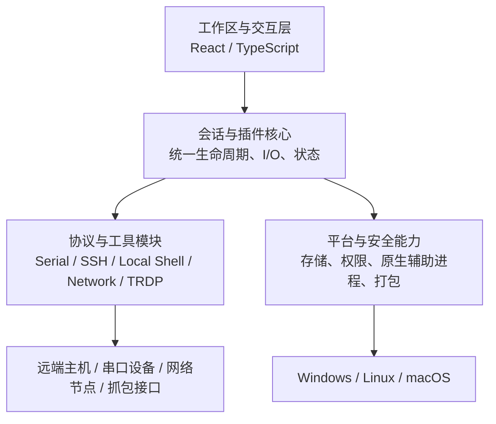

# TauTerm 设计总览

> **维护者审查入口。** 本目录中的“当前设计”文档与代码属于同一个交付物。以后进行架构或方案变更时，AI 必须同步更新对应文档；你可以优先审查这里，而不是逐行阅读代码。

## 1. 文档定位

TauTerm 的长期文档按读者分层：

- **给 AI：** 根目录 `AGENTS.md` 与 `.agents/skills/`，保存工作规则和专业规范。
- **给社区开发者：** 根 README、`CONTRIBUTING.md`、`docs/community/`，保存使用、构建、平台与发布流程。
- **给维护者：** 本文件、`docs/modules/`、`docs/product/`，使用中文记录架构、方案和产品方向。

同一事实只保留一个权威来源。这里不复制构建命令、发布记录、主题 CSS 规则或版本功能清单；需要时链接到它们的权威文档。

## 2. 当前总体架构

TauTerm 是一个本地优先的桌面工程工作台。当前实现由四层组成：

设计的重点不是“把协议放在同一个窗口”，而是让不同工程连接共享同一套 **Session、Workspace、记录、自动化和平台能力**。协议模块负责协议语义，核心负责公共生命周期和状态，平台层负责操作系统差异与信任边界。

## 3. 必须保持的系统边界

1. **本地优先。** 核心连接、调试、记录与分析能力不依赖云账号才能工作。
2. **会话是工程上下文。** UI、协议状态、日志、传输与自动化都围绕 Session 组织，而不是互相独立的工具窗口。
3. **协议语义不进入公共核心。** 可复用的生命周期、I/O、状态和 Workspace 能力进入核心；协议专属行为留在协议模块。
4. **Workspace 与连接状态分离。** 工作区可以持久化布局和稳定配置引用，但不能把运行中的 socket、PTY、凭据或临时 native handle 当成可恢复状态。
5. **最小权限。** 主应用不因单个特权功能而整体提权；平台专属权限通过最窄的受控边界实现。
6. **设计与代码同步。** 任何改变以上边界或模块职责的代码修改，都必须在同一变更中更新对应模块文档。

## 4. 模块设计索引

| 模块 | 当前职责 |
|---|---|
| [CORE.md](modules/CORE.md) | Session、插件注册、公共 I/O、状态与核心边界 |
| [WORKSPACE.md](modules/WORKSPACE.md) | Pane/Workspace、选择上下文、布局持久化与恢复 |
| [SERIAL.md](modules/SERIAL.md) | 串口、虚拟串口、串口传输与设备调试 |
| [SSH.md](modules/SSH.md) | SSH、多终端、SFTP 与远端日志 |
| [LOCAL_SHELL.md](modules/LOCAL_SHELL.md) | 本地 PTY/ConPTY、多终端与按子会话提权 |
| [NETWORK.md](modules/NETWORK.md) | TCP/UDP、TFTP、Telnet 与 iperf |
| [TRDP.md](modules/TRDP.md) | TRDP Node/Monitor、抓包、XML/Dataset 与 native runtime |
| [AUTOMATION.md](modules/AUTOMATION.md) | SendBar、自动回复、脚本与统一发送能力 |
| [PLATFORM_SECURITY.md](modules/PLATFORM_SECURITY.md) | 凭据、权限辅助、平台适配、打包与更新信任边界 |

视觉主题的实现规范不在这里复制，唯一技术规范见 [tauterm-theme skill](../.agents/skills/tauterm-theme/SKILL.md)。

## 5. 产品方向

下面的文档描述长期方向，不代表已经发布：

- [产品战略](product/PRODUCT_STRATEGY.md)
- [硬件生态方向](product/HARDWARE_ECOSYSTEM.md)
- [商业化战略](product/COMMERCIALIZATION.md)

是否已经交付某项能力，以根目录 [CHANGELOG.md](../CHANGELOG.md) 和当前发布版本为准。

## 6. 社区工程文档

源码构建、平台支持和发布流程属于社区/维护流程，不在架构文档重复：

- [源码构建](community/BUILDING.md)
- [支持平台](community/SUPPORTED_PLATFORMS.md)
- [发布流程](community/RELEASING.md)

## 7. 以后如何审查

一次重要开发完成后，建议按下面顺序审查：

1. 先看本文件是否出现总体架构变化；
2. 看被修改模块对应的 `docs/modules/*.md`，确认职责、数据流和边界是否合理；
3. 如果影响用户能力，再看 README 的公开描述；
4. 如果准备发布，再看 CHANGELOG；
5. 只有需要追查实现细节时再进入代码。

如果代码已经改变模块设计，而对应文档没有变化，应把它视为未完成的实现。
