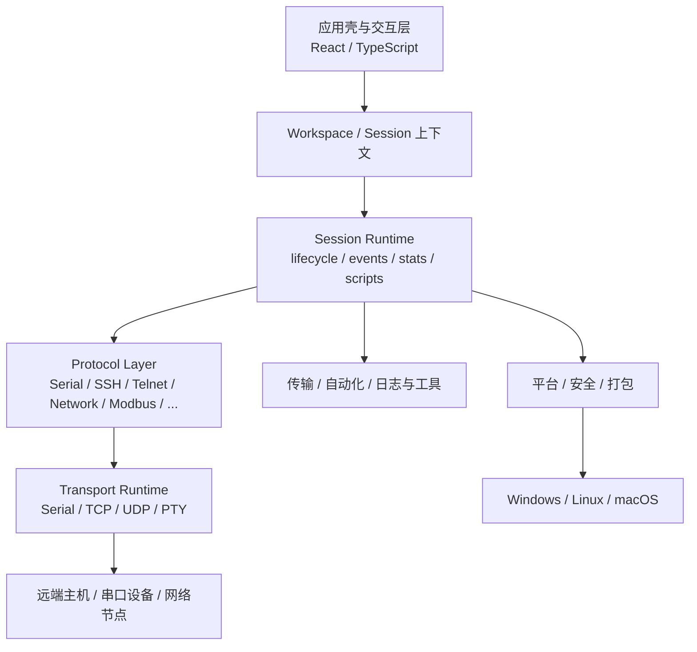

# TauTerm 设计与知识总览

> **维护者主入口。** 代码、当前设计、开发操作和权威知识应在同一个提交中保持一致。日常审查优先从这里进入，不需要先读代码。

## 1. 文档体系

TauTerm 的长期知识按职责分为四类：

| 层级 | 位置 | 主要读者 | 负责什么 |
|---|---|---|---|
| AI 规则层 | 根 `AGENTS.md`、`.agents/skills/` | AI Agent | 工作规则、专业规范、执行流程 |
| 社区层 | 根 README、`CONTRIBUTING.md`、`docs/community/` | 用户/社区开发者 | 项目入口、构建、平台、发布 |
| 维护者层 | 本文件、`docs/modules/`、`docs/maintainer/`、`docs/product/` | 项目维护者 | 当前架构、方案、日常开发操作、长期方向 |
| 标准知识层 | `docs/knowledge/` | AI + 开发者 | 外部标准、官方平台文档、上游实现与许可证依据 |

模块文档回答“TauTerm 当前怎么设计”；知识文档回答“这个设计应依据哪些权威材料”；CHANGELOG 回答“什么时候交付了什么”；README 回答“社区现在能看到什么能力”。同一事实不在多个层级复制。

## 2. 当前总体架构

TauTerm 是本地优先的桌面工程工作台。当前后端核心采用明确的 Session / Protocol / Transport 分层：

Transport 只拥有底层资源和 I/O；Protocol 解释协议语义；Session Runtime 负责用户可见生命周期。文件传输等需要独占主字节流的能力通过 DataPlane exclusive lease 协调，不转移底层 handle。

## 3. 必须保持的系统边界

1. **本地优先**：核心连接、调试、记录与分析能力不依赖云账号。
2. **Session 是工程上下文**：协议状态、日志、传输和自动化围绕 Session 组织。
3. **Transport 不懂协议/UI**：串口/TCP/UDP/PTY 资源所有权与协议解释分离。
4. **协议语义留在模块**：公共核心只保存可复用机制。
5. **持久化与运行时分离**：Workspace/Saved Session 可恢复布局和稳定配置，但不保存 socket、PTY、DataPlane、凭据或 native handle。
6. **最小权限**：主 GUI 不因为某个功能整体提权。
7. **外部标准先确认再实现**：协议/平台语义有疑问时先查 `docs/knowledge/` 的权威来源。
8. **代码与设计同提交**：架构变化没有对应模块文档更新，就视为未完成。

## 4. 当前模块设计

| 模块 | 当前职责 |
|---|---|
| [CORE.md](modules/CORE.md) | Session、插件能力、公共连接与生命周期 |
| [TRANSPORT_RUNTIME.md](modules/TRANSPORT_RUNTIME.md) | DataPlane、Serial/TCP/UDP/PTY transport、错误与独占 lease |
| [UI_FOUNDATION.md](modules/UI_FOUNDATION.md) | 应用壳、renderer、Settings、i18n、快捷键与共享前端结构 |
| [WORKSPACE.md](modules/WORKSPACE.md) | Pane/Workspace、选择上下文、布局持久化与恢复 |
| [SERIAL.md](modules/SERIAL.md) | 串口、虚拟串口与 DataPlane 集成 |
| [TRANSFER.md](modules/TRANSFER.md) | 公共文件传输、ExclusiveIo、X/Y/ZModem、SFTP、进度/取消/清理 |
| [SSH.md](modules/SSH.md) | SSH、多终端、远端文件管理集成与 journald |
| [LOCAL_SHELL.md](modules/LOCAL_SHELL.md) | 本地 PTY/ConPTY、多终端与单 child 提权 |
| [NETWORK.md](modules/NETWORK.md) | TCP/UDP Network Debug、TFTP、Telnet 与 iperf |
| [MODBUS.md](modules/MODBUS.md) | Modbus RTU/ASCII/TCP Client、Monitor、Transactions、Raw 与 Server Simulator |
| [TRDP.md](modules/TRDP.md) | TRDP Node/Monitor、抓包、XML/Dataset 与 native runtime |
| [AUTOMATION.md](modules/AUTOMATION.md) | SendBar、自动回复、Lua 脚本与 SessionIo 统一发送语义 |
| [OBSERVABILITY_TOOLS.md](modules/OBSERVABILITY_TOOLS.md) | 数据批处理、日志、统计和无连接工程工具 |
| [PLATFORM_SECURITY.md](modules/PLATFORM_SECURITY.md) | 凭据、权限、native helper、打包与 updater 信任边界 |

视觉主题的完整技术规范只在 [tauterm-theme skill](../.agents/skills/tauterm-theme/SKILL.md) 维护。

## 5. 标准知识

开发前按任务查阅：

- [网络协议](knowledge/NETWORK_PROTOCOLS.md)
- [Modbus](knowledge/MODBUS.md)
- [终端、串口与自动化](knowledge/TERMINAL_SERIAL_AUTOMATION.md)
- [TRDP](knowledge/TRDP.md)
- [平台与安全](knowledge/PLATFORM_SECURITY.md)
- [许可证与第三方分发](knowledge/LICENSE_COMPLIANCE.md)

知识层完整规则见 [知识库说明](knowledge/README.md)。

## 6. 维护者操作

日常开发、命令速查与审查方式见 [维护者开发手册](maintainer/DEVELOPMENT.md)。`package.json` 始终是 npm 命令的可执行唯一来源；维护者手册提供中文解释和使用场景。

## 7. 产品方向

下面文档描述长期方向，不代表已经发布：

- [产品战略](product/PRODUCT_STRATEGY.md)
- [产品成熟度与执行门槛](product/PRODUCT_MATURITY_PLAN.md)
- [硬件生态方向](product/HARDWARE_ECOSYSTEM.md)
- [商业化战略](product/COMMERCIALIZATION.md)

已交付状态只以当前代码、发布产物和根 [CHANGELOG.md](../CHANGELOG.md) 为准。

## 8. 社区工程文档

- [源码构建](community/BUILDING.md)
- [支持平台](community/SUPPORTED_PLATFORMS.md)
- [测试与可靠性](community/TESTING.md)
- [发布流程](community/RELEASING.md)
- [参与贡献](../CONTRIBUTING.md)

## 9. 根目录长期政策文件

以下文件留在根目录是有意设计，不应并入 `docs/`：

- [SECURITY.md](../SECURITY.md)：公开仓库的安全漏洞报告入口；
- [THIRD_PARTY_LICENSES.md](../THIRD_PARTY_LICENSES.md)：第三方软件与许可 notice 清单；
- [LICENSE](../LICENSE) / [LICENSE-APACHE](../LICENSE-APACHE)：TauTerm 自有代码双许可证文本；
- [CHANGELOG.md](../CHANGELOG.md)：唯一版本变化时间线。

## 10. 文档资产

`docs/assets/` 只保存被长期文档实际引用的图片。没有 Markdown 引用的资产应删除；`npm run docs:check` 会阻止新的孤儿资产进入仓库。

## 11. 以后如何审查

一次重要开发完成后，建议按顺序看：本文件 → 对应 `docs/modules/*.md` → 对应 `docs/knowledge/*.md` → 维护者操作文档 → README/CHANGELOG → CI。只有需要追实现细节时再看代码。

目标不是让文档越少越好，而是让每一类长期知识都有明确所有者，同时没有同一事实的重复副本。