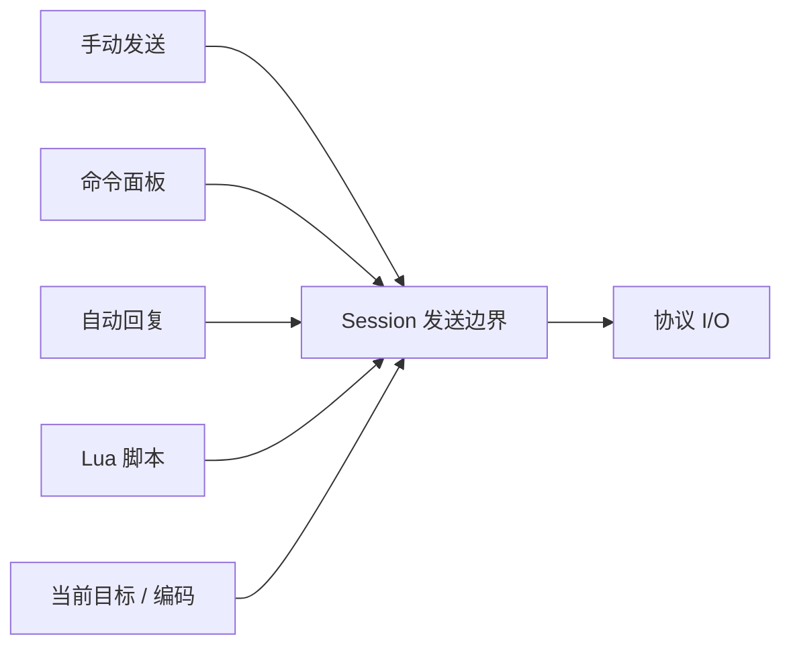

# 发送与自动化设计

## 目标

TauTerm 的发送能力既要支持人工调试，也要支持命令面板、自动回复和脚本。不同入口必须共享同一个 Session 发送语义，避免“手动发送能工作、脚本却走另一条路径”。

## 当前方案

全局 SendBar 是插件能力，而不是所有 Session 的固定 UI。Serial、SSH、Telnet、Network Debug 等声明支持时可使用；Local Shell、TFTP、iperf、TRDP 由各自工作流完成操作，不强制显示发送栏。

对支持 SendBar 的 Session，基础发送、命令面板、自动回复和脚本共享 `CommHandle`/Session 发送边界。字符集转换只作用于文本路径；HEX/raw byte 路径保持原始字节。

Network Debug 还会把当前发送目标同步到公共发送上下文，使人工发送和脚本默认指向同一目标，同时允许脚本使用显式目标 API。

## 数据流

## 设计边界

- SendBar 显示能力由插件 manifest/注册信息定义，Session 配置只能在支持范围内关闭，不能给不支持的插件强行开启。
- 自动回复与脚本必须受 Session 生命周期约束，断开后不能继续使用失效的运行时 handle。
- 文本编码和 raw bytes 明确分流，不能对 HEX/raw 数据做字符集二次转换。
- 自动化不能绕过协议模块的目标选择、安全确认或连接状态。
- 脚本 VM/状态按 Session 隔离，避免不同连接之间共享不可控状态。

## 代码锚点

- `src/components/SendBar/`
- `src-tauri/src/kernel/comm_handle.rs`
- `src-tauri/src/kernel/script_engine/`
- `src/context/SessionContext.tsx`

## 何时更新本文

修改 SendBar 能力模型、发送目标、编码路径、自动回复、Lua API、脚本隔离或自动化与 Session 生命周期的关系时，必须同步更新本文。
