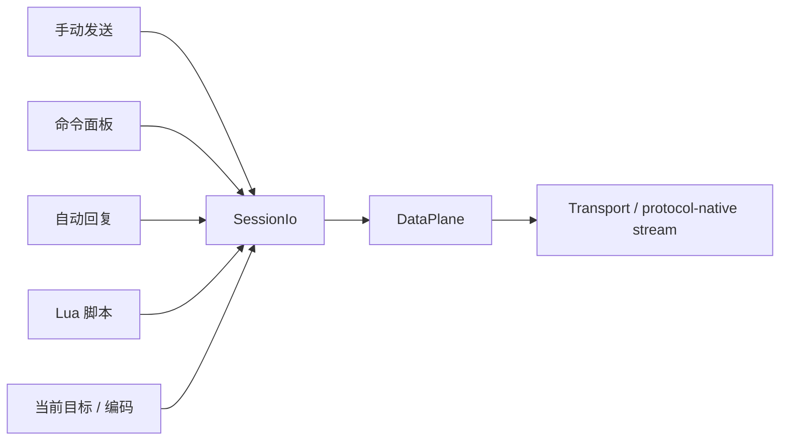

# 发送与自动化设计

## 目标

TauTerm 的发送能力既要支持人工调试，也要支持命令面板、自动回复和脚本。不同入口必须共享同一个 Session 发送语义，避免“手动发送能工作、脚本却走另一条路径”。

## 当前方案

全局 SendBar 是插件能力，而不是所有 Session 的固定 UI。Serial、SSH、Telnet、Network Debug 等声明支持时可使用；Local Shell、TFTP、iperf、TRDP、Modbus 由各自工作流完成操作，不强制显示发送栏。

对支持 SendBar 的 Session，基础发送、命令面板、自动回复和脚本共享 `SessionIo`。文本路径统一由 `SessionIo::send_text` 按 Session encoding 转码，HEX/raw 路径由 `SessionIo::send` 原样写入；Network Debug 的目标发送通过明确的 targeted capability 路由。所有流式 I/O 最终进入同一个 DataPlane，因此脚本、人工发送、统计和断开不会各自维护第二套 handle。

基础发送的手动发送与重复发送共用同一 payload 编码入口：文本模式只在这里追加 CRLF/LF/CR/None，HEX 模式直接生成 raw bytes；重复发送采用串行背压，只有上一次底层写入完成后才安排下一次发送，避免定时器堆叠并发写入。

SendBar 的四个模式不全部常驻 DOM，只挂载当前模式。真正需要跨模式保留的输入、选择和执行所有权由每个 Session 的 `SendBarContext` 保存；Command Set、Auto Reply Config 与 Lua Script 的定义则是跨 Session 复用的工程资产。

Command Set、Auto Reply Config 与 Lua Script 不把浏览器本地存储作为权威来源，统一保存到 Rust ConfigStore 的 `assets.*` 命名空间；WebView 内 `assetStore` 是这些 global asset 的单一内存协调层。同一 key 的写入串行执行，持久化成功后才广播，失败时回滚到最近一次已确认快照并显式报告错误。内置示例只在对应资产存储从未初始化时播种一次；显式空数组是合法用户状态。

工程资产的“当前选择”仍是会话态。每个 SendBar 可以选不同的命令集、自动回复配置或脚本；持久化 active key 只作为新挂载 SendBar 的默认值。Lua 编辑器代码是本会话草稿，共享脚本更新不能覆盖未保存的本地修改。

自动回复与 Lua Script 启动时使用不可变运行快照。SendBar 从启动请求发出开始占有执行权，直到启动失败、停止成功或会话断开后才释放；运行期间禁止切换会改变当前执行语义的状态。命令面板执行同样基于启动时选中命令的串行快照。

Network Debug 的目标选择由 SessionContext 拥有；`TargetBar` 只负责展示和选择，目标同步桥接把 TCP/UDP server 当前目标传给后端运行时。只有已连接的 Network Debug 会话才允许同步运行时副作用；断开、连接中或被新目标取代的异步同步不能产生陈旧状态。

## 数据流

接收方向由 `SessionDataPlane` subscription 分发到 UI、日志和脚本，不使用协议专属 callback registry。

## 设计边界

- SendBar 显示能力由插件 manifest/注册信息定义，Session 配置只能在支持范围内关闭，不能给不支持的插件强行开启。
- 自动回复与脚本必须受 Session 生命周期约束，断开后不能继续使用失效的运行时能力。
- Network Debug 目标属于会话状态；后端目标同步只在已连接 runtime 上执行，并继续严格校验目标能力。
- 文本编码和 raw bytes 明确分流，不能对 HEX/raw 数据做字符集二次转换。
- 重复发送和命令序列必须尊重底层写入背压，不能用不等待结果的固定间隔制造重叠发送。
- 自动化不能绕过协议模块的目标选择、安全确认、独占 lease 或连接状态。
- 脚本 VM/状态按 Session 隔离，避免不同连接共享不可控状态。
- 资产定义与会话选择、编辑草稿、执行所有权分离；`isRunning`、临时日志、当前 VM/DataPlane 不进入持久化资产。
- 破坏性二元确认统一使用公共 `ConfirmDialog`，不在 SendBar 内复制临时确认控件。

## 代码锚点

- `src/components/SendBar/`
- `src/components/SendBar/SendBarContext.tsx`
- `src/components/SendBar/sendPayload.ts`
- `src/components/SendBar/assetStore.ts`
- `src/components/SendBar/assetValidation.ts`
- `src/components/SendBar/useNetworkSendTargetSync.ts`
- `src-tauri/src/session/io.rs`
- `src-tauri/src/session/runtime.rs`
- `src-tauri/src/transport/runtime.rs`
- `src-tauri/src/kernel/script_engine/`
- `src-tauri/src/kernel/config_store.rs`
- `src/context/SessionContext.tsx`

## 回归检查

`npm run check:sendbar` 验证基础发送 payload、重复发送背压、导入 schema、会话态/工程资产边界、Network Debug 目标同步生命周期、执行锁和公共确认弹窗等关键合同，并作为 CI 的前端 hygiene 检查之一。

## 何时更新本文

修改 SendBar 能力模型、SessionIo 发送语义、目标/编码路径、工程资产所有权、自动回复、Lua API、脚本隔离或自动化与 Session 生命周期的关系时，必须同步更新本文。

Lua 5.4 与终端控制序列的权威入口见 [TERMINAL_SERIAL_AUTOMATION.md](../knowledge/TERMINAL_SERIAL_AUTOMATION.md)。