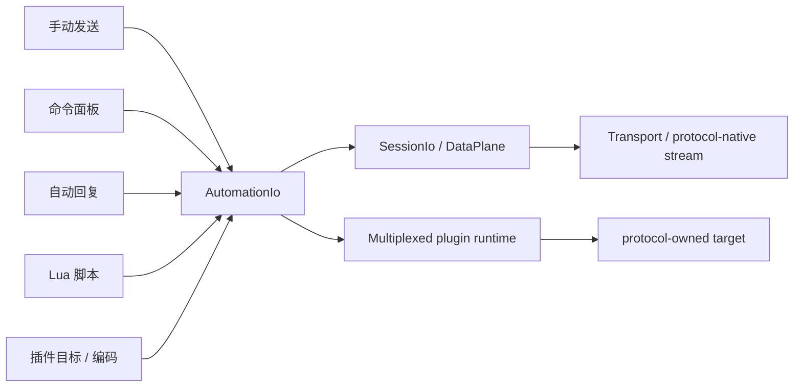

# 发送与自动化设计

## 目标

TauTerm 的发送能力既要支持人工调试，也要支持命令面板、自动回复和脚本。不同入口必须共享同一个 Session 发送语义，避免“手动发送能工作、脚本却走另一条路径”。

## 当前方案

全局 SendBar 是插件能力，而不是所有 Session 的固定 UI。Serial、SSH、Telnet、Network Debug、RTT 等声明支持时可使用；Local Shell、TFTP、iperf、TRDP、Modbus 由各自工作流完成操作，不强制显示发送栏。支持 SendBar 的插件还可以通过运行态 presentation contribution 临时隐藏 surface，例如 RTT 切入 SystemView 语义观察器时回收发送栏空间；隐藏只影响布局，不卸载该 Session 的 SendBar provider，也不能停止已经取得执行权的 Auto Reply/Lua。

SendBar 的人工与自动化入口统一依赖协议无关的 `AutomationIo`。普通流式 Session 由 `SessionIo/DataPlane` 直接实现该能力：文本路径按 Session encoding 转码，HEX/raw 原样写入；Network Debug 保留 targeted send；RTT 这类多路 Container Session 则提供自己的 bounded automation source 与 Down target，而不伪造根 `DataPlane`。因此 Basic/Command/Auto Reply/Lua 能复用同一 SendBar，同时协议仍保留自己的真实 I/O 模型。

基础发送的手动发送与重复发送共用同一 payload 编码入口：文本模式只在这里追加 CRLF/LF/CR/None，HEX 模式直接生成 raw bytes；重复发送采用串行背压，只有上一次底层写入完成后才安排下一次发送，避免定时器堆叠并发写入。

SendBar 的四个模式不全部常驻 DOM，只挂载当前模式。真正需要跨模式保留的输入、选择和执行所有权由每个 Session 的 `SendBarContext` 保存；Command Set、Auto Reply Config 与 Lua Script 的定义则是跨 Session 复用的工程资产。

SendBar 的垂直分割尺寸采用像素空间模型：用户调整的是主体高度，主体最小值直接由主题中的 `--sendbar-min-height` 解析，保证四个竖排模式按钮在启动状态和拖回最小状态具有完全相同的几何；`TargetBar` 是固定附加行，不参与主体比例换算。终端区域始终通过 flex 获取剩余高度，SendBar 总高度上限为主内容区的 80%，主内容区高度变化时重新钳制当前值。禁止把主体最小高度先换算为整数百分比再回算像素，以免产生不可逆的高度量化误差。

Command Set、Auto Reply Config 与 Lua Script 不把浏览器本地存储作为权威来源，统一保存到 Rust ConfigStore 的 `assets.*` 命名空间；WebView 内 `assetStore` 是这些 global asset 的单一内存协调层。同一 key 的写入串行执行，持久化成功后才广播，失败时回滚到最近一次已确认快照并显式报告错误。内置示例只在对应资产存储从未初始化时播种一次；显式空数组是合法用户状态。

工程资产的“当前选择”仍是会话态。每个 SendBar 可以选不同的命令集、自动回复配置或脚本；持久化 active key 只作为新挂载 SendBar 的默认值。Lua 编辑器代码是本会话草稿，共享脚本更新不能覆盖未保存的本地修改。

自动回复与 Lua Script 启动时使用不可变运行快照。SendBar 从启动请求发出开始占有执行权，直到启动失败、停止成功或会话断开后才释放；运行期间禁止切换会改变当前执行语义的状态。命令面板执行同样基于启动时选中命令的串行快照。 插件 TargetBar 也是该执行快照的一部分；执行锁存在时公共 SendBar 通过统一 `disabled` contract 禁用 Network/RTT 等目标控件，不能在运行中悄悄改写目标。

Network Debug 与 RTT 的目标选择都由各自插件 runtime store 拥有；公共 SendBar 只通过 `sendTarget` / `sendData` contribution 挂载目标选择和发送策略。Network 目标同步只在已连接 runtime 上执行。RTT 将“当前 Up automation receive source”和“当前 Down send target”建模为两个独立选择，重连 generation 变化后重新同步，不能假设同 index 一定双向；有多个普通 Up Channel 时，两者统一在 TargetBar 中选择，不再把接收源控件塞进 RTT viewer header。AutomationRx 在启动时捕获 Up source，因此运行中的 Auto Reply/Lua 不会因为用户浏览其它 RTT Channel 而改变输入流。

## 数据流

普通流式 Session 的接收方向由 `SessionDataPlane` subscription 分发。多路 Container Session 可以提供自己的 `AutomationRx`，但必须保持有界、独立订阅和明确来源选择；公共脚本引擎不解释协议 Channel。

## 设计边界

- SendBar 显示能力由插件 manifest/注册信息定义，Session 配置只能在支持范围内关闭，不能给不支持的插件强行开启；运行态 contribution 只能控制 presentation visibility，不能通过卸载 provider 改写自动化生命周期。
- SendBar 主体最小高度必须直接保持 CSS 定义的 canonical 像素值；拖高后再次拖到最小值必须与首次打开一致，不能通过百分比取整、向上取整或其它量化模型改变几何。
- 自动回复与脚本必须受 Session 生命周期约束，断开后不能继续使用失效的运行时能力。
- Network Debug/RTT 目标属于插件私有 Session runtime 状态；公共 SessionContext 不保存 peer/Channel 字段。RTT 的 Up automation source 与 Down send target 必须分离校验。
- 文本编码和 raw bytes 明确分流，不能对 HEX/raw 数据做字符集二次转换。
- 重复发送和命令序列必须尊重底层写入背压，不能用不等待结果的固定间隔制造重叠发送。
- 自动化不能绕过协议模块的目标选择、安全确认、独占 lease 或连接状态。
- 脚本 VM/状态按 Session 隔离，避免不同连接共享不可控状态。
- 资产定义与会话选择、编辑草稿、执行所有权分离；`isRunning`、临时日志、当前 VM/DataPlane 不进入持久化资产。
- 破坏性二元确认统一使用公共 `ConfirmDialog`，不在 SendBar 内复制临时确认控件。

## 代码锚点

- `src/components/SendBar/`
- `src/components/SendBar/SendBarContext.tsx`
- `src/components/SendBar/sendBarLayout.ts`
- `src/components/SendBar/useSendBarLayout.ts`
- `src/components/SendBar/sendPayload.ts`
- `src/components/SendBar/assetStore.ts`
- `src/components/SendBar/assetValidation.ts`
- `src/plugins/network/NetworkSendTarget.tsx`
- `src/plugins/network/runtime-store.ts`
- `src-tauri/src/session/io.rs`
- `src-tauri/src/session/runtime.rs`
- `src-tauri/src/transport/runtime.rs`
- `src-tauri/src/kernel/script_engine/`
- `src-tauri/src/kernel/config_store.rs`
- `src/context/SessionContext.tsx`

## 回归检查

`npm run check:sendbar` 验证基础发送 payload、重复发送背压、导入 schema、会话态/工程资产边界、Network Debug 目标同步生命周期、执行锁、公共确认弹窗以及发送栏像素级最小高度/TargetBar 附加高度等关键合同，并作为 CI 的前端 hygiene 检查之一。

## 何时更新本文

修改 SendBar 能力模型、布局尺寸合同、SessionIo 发送语义、目标/编码路径、工程资产所有权、自动回复、Lua API、脚本隔离或自动化与 Session 生命周期的关系时，必须同步更新本文。

Lua 5.4 与终端控制序列的权威入口见 [TERMINAL_SERIAL_AUTOMATION.md](../knowledge/TERMINAL_SERIAL_AUTOMATION.md)。