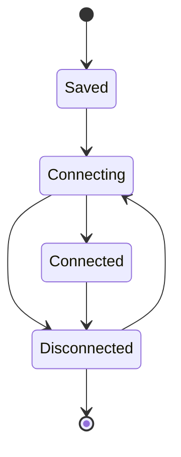

# 核心与会话架构

## 目标

核心层负责把不同协议统一成可管理的 Session，同时提供插件注册、I/O、状态、配置、日志和公共生命周期。它不负责解释某个协议的业务语义。

## 当前方案

后端以 Rust 核心作为 Session 生命周期的权威所有者。协议通过 Adapter/插件接入，连接后向核心提供同步或异步通道、侧通道能力，或容器型会话能力。前端插件注册表负责声明内容类型、发送栏等 UI 能力，React 只消费统一的 Session 状态和协议暴露的视图。

一个配置可以对应单个 Session，也可以由协议提供“一个父配置、多子终端/连接”的工厂能力。公共核心负责子会话编号、数量限制、状态与清理，协议只负责创建自身资源。

## 关键生命周期

连接、断开、异常退出和删除必须通过统一生命周期收敛。协议可以提供更细的内部状态，但不能绕过公共 Session 状态制造第二个连接真相。

## 设计边界

- 核心只拥有可复用机制，不加入 TRDP、SSH、串口等协议专属判断。
- 协议连接入口最终由统一的内核路由分发，避免多个前端入口各自实现连接逻辑。
- UI 能力由插件声明；例如 SendBar 是否适用属于插件能力，不由页面临时猜测。
- 运行时对象不能被当成持久化配置保存。
- 异常断开要留下足够状态供 UI 呈现，但清理资源仍由后端完成。
- 新协议优先复用现有 Session/Channel/SideChannel/Factory 模型，只有现有抽象无法表达稳定需求时才扩展核心。

## 代码锚点

- `src-tauri/src/kernel/`
- `src-tauri/src/channel/`
- `src-tauri/src/commands.rs`
- `src/core/plugin-registry.ts`
- `src/context/SessionContext.tsx`

## 何时更新本文

修改 Session 状态机、插件注册契约、公共连接路由、通道模型、父子会话模型、配置/日志公共职责时，必须同步更新本文。
