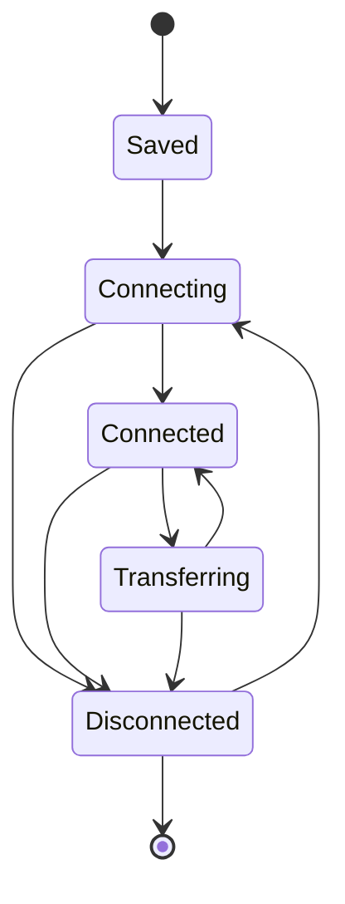

# 核心与会话架构

## 目标

核心层负责把不同协议统一成可管理的 Session，并提供插件注册、运行时 I/O 能力、状态、配置和公共生命周期。它不解释任何具体协议的业务语义。

## 当前方案

后端以 Rust `SessionStore` 作为用户可见 Session 生命周期的权威所有者。`PluginRuntime` 是插件身份、canonical manifest、通用 `ProtocolAdapter` 与类型化 contribution 的唯一后端目录；只有应用 composition root 知道有哪些具体内建插件，`AppState` 不再为 Serial、SSH、Telnet 等维护平行 adapter 字段。协议 Adapter 负责建立协议资源，并以 `ProtocolConnection` 返回 `DataPlaneRuntime`、可选 `SessionService`、显式 `FileTransfer` capability、可选子终端工厂和 attach hook 等明确能力；核心把 DataPlane 绑定为 `SessionDataPlane + SessionIo`，统一承担收发、订阅、统计、终端 resize 和独占 I/O lease。

Transport、Protocol、Session Runtime 三层职责固定：Transport 只拥有串口/TCP/UDP/PTY 等物理或系统资源；Protocol 解释 Telnet、Modbus、SSH 等协议语义；Session Runtime 负责生命周期、事件、日志、脚本、统计、子连接和取消。协议不得复制公共 Session 生命周期，Session Runtime 也不得解析协议字段。

一个配置可以对应单个 Session，也可以由协议提供“一个父配置、多子终端/peer”的工厂能力。公共核心负责子连接编号、活动根 Session 资源预算、状态与清理，协议只负责创建自身资源。Network peer 和 SSH/local-shell 子终端都使用同一 `SubConnection` 生命周期；是否显示为独立 tab 属于表现能力，而不是第二套后端模型。

Saved Session Library 是独立的版本化磁盘配置集合，不受活动运行时数量预算约束。Runtime Session 只消费稳定配置，不把 socket、PTY、DataPlane、任务、计数器等运行态写回 Library；Library 只允许通过显式保存、删除、重命名与参数事务入口修改。Session Library、ConfigStore 与 SSH known-host 等 TauTerm 自有 JSON 状态通过共享原子写入边界提交，新快照完整写入后才替换旧文件。

Tauri command 按阻塞风险分类：纯内存/短锁读取可以同步；文件系统、进程、凭据后端、驱动/平台探测、thread join 等潜在阻塞工作必须使用 async command，并在需要时进入 blocking worker。端点发现同样是配置辅助能力，不属于 Session 生命周期；前端进入配置页时按需请求，后端不得让硬件枚举阻塞 UI。

前端 `PluginRegistry` 是唯一运行时插件注册目录；`plugin-contracts.ts` 只提供不依赖 React、i18n 或 SessionContext 的稳定类型合同，不建立第二套 registry。连接表单可以通过 `PluginRegistration.isConnectionConfigValid(params)` 声明“允许创建/保存 Session”的最低条件，插件也可以通过 `persistedConnectionParams`、`reconnectGuard` 与 `sessionPresentation` 分别拥有持久化参数投影、重连前置策略和会话展示格式。统一 Session/UI 层只调用这些 contribution，不按 SSH、TFTP、TRDP 等具体插件 ID 复制同一业务规则。

## 关键生命周期

`Transferring` 只表示 Session 的 inline 独占资源被传输任务占用；真实底层资源仍归 DataPlane Runtime 所有。连接、断开、异常退出、子连接关闭和传输结束必须通过统一生命周期收敛。

## 设计边界

- 核心只拥有可复用机制，不加入 TRDP、SSH、Modbus、串口等协议专属判断；`kernel/` 不允许依赖 `crate::plugins::*`。
- 协议连接入口由 `PluginRuntime` 中注册的类型化 Session connector contribution 分发；公共 `connect_session` 不按插件 ID `match`。新增内建插件只在 composition root 注册 manifest、Adapter/能力和 connector。`connect_session`、端点枚举和保存配置都要求显式 `plugin_id`，公共层不提供 Serial 等具体插件的兼容默认值。
- 插件专属运行态必须由插件对象或 Session capability 持有，不把 SSH known-host verifier、协议 runtime registry 等字段泄漏到 `AppState`。Adapter 需要按 `session_id` 查找专属 runtime 时使用 `SessionRuntimeRegistry<T>`：索引实例由 Adapter 持有且只保存 `Weak<T>`，SessionStore capability graph 仍是唯一强生命周期 owner；禁止模块级 `OnceLock`/静态 runtime registry。
- 前端只保留一个 `PluginRegistry`。依赖无关的 contract 可以独立成类型模块，但不得为了绕过循环依赖再镜像插件注册数据；会话 presentation、持久化参数投影、重连策略、状态栏项和自定义视图均由插件 registration 直接声明。
- 通用前端状态/渲染合同只包含协议无关字段。Serial 虚拟端口、SSH journald/文件服务、Network peer、TRDP A/B 链路等私有运行态不能为了某个 renderer 的便利继续扩张 `StatusBarContext`、通用 presentation helper 或其它公共 registry contract；插件 renderer 应通过自己的 Session/plugin store 获取私有状态。
- UI 能力由插件 manifest/registration 声明；SendBar、自定义视图、连接配置合法性等不由页面临时猜测。
- 运行时对象不能被持久化为 Session 配置；插件需要从编辑态参数剥离凭据或其它瞬态字段时，通过自己的持久化投影 contribution 完成，公共 Session 层不解释字段名。
- 所有流式 Session 都通过 `SessionIo/DataPlane` 发送、订阅和关闭，不建立协议专属第二套发送总线。
- 需要独占主字节流的操作使用 `SessionIo::acquire_exclusive`；不转移底层 handle 所有权。
- PTY resize、targeted send、多 peer、SFTP 等属于独立 capability，不塞进万能 stream trait。文件传输 provider 的具体执行策略只存在于 `transfer/`；Kernel 仅传递不透明传输协议 ID，不维护 X/Y/ZModem、SFTP 等 provider 名称或执行模式。
- 异常断开必须保留足够信息供 UI 呈现，同时后端负责确定性资源清理。
- 新协议优先组合 Transport + Protocol + Session Runtime 现有能力；只有稳定需求无法表达时才扩展公共契约。新增协议的常规路径应只新增插件目录、canonical manifest 与 composition-root 注册，不修改公共 Session presentation/status contract。

## 代码锚点

- `src-tauri/src/kernel/session_store.rs`
- `src-tauri/src/kernel/plugin_adapter.rs`
- `src-tauri/src/kernel/plugin_runtime.rs`
- `src-tauri/src/session/io.rs`
- `src-tauri/src/session/runtime.rs`
- `src-tauri/src/transport/runtime.rs`
- `src-tauri/src/kernel/config_store.rs`
- `src-tauri/src/kernel/persistence.rs`
- `src-tauri/src/commands.rs`
- `src-tauri/src/commands/`
- `src/core/plugin-contracts.ts`
- `src/core/plugin-registry.ts`
- `src/context/SessionContext.tsx`

## 单一来源约束

内建插件元数据位于 `src/plugin-manifests/*.json`，TypeScript `PluginRegistry` 与 Rust `PluginRuntime` 都消费这组 canonical manifest。前端 registry 只叠加 UI/application contribution，重复插件 ID 直接失败；不存在独立的 Session presentation registry。后端 runtime 将 manifest、可选 `ProtocolAdapter` 与类型化 contribution 收敛为单一注册记录，并在启动时校验 Adapter 自声明 ID 与 manifest ID 一致。Session 运行时生命周期仍只由 `SessionStore` 负责。

分屏/Workspace Layout 的真实 owner 是前端 SplitLayoutContext + `core/split-layout.ts`；不保留未接入运行时的平行 WindowManager/TabHost/IPC 骨架。通用 Tauri invoke/event 是当前 IPC 边界。

架构回归测试不仅检查 Rust import 方向，也检查前端公共 plugin/status/presentation contract 不重新引入具体协议字段或 built-in plugin 分支。插件扩展性属于可执行架构约束，而不是仅靠文档约定。

## 何时更新本文

修改 Session 状态机、插件注册契约、公共连接路由、DataPlane/SessionIo 能力、父子会话模型或配置公共职责时，必须同步更新本文。

Transport/DataPlane 细节见 [TRANSPORT_RUNTIME.md](TRANSPORT_RUNTIME.md)；共享文件传输见 [TRANSFER.md](TRANSFER.md)；数据批处理/日志见 [OBSERVABILITY_TOOLS.md](OBSERVABILITY_TOOLS.md)。
