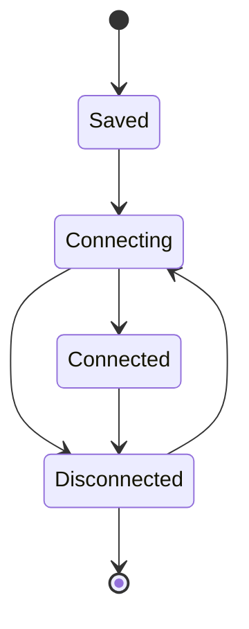

# 核心与会话架构

## 目标

核心层负责把不同协议统一成可管理的 Session，同时提供插件注册、主 I/O 所有权、状态、配置和公共生命周期。它不负责解释某个协议的业务语义。

## 当前方案

后端以 Rust 核心作为 Session 生命周期的权威所有者。协议通过 Adapter/插件接入，连接后向核心提供同步或异步通道、侧通道能力，或容器型会话能力。前端插件注册表负责声明内容类型、发送栏等 UI 能力，React 只消费统一的 Session 状态和协议暴露的视图。

一个配置可以对应单个 Session，也可以由协议提供“一个父配置、多子终端/连接”的工厂能力。公共核心负责子会话编号、活动根 Session 资源预算、状态与清理，协议只负责创建自身资源。Saved Session Library 是独立的版本化磁盘配置集合，不受活动运行时数量预算约束。Runtime Session 只消费这份配置，不再在 connect/disconnect/channel 生命周期中把当前运行态反向 bulk-save 到 Library；Library 只允许通过显式的单 Session 保存、删除、重命名与参数事务入口修改。Session Library、ConfigStore 与 SSH known-host 等 TauTerm 自有 JSON 状态通过共享原子写入边界提交：新快照完整写入后才替换旧文件；read-modify-write 遇到读取 I/O 错误必须失败而不是把现有状态当成空集合继续覆盖。

Tauri command 按阻塞风险分类：纯内存/短锁读取可以保持同步；文件系统、进程、凭据后端、驱动/平台探测、thread join 等潜在阻塞工作必须使用 async command，并在需要等待阻塞资源时进入 blocking worker。CI 会阻止这些风险重新进入同步 command 分发路径。配置/主题与平台命令已从单体 `commands.rs` 拆入职责子模块，公共 invoke 名称保持不变。

端点发现属于配置辅助能力，不属于 Session 生命周期。前端按当前协议进入配置页时才请求发现，并复用短时缓存；后端对可能阻塞的平台/硬件枚举放到 blocking worker，避免设备驱动或平台命令拖住应用 UI。

## 关键生命周期

连接、断开、异常退出和删除必须通过统一生命周期收敛。协议可以提供更细的内部状态，但不能绕过公共 Session 状态制造第二个连接真相。

## 设计边界

- 核心只拥有可复用机制，不加入 TRDP、SSH、串口等协议专属判断。
- 协议连接入口最终由统一的内核路由分发，避免多个前端入口各自实现连接逻辑。
- UI 能力由插件声明；例如 SendBar 是否适用属于插件能力，不由页面临时猜测。
- 运行时对象不能被当成持久化配置保存。
- 异常断开要留下足够状态供 UI 呈现，但清理资源仍由后端完成；同步/异步 I/O loop 必须自动覆盖读写、部分写、取消、Shutdown 与注入失败路径。
- 新协议优先复用现有 Session/Channel/SideChannel/Factory 模型，只有现有抽象无法表达稳定需求时才扩展核心。

## 代码锚点

- `src-tauri/src/kernel/session_store.rs`
- `src-tauri/src/kernel/plugin_adapter.rs`
- `src-tauri/src/kernel/plugin_host.rs`
- `src-tauri/src/kernel/config_store.rs`
- `src-tauri/src/kernel/persistence.rs`
- `src-tauri/src/channel/`
- `src-tauri/src/commands.rs`、`src-tauri/src/commands/`
- `src/core/plugin-registry.ts`
- `src/context/SessionContext.tsx`

## 何时更新本文

修改 Session 状态机、插件注册契约、公共连接路由、通道模型、父子会话模型或配置公共职责时，必须同步更新本文。

共享文件传输由 [TRANSFER.md](TRANSFER.md) 负责；数据批处理/日志由 [OBSERVABILITY_TOOLS.md](OBSERVABILITY_TOOLS.md) 负责；应用壳/i18n/Settings 由 [UI_FOUNDATION.md](UI_FOUNDATION.md) 负责。

## 单一来源约束

内建插件元数据位于 `src/plugin-manifests/*.json`，TypeScript PluginRegistry 与 Rust PluginHost 都消费这组 canonical manifest。PluginHost 不再维护独立生命周期 descriptor；Session 运行时生命周期由 SessionStore 负责。

分屏/Workspace Layout 的真实 owner 是前端 SplitLayoutContext + `core/split-layout.ts`；不保留未接入运行时的平行 WindowManager/TabHost/IPC 骨架。通用 Tauri invoke/event 是当前 IPC 边界。
