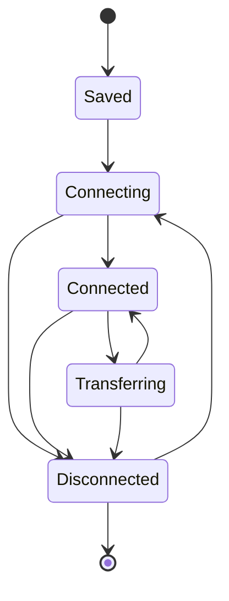

# 核心与会话架构

## 目标

核心层负责把不同协议统一成可管理的 Session，并提供插件注册、运行时 I/O 能力、状态、配置和公共生命周期。它不解释任何具体协议的业务语义。

## 当前方案

后端以 Rust `SessionStore` 作为用户可见 Session 生命周期的权威所有者。协议 Adapter 负责建立协议资源，并以 `ProtocolConnection` 返回 `DataPlaneRuntime`、可选 `SessionService`、显式 `FileTransfer` capability、可选子终端工厂和 attach hook 等明确能力；核心把 DataPlane 绑定为 `SessionDataPlane + SessionIo`，统一承担收发、订阅、统计、终端 resize 和独占 I/O lease。

Transport、Protocol、Session Runtime 三层职责固定：Transport 只拥有串口/TCP/UDP/PTY 等物理或系统资源；Protocol 解释 Telnet、Modbus、SSH 等协议语义；Session Runtime 负责生命周期、事件、日志、脚本、统计、子连接和取消。协议不得复制公共 Session 生命周期，Session Runtime 也不得解析协议字段。

一个配置可以对应单个 Session，也可以由协议提供“一个父配置、多子终端/peer”的工厂能力。公共核心负责子连接编号、活动根 Session 资源预算、状态与清理，协议只负责创建自身资源。Network peer 和 SSH/local-shell 子终端都使用同一 `SubConnection` 生命周期；是否显示为独立 tab 属于表现能力，而不是第二套后端模型。

Saved Session Library 是独立的版本化磁盘配置集合，不受活动运行时数量预算约束。Runtime Session 只消费稳定配置，不把 socket、PTY、DataPlane、任务、计数器等运行态写回 Library；Library 只允许通过显式保存、删除、重命名与参数事务入口修改。Session Library、ConfigStore 与 SSH known-host 等 TauTerm 自有 JSON 状态通过共享原子写入边界提交，新快照完整写入后才替换旧文件。

Tauri command 按阻塞风险分类：纯内存/短锁读取可以同步；文件系统、进程、凭据后端、驱动/平台探测、thread join 等潜在阻塞工作必须使用 async command，并在需要时进入 blocking worker。端点发现同样是配置辅助能力，不属于 Session 生命周期；前端进入配置页时按需请求，后端不得让硬件枚举阻塞 UI。

前端插件连接表单可以通过 `PluginRegistration.isConnectionConfigValid(params)` 声明“允许创建/保存 Session”的最低条件。统一 `ConnectDialog` 同时用它控制确认按钮和创建入口；协议专属必填规则留在插件中，公共对话框只消费布尔结果，不增加 Modbus、TRDP 等协议分支。

## 关键生命周期

`Transferring` 只表示 Session 的 inline 独占资源被传输任务占用；真实底层资源仍归 DataPlane Runtime 所有。连接、断开、异常退出、子连接关闭和传输结束必须通过统一生命周期收敛。

## 设计边界

- 核心只拥有可复用机制，不加入 TRDP、SSH、Modbus、串口等协议专属判断。
- 协议连接入口最终由统一内核路由分发，避免前端入口各自实现连接生命周期。
- UI 能力由插件 manifest/registration 声明；SendBar、自定义视图、连接配置合法性等不由页面临时猜测。
- 运行时对象不能被持久化为 Session 配置。
- 所有流式 Session 都通过 `SessionIo/DataPlane` 发送、订阅和关闭，不建立协议专属第二套发送总线。
- 需要独占主字节流的操作使用 `SessionIo::acquire_exclusive`；不转移底层 handle 所有权。
- PTY resize、targeted send、多 peer、SFTP 等属于独立 capability，不塞进万能 stream trait。
- 异常断开必须保留足够信息供 UI 呈现，同时后端负责确定性资源清理。
- 新协议优先组合 Transport + Protocol + Session Runtime 现有能力；只有稳定需求无法表达时才扩展公共契约。

## 代码锚点

- `src-tauri/src/kernel/session_store.rs`
- `src-tauri/src/kernel/plugin_adapter.rs`
- `src-tauri/src/kernel/plugin_host.rs`
- `src-tauri/src/session/io.rs`
- `src-tauri/src/session/runtime.rs`
- `src-tauri/src/transport/runtime.rs`
- `src-tauri/src/kernel/config_store.rs`
- `src-tauri/src/kernel/persistence.rs`
- `src-tauri/src/commands.rs`
- `src-tauri/src/commands/`
- `src/core/plugin-registry.ts`
- `src/context/SessionContext.tsx`

## 单一来源约束

内建插件元数据位于 `src/plugin-manifests/*.json`，TypeScript PluginRegistry 与 Rust PluginHost 都消费这组 canonical manifest。PluginHost 不维护平行生命周期 descriptor；Session 运行时生命周期由 SessionStore 负责。

分屏/Workspace Layout 的真实 owner 是前端 SplitLayoutContext + `core/split-layout.ts`；不保留未接入运行时的平行 WindowManager/TabHost/IPC 骨架。通用 Tauri invoke/event 是当前 IPC 边界。

## 何时更新本文

修改 Session 状态机、插件注册契约、公共连接路由、DataPlane/SessionIo 能力、父子会话模型或配置公共职责时，必须同步更新本文。

Transport/DataPlane 细节见 [TRANSPORT_RUNTIME.md](TRANSPORT_RUNTIME.md)；共享文件传输见 [TRANSFER.md](TRANSFER.md)；数据批处理/日志见 [OBSERVABILITY_TOOLS.md](OBSERVABILITY_TOOLS.md)。
