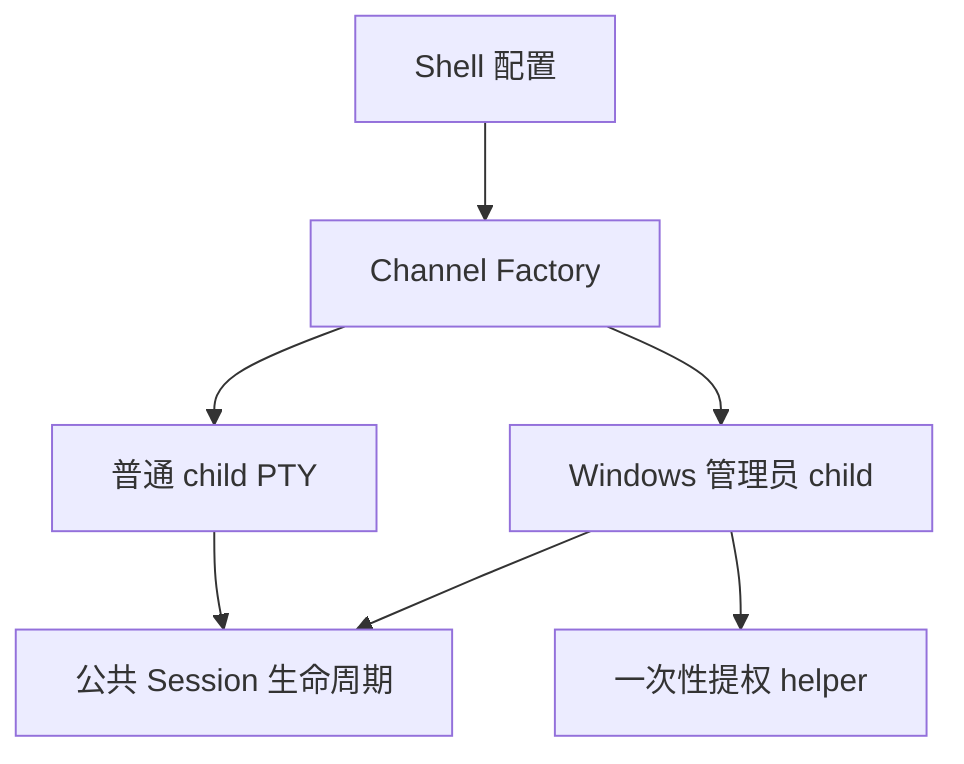

# Local Shell 设计

## 目标

Local Shell 让本机命令行与远端/设备 Session 使用同一套终端工作区，同时保持本地进程、工作目录和权限语义清晰。

## 当前方案

Shell 预设发现属于配置辅助能力，只在进入 Local Shell 配置页时按需执行。自动发现结果以实际探测到的组件名称为主体；仅在有助于区分来源时保留必要分类，例如 WSL 发行版显示为 `WSL · <注册发行版名称>`，不再生成编号或泛化别名。Windows 上的 WSL 发行版探测运行在后台 blocking worker，并设置有限等待时间；平台命令异常或 WSL 服务不可用时只跳过对应预设，不能阻塞配置页面或 Session 核心。

Local Shell 通过平台原生 PTY 创建终端：

- Windows 使用 ConPTY；
- Linux/macOS 使用 Unix PTY。

一个保存配置可以作为父 Session 创建多个独立本地终端。公共核心负责 child lifecycle，Local Shell 工厂负责解析 shell、参数、工作目录并创建对应进程。

Windows 的“以管理员身份新建”只提升某一个 child terminal。主 TauTerm 进程保持普通权限，通过一次性受控 helper/本地 IPC 建立管理员 ConPTY；拒绝 UAC 不产生 child。WSL 仍按 Linux 环境语义运行，不使用该 Windows 原生提权路径。

## 关键数据流

## 设计边界

- 主应用不因管理员 Shell 整体提权。
- 管理员属性属于单个运行时 child，不写回父配置。
- 每个 child 是独立进程/PTY，不共享 shell 进程状态。
- Local Shell 使用终端搜索、尺寸与日志能力，但不启用远端传输或全局 SendBar。
- shell 发现只提供可解释的候选；自定义 executable、参数和工作目录必须保持独立字段，避免命令字符串拼接。

## 代码锚点

- `src/plugins/local-shell/`
- `src-tauri/src/plugins/local_shell/`
- `src-tauri/src/kernel/session_store.rs`
- Windows helper 与启动边界位于 `src-tauri/src/`

## 何时更新本文

修改 PTY 后端、shell 解析/发现、父子会话、管理员 child、IPC/权限边界时，必须同步更新本文。
