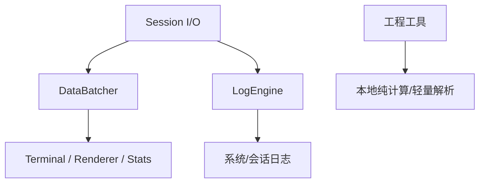

# 数据、日志与工程工具设计

## 目标

这一模块覆盖两类共享能力：

1. **可观测性数据路径**：高频 Session 数据如何送往前端、如何记录日志、如何形成统计；
2. **无连接工程工具**：校验、编码、位操作、数值转换和轻量协议解析等不应绑定某个协议 Session 的辅助能力。

它们都属于跨协议公共能力，但不能因此进入协议核心状态机。

## 当前方案

### 数据批处理

高频接收数据先在 Rust 侧按短时间窗口和大小阈值合并，再以 Base64 事件发送前端，降低大量小包造成的 IPC/JSON/渲染开销。关闭时必须 flush 已缓存数据。

### 日志

LogEngine 使用有界生产者/消费者队列和独立写线程处理系统日志与 Session 数据日志。日志写入、滚动、格式化和敏感信息清理由后端统一完成；设置页只控制公开配置，不直接管理文件句柄。

### 统计与工程工具

Stats renderer/状态区消费 Session 统计信息。右侧工程工具中的 CRC/Checksum、Base64/HEX/浮点/大小端、位运算、计算器以及 Modbus/AT 解析器是无连接辅助工具；它们不得被宣传成完整协议实现或协议合规验证器。

## 数据流

## 设计边界

- 高频数据批处理不能改变字节顺序和 Session 归属。
- 丢包、队列满或截断必须可观察，不能静默制造“完整数据”的假象。
- 日志路径必须通过统一 sanitizer 处理敏感字段。
- 工程工具默认是本地纯函数式能力，不应暗中建立网络连接。
- Modbus/AT 等 parser 只解析它明确支持的范围；协议标准依据记录在 `docs/knowledge/`，不能把工具 UI 当成标准。
- 性能参数只有在成为长期合同后才写入本文；具体实现常量仍留在代码。

## 代码锚点

- `src-tauri/src/kernel/data_batcher.rs`
- `src-tauri/src/kernel/log_engine.rs`
- `src-tauri/src/kernel/log_writer.rs`
- `src/components/Tools/`
- `src/renderers/StatsDashboardRenderer.tsx`
- `src/components/Settings/panels/LoggingSettings.tsx`

## 何时更新本文

修改数据批处理语义、日志数据模型/信任边界、统计所有权、工程工具范围或轻量协议 parser 的定位时，必须同步更新本文。
