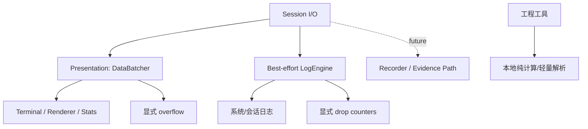

# 数据、日志与工程工具设计

## 目标

这一模块覆盖两类共享能力：

1. **可观测性数据路径**：高频 Session 数据如何送往前端、如何记录日志、如何形成统计；
2. **无连接工程工具**：校验、编码、位操作、数值转换和轻量协议解析等不应绑定某个协议 Session 的辅助能力。

它们都属于跨协议公共能力，但不能因此进入协议核心状态机。

## 当前方案

### 数据批处理

高频接收数据先在 Rust 侧按短时间窗口和大小阈值合并，再以 Base64 事件发送前端，降低大量小包造成的 IPC/JSON/渲染开销。关闭时必须 flush 已缓存数据。

DataBatcher 属于 **Presentation Path**：极端过载时允许丢弃显示数据块以保护 UI，但每次丢弃都会累计计数，并按 1/2/4/8… 次节流发送 `session-display-overflow`；同一节流规则也用于后端 overflow warning，避免在过载时用日志本身制造新的队列压力。这个降级语义不能复制到未来 Recorder/Evidence Path。

### 日志

LogEngine 使用有界生产者/消费者队列和独立写线程处理系统日志与 Session 数据日志。两者拥有独立启用语义：`system_enabled/system_level` 只控制应用诊断日志，`session_enabled` 只控制 Session 数据日志；任一开关不能短路另一类日志的生命周期。Session Data Log 关闭时生产者直接停止入队，不能继续用“最终会被消费者丢弃”的数据占满共享队列。

日志队列溢出和实际文件写失败分别归入对应的 `dropped_system_entries` / `dropped_session_entries`，通过 `get_log_health` 暴露给设置 UI。System Log 文件自身无法打开/写入时，消费者不得再调用同一个 `log` bridge 递归记录该失败；只使用 stderr 诊断并累计 loss counter。出现非零计数时必须提示相关日志可能不完整，不能把 best-effort Session Log 描述为工程证据记录。

日志设置由 Rust ConfigStore 持久化；设置页只消费公开配置，不直接拥有文件句柄或浏览器本地持久化。相关设置以一个 ConfigStore snapshot 先持久化、后应用运行态；若 LogEngine 运行态应用失败，必须恢复旧 ConfigStore snapshot 并把失败显式返回给 UI。ConfigStore 未成功绑定磁盘时读写必须显式失败，不能退化成“仅本进程成功”。“清除所有日志”也由唯一持有 writer 的消费者线程执行 close/flush → delete → reopen → ACK，避免 Windows 打开句柄删除失败或 Linux unlink 后继续向不可见 inode 写入。 启动 Session Log 与清除日志的 ACK 等待必须运行在 blocking worker，而不是占用同步 Tauri 命令分发路径；日志控制命令使用有界队列的 fail-fast 入队语义，队列过载时向 UI 明确返回错误，不能为了等待控制队列而冻结界面。

### 诊断与性能合同

前端未捕获异常通过受限诊断桥进入 System Log。Settings/About 可以导出版本化、脱敏的诊断 JSON，包含构建/平台信息、ConfigStore/凭据后端健康、日志丢失计数、插件元数据与按插件聚合的 Session 状态；凭据、端点、Session 名称、raw payload、System Log 内容与 Session Data Log 不进入诊断包。保存路径由 Rust 发起的 native dialog 决定，WebView 不接收任意目标路径。

性能与长稳验证是独立工程合同：release-mode performance workflow 记录固定 32 MiB I/O dispatch 与原子持久化的趋势数据；reliability workflow 反复创建/发送/Shutdown I/O 生命周期并输出 JSON。Hosted Runner 的性能数值在形成稳定历史前只作为趋势证据，不凭单次波动设置拍脑袋阈值。

### 统计与工程工具

Stats renderer/状态区消费 Session 统计信息。右侧工程能力分成两个明确层级：

1. **Protocol Inspector / 协议检查器**：对用户显式提供的一段文本或字节做离线识别、字段解释、校验与诊断；
2. **Quick Tools / 快捷工具**：对字节、数值、CRC、编码、位、C 结构布局与常用工程参数做本地纯计算。

两者都属于无连接能力，不创建 socket、串口或远端 Session，也不自动订阅 Session I/O。

#### Protocol Inspector

协议检查器使用 `src/protocols/` 下的注册式模型，而不是在 UI 组件中按协议堆叠条件分支。所有 Inspector 输出统一包含：

- 带 `byte` / `char` 单位的字段 range，可与原始数据联动高亮；
- 独立的结构、checksum、协议语义 check；
- 带 severity 与可选 range 的 issue；
- 自动识别结果与置信度；
- 对有请求/响应语义的协议保留显式 direction。

当前 Inspector 覆盖：

- Modbus RTU：CRC-16/MODBUS、常用 01/02/03/04/05/06/0F/10 请求/响应与异常响应；
- Modbus ASCII：ASCII HEX/LRC 与同一套 Modbus PDU 解释；
- Modbus TCP：MBAP + PDU，不错误附加串行 CRC/LRC 语义；
- AT 文本：命令回显、信息响应/URC、prompt、最终结果与通用参数拆分；
- NMEA 0183：语句/talker/type/字段与 XOR checksum，常用 GGA/RMC 字段提供通用解释；
- Raw Frame：只展示规范化字节，不暗示存在协议语义；
- Custom Schema：用本地 JSON schema 描述固定 offset 的整数、浮点、bytes、ASCII/UTF-8、reserved、bitfield、enum/expected 约束、固定/remaining/`lengthFrom` 长度与可选 CRC 字段。动态长度只能引用此前已经解析出的非负整数字段，非法引用或越界必须失败关闭。

自动识别只在高置信模式下识别有明显 framing/checksum 特征的协议；无法可靠判断的 HEX 退化为 Raw Frame，普通文本退化为低置信 AT/Text 分析，不能伪造确定协议结论。

**未来 Modbus Session 与这里不是两套产品能力。** Inspector 是离线 decoder/validator；未来在线 Modbus Session 负责 Serial/TCP transport、request lifecycle、polling、timeout/retry、设备数据视图。功能码、PDU/ADU、异常码和 validation 规则必须复用同一个 canonical Modbus protocol core，禁止分别在 Session 与 Inspector 中维护两份功能码表和解析逻辑。

#### Quick Tools

工程工具使用统一的严格 ByteInput parser；支持连续 HEX、分隔 HEX、`0x` token、`\xHH`、冒号/横线和 C 数组形式。任何非法 token、奇数 nibble 或不完整 endian group 都失败关闭，不能部分解析后返回看似有效的结果。纯函数错误统一返回 typed `ToolResult`，UI 再完成本地化，不再用 `[Error: ...]` 字符串作为业务协议。

当前快捷工具包含：

- **Data Inspector**：同一份 bytes 同时解释为 HEX、ASCII/control、严格 UTF-8、8/16/32/64 位 signed/unsigned、BE/LE、Float32/64 与合法 Packed BCD；
- **CRC Lab**：SUM8/16/32、XOR、规范化 CRC-8/16/32 presets、公开参数/check vector、自定义 Poly/Init/RefIn/RefOut/XorOut、尾部 CRC 验证与 BE/LE 追加；
- **Encoding**：UTF-8/HEX、严格 Base64 与可选忽略空白兼容模式、URL、任意精度整数进制、Float32/64、16/32/64-bit endian、Packed BCD；
- **Bits / C Layout**：8/16/32/64-bit BigInt 位运算、signed/unsigned 结果、bit toggle/range mask，以及 ILP32/LP64/LLP64 + packing 的 C 结构布局估算；
- **Engineering**：串口 frame timing、Unix/HEX timestamp、IPv4/CIDR 与 Byte Diff。

C 结构布局不是编译器 ABI 认证器；位域、嵌套 struct/union 和未知类型失败关闭。文本转 bytes 的默认工程语义是 UTF-8；HEX → UTF-8 默认 strict/fatal，非法序列不能静默变成 replacement character。

Quick Tools 的各 tab 保持 mounted，因此在同一个 Session 的右侧栏中切换 tab 不会丢失当前输入。协议检查器、Data Inspector、Encoding 和 Checksum 记录最近 10 条有效输入并允许运行态固定；历史只存在于当前前端组件生命周期，不写入磁盘，也不进入 Session Library/Workspace 持久化资产模型。

Session 与 Inspector 之间只允许**用户显式数据桥**：xterm 选区可通过右键“在协议检查器中查看所选内容”发送，Dual/HEX 视图可对单行完整 HEX 帧执行同类动作。事件携带 `sessionId` 并只由对应 Session 的 Inspector 消费，同时显式展开右侧栏。Inspector 不自动监听后台 RX/TX、不复制所有 Session 流量，也不因此承担 Recorder/Evidence Path 职责。

CRC canonical `123456789` check vector、严格 byte parsing、64-bit conversion/bitops、ABI layout、Modbus RTU/ASCII/TCP、AT、NMEA、Custom Schema、Data Inspector 与工程换算由 `npm run check:engineering-tools` 的合同测试覆盖，并作为 CI gate。

## 数据流

## 设计边界

- 高频数据批处理不能改变字节顺序和 Session 归属。
- 丢包、队列满或截断必须可观察，不能静默制造“完整数据”的假象。
- 日志路径必须通过统一 sanitizer 处理敏感字段。
- 工程工具默认是本地纯函数式能力，不应暗中建立网络连接。
- Modbus/AT 等 parser 只解析它明确支持的范围；协议标准依据记录在 `docs/knowledge/`，不能把工具 UI 当成标准。
- 性能参数只有在成为长期合同后才写入本文；具体实现常量仍留在代码。Benchmark 输出是回归趋势证据，不是产品宣传跑分。
- Diagnostic Bundle 只能包含经过明确白名单选择和脱敏的信息，不能变成绕过日志/凭据边界的数据导出通道。

## 代码锚点

- `src-tauri/src/kernel/data_batcher.rs`
- `src-tauri/src/kernel/log_engine.rs`
- `src-tauri/src/kernel/log_writer.rs`
- `src/components/Tools/`
- `src/renderers/StatsDashboardRenderer.tsx`
- `src/components/Settings/panels/LoggingSettings.tsx`

## 何时更新本文

修改数据批处理语义、日志数据模型/信任边界、统计所有权、工程工具范围或轻量协议 parser 的定位时，必须同步更新本文。
