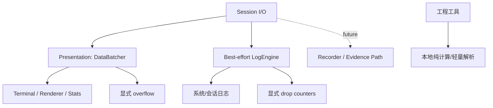

# 数据、日志与工程工具设计

## 目标

这一模块覆盖两类共享能力：

1. **可观测性数据路径**：高频 Session 数据如何送往前端、如何记录日志、如何形成统计；
2. **无连接工程工具**：校验、编码、位操作、数值转换和轻量协议解析等不应绑定某个协议 Session 的辅助能力。

它们都属于跨协议公共能力，但不能因此进入协议核心状态机。

## 当前方案

### 数据批处理

高频接收数据先在 Rust 侧按短时间窗口和大小阈值合并，再以 Base64 事件发送前端，降低大量小包造成的 IPC/JSON/渲染开销。关闭时必须 flush 已缓存数据。

DataBatcher 属于 **Presentation Path**：极端过载时允许丢弃显示数据块以保护 UI，但每次丢弃都会累计计数，并按 1/2/4/8… 次节流发送 `session-display-overflow`；同一节流规则也用于后端 overflow warning，避免在过载时用日志本身制造新的队列压力。这个降级语义不能复制到未来 Recorder/Evidence Path。

### 日志

LogEngine 使用有界生产者/消费者队列和独立写线程处理系统日志与 Session 数据日志。两者拥有独立启用语义：`system_enabled/system_level` 只控制应用诊断日志，`session_enabled` 只控制 Session 数据日志；任一开关不能短路另一类日志的生命周期。Session Data Log 关闭时生产者直接停止入队，不能继续用“最终会被消费者丢弃”的数据占满共享队列。

日志队列溢出和实际文件写失败分别归入对应的 `dropped_system_entries` / `dropped_session_entries`，通过 `get_log_health` 暴露给设置 UI。System Log 文件自身无法打开/写入时，消费者不得再调用同一个 `log` bridge 递归记录该失败；只使用 stderr 诊断并累计 loss counter。出现非零计数时必须提示相关日志可能不完整，不能把 best-effort Session Log 描述为工程证据记录。

日志设置由 Rust ConfigStore 持久化；设置页只消费公开配置，不直接拥有文件句柄或浏览器本地持久化。相关设置以一个 ConfigStore snapshot 先持久化、后应用运行态；若 LogEngine 运行态应用失败，必须恢复旧 ConfigStore snapshot 并把失败显式返回给 UI。ConfigStore 未成功绑定磁盘时读写必须显式失败，不能退化成“仅本进程成功”。“清除所有日志”也由唯一持有 writer 的消费者线程执行 close/flush → delete → reopen → ACK，避免 Windows 打开句柄删除失败或 Linux unlink 后继续向不可见 inode 写入。

### 统计与工程工具

Stats renderer/状态区消费 Session 统计信息。右侧工程工具中的 CRC/Checksum、Base64/HEX/浮点/大小端、位运算、计算器以及 Modbus/AT 解析器是无连接辅助工具；它们不得被宣传成完整协议实现或协议合规验证器。

## 数据流

## 设计边界

- 高频数据批处理不能改变字节顺序和 Session 归属。
- 丢包、队列满或截断必须可观察，不能静默制造“完整数据”的假象。
- 日志路径必须通过统一 sanitizer 处理敏感字段。
- 工程工具默认是本地纯函数式能力，不应暗中建立网络连接。
- Modbus/AT 等 parser 只解析它明确支持的范围；协议标准依据记录在 `docs/knowledge/`，不能把工具 UI 当成标准。
- 性能参数只有在成为长期合同后才写入本文；具体实现常量仍留在代码。

## 代码锚点

- `src-tauri/src/kernel/data_batcher.rs`
- `src-tauri/src/kernel/log_engine.rs`
- `src-tauri/src/kernel/log_writer.rs`
- `src/components/Tools/`
- `src/renderers/StatsDashboardRenderer.tsx`
- `src/components/Settings/panels/LoggingSettings.tsx`

## 何时更新本文

修改数据批处理语义、日志数据模型/信任边界、统计所有权、工程工具范围或轻量协议 parser 的定位时，必须同步更新本文。
