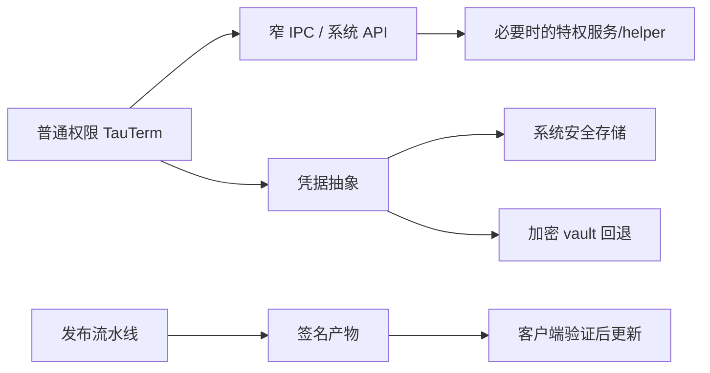

# 平台与安全边界设计

## 目标

平台层吸收 Windows/Linux/macOS 差异，并把凭据、提权、native helper、安装包和在线更新放在可审查的信任边界内。原则是：普通工程功能默认以普通用户权限运行，只有确实需要的动作进入最窄特权边界。

## 当前方案

### 凭据

凭据存储优先使用操作系统提供的安全存储；不可用时使用应用自己的加密 vault 回退。协议模块不直接决定存储实现，只通过统一凭据接口消费。

SSH 的持久化 Session 只保存由 Session ID 确定的 `credential_account` 引用，不保存密码、私钥正文或 passphrase。连接时由 Rust 后端从安全存储注入短生命周期认证材料；WebView 的 Session 状态和重新打开的配置表单不回填秘密，也不暴露可返回凭据明文的通用 Tauri command。Session Library 与凭据存储的跨存储变更使用显式提交/回滚：保存配置时先提交非敏感 Session 快照、再提交安全凭据，第二步失败则恢复 Session 快照；删除时凭据清理失败同样恢复 Session 条目。原生 keyring 自身在 credential/index 更新发生部分失败时也尝试恢复旧 secret/index 状态。加载持久化会话时若发现开发期遗留的 SSH 明文字段，会立即从 `sessions.json` 擦除并要求用户重新配置，不迁移旧凭据、不保留兼容分支。

SSH 主机身份另由版本化 `known_hosts.json` 保存公开的 host/port/fingerprint 与 first/last seen。首次信任需要明确确认；已知 fingerprint 匹配时自动通过；已知主机密钥变化时 fail-closed。known-host 文件损坏、schema 版本不支持或存储未初始化时同样 fail-closed：可以备份原文件用于诊断，但不能把已有信任状态解释成空库重新 TOFU。并发确认使用独立 request ID，不以 fingerprint 作为 pending key。

### WebView 文件访问边界

主 WebView 不拥有通用文件系统读写 capability，也不注册 `tauri-plugin-fs` 作为前端直接文件通道。文件/目录选择使用系统 dialog 获取用户明确选择的路径，实际 SFTP、Serial transfer、Command Set 导入导出、配置、日志和诊断文件读写继续由 Rust 后端的受控命令/服务完成。这样文件选择能力与任意路径读写能力保持分离。

需要新增前端文件访问能力时，必须先证明 Rust 边界无法合理承载，并为实际目录设置最小 scope；禁止恢复全盘通配形式的 WebView 文件权限。

### Windows 特权操作

主 GUI 进程保持普通权限。虚拟串口等需要系统权限的操作，在正式安装场景通过受控服务执行，并限制 IPC API 与调用者身份；服务不可用或 Debug 开发场景使用明确的 `direct-uac-on-demand`。Release 下该回退只允许从 Windows Program Files 中的受保护安装目录启动；用户可写 portable 目录不具备可信资源边界，helper 必须拒绝提权执行其中的 `setupc.exe`。该回退不是 shell/batch 透传：普通 GUI 通过随机本地命名管道启动**当前 TauTerm 可执行文件本身**的窄类型 one-shot helper，helper 与 GUI 双向核对 pipe 对端 PID，只接受固定的 install/create/cleanup 请求，并在特权侧自行派生可信 resource/ownership 路径。Local Shell 的管理员 child 是另一条独立的一次性提权路径，不等于给主应用提权。

Windows 虚拟串口的 endpoint ownership 统一存放在受保护的机器级目录 `%ProgramData%\TauTerm\virtual-port`。该目录的 DACL 禁止普通 Authenticated Users 写入，只允许读取；SYSTEM/Administrators 才能修改。TauTermService 与 direct-UAC helper 共用这一本 ledger，普通 GUI 只能读取，因而用户态状态文件不能被篡改成“删除第三方 bus”的特权授权。ledger 同时记录 owner PID；另一个仍在运行的 TauTerm 实例拥有的 endpoint 不能被服务/helper 当作 orphan 回收。服务重启后的 v2 握手会按已验证的 GUI PID 重新接管仍存在且驱动映射一致的 endpoint。任何删除动作都必须在执行 `remove` 前再次确认当前 bus 的 CNCA/CNCB→COM identity 与 protected ledger 完全一致；仅凭旧 bus 号绝不能授权删除。

Release 构建无法连接服务时进入 `direct-uac-on-demand` 并记录真实服务故障；只有受保护的 Program Files 安装目录允许真正进入 helper 提权事务，portable/user-writable release 会在 helper 边界 fail closed。Debug 构建从启动时就处于该后端。普通启动阶段只读取 protected ownership 与 SCM 驱动状态，不运行 `setupc list`、不主动执行特权 cleanup，也不因为“只读探测”触发 UAC；创建、安装或手动清理等用户明确动作才允许进入特权流程。所有产品 `setupc` 调用必须使用 `--silent`，并由特权上下文在全局 mutation lock 内完成状态枚举、bus/COM 分配、install 和安装后实际映射核验，禁止普通 GUI 预分配 bus，也禁止接受 com0com 的交互式“换一个 CNCA/CNCB 标识符”作为成功结果。

App ↔ TauTermService 的窄 IPC 握手携带显式协议版本，版本不匹配必须作为独立错误拒绝，而不是退化成模糊的 read failure；服务命名管道拒绝 remote clients，并在同目录可执行文件/PID 校验后为每个 GUI 连接建立独立处理线程，使多个 TauTerm 实例可以同时使用同一特权服务。每条连接必须先完成 hello，后续请求的 client_id 必须与该连接绑定值一致；com0com mutation 仍由共享 manager 与全局 mutex 串行化。管道断开本身不再等同于 GUI 退出：服务仅在已验证 GUI 进程实际退出后才清理该连接 endpoint，短暂 pipe 断开/重连保留 active ownership，避免旧连接线程与新连接 re-adoption 竞态误删仍在使用的端口。命名管道读写失败保留 Win32 错误/超时上下文用于正式构建诊断。`driver installed` 与 `privileged management backend available` 是两个独立状态，日志和 UI 不得混为“虚拟串口全部就绪”。

### 崩溃诊断与本地证据

System Log 只能覆盖仍能返回到 Rust 控制流的故障；native exception、驱动/FFI 导致的进程级异常可能在业务日志写入前直接终止进程。TauTerm 因此在 GUI 启动早期安装一层**本地、有限、非上传式** crash diagnostics：

- Rust panic 记录版本、时间、PID、线程、源位置、panic payload 与 backtrace；
- Windows 正常启动时预先拉起同一可执行文件的普通权限 crash-helper；未处理 native exception 的过滤器只向已建立的私有 pipe 写入固定大小异常上下文并短暂等待，真正的 `MiniDumpWriteDump(MiniDumpNormal)` 在独立 helper 进程中执行，随后主进程返回正常 Windows/WER 异常处理链；
- crash artifact 正常保存在当前用户本地应用数据目录下的 `TauTerm/crash`；只有无法解析用户目录时才使用带 PID 的临时 fallback。Unix 目录/文本报告分别收紧为仅当前用户可访问/读写，并按数量上限清理旧文件；应用不会自动上传、网络发送或并入普通 Session/System Log；
- 普通“导出诊断”只包含 crash artifact 数量与当前平台是否具备 native minidump 能力，不复制 dump 正文。

即使使用 `MiniDumpNormal`，dump 仍可能包含线程栈和与崩溃现场有关的进程内存片段，必须视为潜在敏感诊断材料。产品不得静默上传、共享或扩大为 full-memory dump；用户主动提供 dump 时也应按敏感调试资料处理。

### Native helper 与动态库

TRDP sidecar、抓包库等 native 依赖只能从受控位置解析。生产构建不能把当前工作目录当成可信可执行文件/DLL 搜索源。

### 打包与更新

构建产物由平台 CI 生成，更新包按 Tauri updater 的签名链校验，发布流程对此保持 fail-closed。TauTerm 只在生产 bundle 中启用 updater；Vite/Tauri 开发运行没有可靠的已安装 bundle/installer target 身份，因此自动检查、手动检查、下载与重启更新路径均不访问正式 updater endpoint。开发态不得通过给 `latest.json` 增加 `windows-x86_64` 等通用兼容键来伪造安装包身份。

正式更新清单只发布经过发布流水线验证的 exact bundle targets，例如 Windows NSIS 使用 `windows-x86_64-nsis`。CI 必须持续验证 Rust/JS updater 版本配对、exact target 清单和签名产物，不能用宽泛 fallback 掩盖运行时 target 与发布资产不一致。

Windows Authenticode 发布者签名当前尚未启用：开发阶段的 NSIS、主程序、service/TRDP helper 可能没有 publisher signature。这个限制必须在平台支持文档中明确披露；进入广泛生产分发前，需要恢复 Authenticode + RFC 3161 时间戳并在 CI 中验证 signer/timestamp。

依赖风险由 Dependabot 与定时 Dependency Security workflow 持续检查；npm 生产依赖高危 advisory 和 RustSec advisory 会形成明确失败/报告。许可证合规与漏洞风险是两个独立合同，不能用其中一个替代另一个。

正式 bundle 前会从锁定的 Cargo/npm 依赖图生成第三方依赖 notice，并与 TauTerm 自有许可证、TCNOpen MPL 许可证和特殊第三方清单一起进入安装包；Windows 再包含 com0com GPL/来源材料。发布流程在公开稳定版本成为 latest updater 之前验证产物集合、签名、合规资源和可下载内容，并把 com0com 对应官方源码作为同一 Release 的 fail-closed 资产。

具体平台支持矩阵和发布步骤属于社区工程文档，不在本文复制。

## 信任边界

## 设计边界

- 不能为了方便让主应用长期以管理员/root 权限运行。
- 特权 IPC 只暴露最小动作集合，并验证调用者和资源范围。
- Windows 直连 UAC fallback 不在普通启动阶段执行需要特权的 `setupc` 探测/清理；启动恢复属于 TauTermService，直连路径只在明确动作中提权。
- 密码、私钥、token 等不得进入普通日志或文档示例。
- WebView 不获得没有当前功能需求支撑的通用文件系统 capability；用户通过 dialog 选择路径不等于授权前端任意文件 I/O。
- 运行时可覆盖 native helper 的机制只能用于明确的受信开发场景，不能让导入配置变成任意代码执行入口。
- Crash diagnostics 默认仅本地、有限保留；自动采集不得使用 full-memory dump，也不得建立隐式上传通道。
- 安装/更新状态与应用版本元数据必须由发布流程验证，不能靠 README 手工同步。
- Updater 运行资格由生产 bundle 决定；开发态不访问正式 endpoint，正式 manifest 不提供为开发运行准备的通用平台 fallback。
- 安全漏洞披露流程只在根 `SECURITY.md` 维护。

## 代码锚点

- `src-tauri/src/security/`
- `src-tauri/src/virtual_port/`
- `src-tauri/src/bin/`
- `src-tauri/src/crash_diagnostics.rs`
- `src-tauri/tauri*.conf.json`
- `src/hooks/useUpdater.ts`
- `scripts/prepare-service-bin.js`
- `scripts/stage-release.js`
- `scripts/assemble-release.js`
- `.github/workflows/release.yml`

## 何时更新本文

修改凭据后端、权限模型、服务/helper IPC、native 加载路径、崩溃诊断/转储策略、打包信任边界、更新签名/发布验证策略时，必须同步更新本文。

Tauri/Windows 平台权威资料见 [PLATFORM_SECURITY.md](../knowledge/PLATFORM_SECURITY.md)；第三方分发和许可证依据见 [LICENSE_COMPLIANCE.md](../knowledge/LICENSE_COMPLIANCE.md)。
