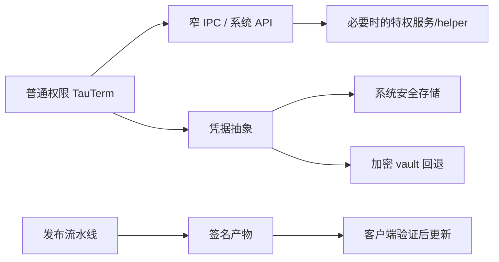

# 平台与安全边界设计

## 目标

平台层吸收 Windows/Linux/macOS 差异，并把凭据、提权、native helper、安装包和在线更新放在可审查的信任边界内。原则是：普通工程功能默认以普通用户权限运行，只有确实需要的动作进入最窄特权边界。

## 当前方案

### 凭据

凭据存储优先使用操作系统提供的安全存储；不可用时使用应用自己的加密 vault 回退。协议模块不直接决定存储实现，只通过统一凭据接口消费。

SSH 的持久化 Session 只保存由 Session ID 确定的 `credential_account` 引用，不保存密码、私钥正文或 passphrase。连接时由 Rust 后端从安全存储注入短生命周期认证材料；WebView 的 Session 状态和重新打开的配置表单不回填秘密，也不暴露可返回凭据明文的通用 Tauri command。加载持久化会话时若发现开发期遗留的 SSH 明文字段，会立即从 `sessions.json` 擦除并要求用户重新配置，不迁移旧凭据、不保留兼容分支。

### Windows 特权操作

主 GUI 进程保持普通权限。虚拟串口等需要系统权限的操作，在正式安装场景通过受控服务执行，并限制 IPC API 与调用者身份；开发/便携场景可以使用明确的按需 UAC 回退。Local Shell 的管理员 child 是独立的一次性提权路径，不等于给主应用提权。

### Native helper 与动态库

TRDP sidecar、抓包库等 native 依赖只能从受控位置解析。生产构建不能把当前工作目录当成可信可执行文件/DLL 搜索源。

### 打包与更新

构建产物由平台 CI 生成，更新包按 Tauri updater 的签名链校验，发布流程对此保持 fail-closed。Windows Authenticode 发布者签名当前尚未启用：开发阶段的 NSIS、主程序、service/TRDP helper 可能没有 publisher signature。这个限制必须在平台支持文档中明确披露；进入广泛生产分发前，需要恢复 Authenticode + RFC 3161 时间戳并在 CI 中验证 signer/timestamp。

正式 bundle 前会从锁定的 Cargo/npm 依赖图生成第三方依赖 notice，并与 TauTerm 自有许可证、TCNOpen MPL 许可证和特殊第三方清单一起进入安装包；Windows 再包含 com0com GPL/来源材料。发布流程在公开稳定版本成为 latest updater 之前验证产物集合、签名、合规资源和可下载内容，并把 com0com 对应官方源码作为同一 Release 的 fail-closed 资产。

具体平台支持矩阵和发布步骤属于社区工程文档，不在本文复制。

## 信任边界

## 设计边界

- 不能为了方便让主应用长期以管理员/root 权限运行。
- 特权 IPC 只暴露最小动作集合，并验证调用者和资源范围。
- 密码、私钥、token 等不得进入普通日志或文档示例。
- 运行时可覆盖 native helper 的机制只能用于明确的受信开发场景，不能让导入配置变成任意代码执行入口。
- 安装/更新状态与应用版本元数据必须由发布流程验证，不能靠 README 手工同步。
- 安全漏洞披露流程只在根 `SECURITY.md` 维护。

## 代码锚点

- `src-tauri/src/security/`
- `src-tauri/src/virtual_port/`
- `src-tauri/src/bin/`
- `src-tauri/tauri*.conf.json`
- `scripts/prepare-service-bin.js`
- `scripts/stage-release.js`
- `scripts/assemble-release.js`
- `.github/workflows/release.yml`

## 何时更新本文

修改凭据后端、权限模型、服务/helper IPC、native 加载路径、打包信任边界、更新签名/发布验证策略时，必须同步更新本文。

Tauri/Windows 平台权威资料见 [PLATFORM_SECURITY.md](../knowledge/PLATFORM_SECURITY.md)；第三方分发和许可证依据见 [LICENSE_COMPLIANCE.md](../knowledge/LICENSE_COMPLIANCE.md)。
