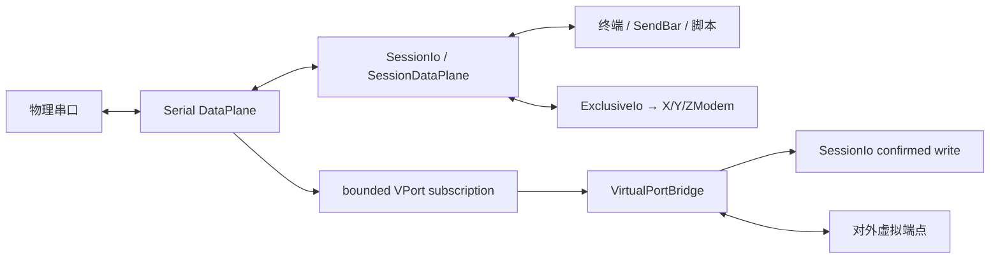

# 串口与设备调试设计

## 目标

串口模块把物理串口连接、文本/HEX 观察、自动化和文件传输整合成一个设备调试 Session，并在需要时把同一物理数据流桥接给外部工具。

## 当前方案

Serial 作为标准终端型协议接入公共 Session/DataPlane 核心。真正的串口 handle 由 `transport::serial` 打开并由 `DataPlaneRuntime` 独占持有；终端显示、SendBar、字符集、脚本、统计和断开都通过 `SessionDataPlane + SessionIo` 复用公共能力。

X/Y/ZModem 不再把物理串口从运行时取出再归还。传输启动时通过 `SessionIo::acquire_exclusive` 获得独占 lease，任务结束后 RAII 释放；底层串口所有权始终留在 DataPlane Runtime，因此普通发送、取消、断开和传输之间不存在第二套端口 ownership。

物理串口列表只在进入 Serial 配置页时按需刷新，并保留最近一次发现结果供表单立即显示。Windows 端口枚举可能受 SetupAPI、蓝牙设备或第三方驱动影响而变慢，因此枚举必须在后台 blocking worker 中运行，不能阻塞配置 UI。

### 插件/UI 职责

Serial 的连接表单、当前参数 schema、参数规范化、校验、会话展示和串口专属状态栏项都由 `src/plugins/serial/` 注册到 PluginRegistry。`ConnectDialog` 只提供通用会话外壳、端点发现挂接和 Session 级能力，不再维护 baud/data bits/parity/stop bits/flow control/virtual-port 等 Serial 专属状态。

`transferEnabled / transferProtocol / sendBarEnabled` 属于通用 Session 能力，只有顶层 Session 配置一份事实源；它们不得再次写入 Serial `params`。Serial `params` 当前只保存协议自身需要的链路、终端显示和虚拟串口策略字段。预稳定阶段不保留旧字段别名或双写兼容层；读入当前 Session 时由插件规范化到当前 schema，未知的旧 Serial 字段不会继续进入运行态。

会话默认名称只在创建时生成一次，`@` 后使用创建时的数据模式，例如 `Serial @ Text`、`Serial @ HEX` 或 `Serial @ Dual`；当前端口、baud/frame/flow 等链路参数由动态 subtitle 展示。后续改变显示方式或链路配置不得偷偷改写用户可见的 Session 身份。

### 配置职责与连接语义

串口链路只有一份后端 transport 配置事实：波特率、数据位、校验位、停止位和流控由强类型 `SerialTransportConfig` 解析与校验。校验位、停止位和流控在 Rust 内部使用枚举，不以任意字符串贯穿 driver 实现。Serial 插件不维护第二套后端 DTO；Session 参数里同时存在的终端显示方式、字符集和虚拟串口策略不是 transport 配置，底层串口适配器不得解释这些字段。

参数边界采用 fail-fast：已声明的串口链路字段一旦类型错误或组合非法，连接必须返回配置错误，禁止静默回退到 115200/8N1 后继续打开设备。默认值只用于创建完整的新配置或协议自身明确需要的默认 transport 配置，展示层不得自行猜测缺失参数。

一次 Session connect 对应一次物理端口 open。底层 transport 不做隐藏重试、固定等待或连接成功后的无条件 RX/TX purge；重新连接与 teardown 等待属于 Session 生命周期策略。设备在 open 后立即产生的启动/复位输出属于有效输入，应直接进入 DataPlane startup buffer，而不是被适配器丢弃。串口 read timeout 是 Transport Runtime 的调度参数，不属于持久化用户配置。

### 串口端点数据契约

`EndpointInfo.name` 是真正用于连接的系统端点名，例如 `COM5`；`description` 只提供补充说明，不重复 `name`。USB 串口至少携带 VID/PID、serial number、manufacturer、product，并在 serial number 可用时生成稳定 device identity。驱动友好名若仅在末尾重复当前端口号，展示层会规范化掉重复后缀，但结构化 identity 中仍保留驱动原始字段。

COM/tty 名称是瞬时属性，不能把它当成未来 same-device reconnect 的唯一身份。蓝牙/PCI/未知串口也保留类型与 system port 元数据，但不伪造不存在的硬件唯一 ID。

## 虚拟串口模型

虚拟串口是平台能力而不是协议替代品：

- Windows 由受控的 com0com 后端创建端口对，生产安装场景优先通过特权服务执行；特权服务不可用时进入 `direct-uac-on-demand`。Release helper 仅信任 Program Files 下的受保护安装目录；portable/user-writable release 不执行 privileged setupc。该回退通过当前 TauTerm 可执行文件启动窄类型 one-shot UAC helper，普通 GUI 不执行 `setupc.exe`，普通启动也不运行 `setupc list` 或 orphan 清理；只有创建、安装、手动清理等明确动作才进入特权事务；
- Linux/macOS 使用进程内 POSIX PTY 桥接，不依赖外部 helper。

Serial 运行时只调用统一的 `ensure_endpoints` capability，并消费强类型的创建失败语义；驱动安装、UAC、特权服务选择和 setupc 文本错误归一化全部留在 virtual-port backend 边界，Serial 不通过字符串猜测平台权限状态。

上层统一使用“内部 bridge + 对外 external endpoint”的能力模型。Windows 的 com0com 一对端口中：

- `bridge_path` 只由 TauTerm 桥接线程打开，是内部资源，不进入普通串口选择列表，也不进入前端展示契约；
- `external_path` 是用户和其它软件应该打开的端点，例如 `COM21`；
- 前端不感知 `CNCA/CNCB`、bus 编号或 Windows 端口对实现细节。

典型数据流：

```text
物理 COM6 → Serial DataPlane → named bounded subscription → VPort fan-out pump
                                                        ├→ bounded egress → COM21 Endpoint Actor
                                                        └→ bounded egress → COM23 Endpoint Actor

每个 Endpoint Actor 独占一个 bridge handle：
physical egress → actor serial write → internal/external COM
external COM → actor serial read → SessionIo confirmed write → 物理 COM6
```

桥接不挂在 UI `on_data` 回调。物理 → 虚拟方向只有一个**有界 DataPlane subscription pump**，它只负责接收与非阻塞 fan-out，绝不执行可能阻塞的虚拟端口 I/O。DataPlane subscription 支持按消费者指定消息容量并记录明确的 detach reason；VPort 根据串口线速给上游分配有限 burst 窗口，避免 Windows 驱动产生大量小 chunk 时被通用 256-message 默认值误摘除，同时仍有硬上限。每个 external endpoint 独占自己的 Endpoint Actor、单一 bridge handle 与按字节计量的有界 egress backlog；Actor 串行执行 peer presence 检查、物理 → 虚拟写入和虚拟 → 物理读取，禁止通过 `try_clone` 把同一个 Windows COM 资源交给并发 reader/writer worker。一个外部工具停止读取时只能耗尽自己的 endpoint 预算，不能拖慢 DataPlane subscription，也不能阻塞其它虚拟端口。多个 endpoint 共享物理数据块的不可变引用，fan-out 不为每个端口复制整块数据。

多个请求的虚拟端点采用原子启动：所有内部 endpoint 必须在任何 Actor 启动之前同步打开成功，任何一个失败都会判定本次 VPort 启动失败并回滚刚创建的 endpoint 资源。VPort 是可选能力，启动失败只报告 `virtual-port-failed`，不能把已经有效建立的物理 Serial Session 伪装成连接失败。关闭时先停止新的 fan-out，再取消 Windows 上仍阻塞的同步 I/O，并等待所有 Endpoint Actor 与 pump/supervisor 完整退出；持有 COM handle 的 worker 不允许超时后 detach。

X/Y/ZModem 获得 Exclusive lease 时 Endpoint Actor 不再读取 external endpoint 的新字节，避免消费随后无法写入物理端口的数据；lease 释放后恢复共享桥接。DataPlane subscription 自身若溢出/断开，或 virtual → physical 的确认写失败，说明共享数据面已经失去完整性，属于整个 Bridge 的明确失败。单个 external endpoint 的写入/读取持续无进展或 egress 预算耗尽则只把该 endpoint 标记为 `backpressured`，暂停它的双向镜像并保留父 Serial Session、其它 endpoint 与 bridge supervisor。

external peer 的存在是独立生命周期：Unix PTY master 在 slave 尚未被外部工具打开、或外部工具关闭时可能返回 EIO；Windows com0com 的内部 bridge 端把 DSR 映射到远端 `ropen`，Endpoint Actor 因而可以区分“external endpoint 尚未打开”和“已打开 peer 长时间不消费”。状态监测与数据完整性是两个不同维度：一次 DSR/presence 查询失败只进入 `degraded`，保留最后一次已确认的 peer 状态；若最后已知 peer 仍打开，Actor 继续串行读写，不能因为监测瞬时失败主动制造丢数据。只有初始状态尚未知、已确认 peer 关闭，或真实队列/I/O 已发生数据缺口时才停止对应镜像。Windows 上已连接 peer 一旦进入 `backpressured`，必须先观察到该 peer 关闭、再重新打开，才能恢复为 fresh stream；缺口期间旧数据不会补发，也不会在同一 peer 连接上偷偷恢复。

桥接只保证字节流转发，不模拟真实 UART 电气特性、调制解调器控制线或所有波特率行为。当前没有 actor-owned 的 DTR/RTS/CTS/DSR 能力，因此状态栏不得显示虚假的 `--` 占位；未来只有在 DataPlane/driver 提供真实控制线 capability 后才能暴露这些状态与控制。

## 虚拟端口所有权与清理

Windows endpoint 删除权限只来自 TauTerm 自己的**受保护 ownership ledger**，不能通过“驱动里存在一个 com0com bus”推断归属。TauTermService 与 direct-UAC helper 共用：

`%ProgramData%\TauTerm\virtual-port\com0com_state.json`

目录由特权进程创建/修复 DACL：Authenticated Users 只读，SYSTEM 与 Administrators 完全控制；普通 GUI 可以读取 ownership 用于隐藏内部 bridge、计算 orphan，但**不能写入或伪造删除授权**。状态记录包含完整 `VirtualEndpoint` 和创建 owner PID；当前进程/服务仍持有的 endpoint 另外存在内存 `active_endpoints` 中。

语义上：

```text
reclaimable orphan
  = owned endpoint
  - current backend active endpoint
  - endpoint owned by another still-running TauTerm process
```

Windows mutation 还使用一个全局命名 mutex，把 TauTermService、direct-UAC helper 与多实例之间的 com0com 写操作串行化。创建流程必须在**已经进入特权上下文后**完成真实状态读取、分配、安装与验证：

1. 获取全局 mutation lock；
2. 通过 `setupc --silent list`、系统 COM 枚举和 protected ownership 建立权威冲突视图；
3. 在产品区间内选择空闲 bus 与 COM 对，避开测试预留区；
4. 使用 `setupc --silent install` 创建端口对；
5. 再次枚举并确认实际 `CNCA/CNCB → bridge/external COM` 映射；不能假设“请求 bus N 就一定得到 bus N”；
6. 只有验证后的实际 bus/COM 才提交到 protected ownership，并转为当前 backend 的 active endpoint；
7. 批量创建任一环节失败时回滚本批已创建资源；未知/第三方 bus 永远不参与回滚。

因此 direct-UAC GUI 不再在提权前猜 bus、预写 ownership 或动态生成 `.cmd`。com0com 的交互式“标识符已占用，改用另一组 CNCA/CNCB”窗口也不得进入产品流程；所有产品调用都必须静默执行，并由 TauTerm 自己验证结果。

生命周期规则：

- active endpoint 永远不是 orphan；external peer 打开/关闭不改变父 Serial Session ownership；
- 特权服务正常关闭时由 GUI 显式 remove endpoint；若服务 pipe 异常断开，服务必须先确认已验证 GUI 进程确实退出，再清理该连接 endpoint。GUI 仍存活时保留 active ownership 供重连/重新接管，避免旧连接 cleanup 与新连接 re-adoption 竞态误删；若 endpoint 暂时占用导致 remove 失败，则保持原 COM identity 与 ownership 进入 deferred cleanup，不通过解绑 PortName 的方式破坏后续身份核验；
- direct-UAC Session 断开不突然弹第二次 UAC：GUI 只结束本地 active/hide 状态，protected ownership 保留为可恢复记录；下一次明确创建或手动清理动作由 helper 在受控特权事务中回收；创建路径先确保新端点成功，再清理旧 orphan，避免创建失败时让 GUI 对旧端点的本地可见性状态失真；
- 服务与 direct helper 共用同一个 machine ledger，因此服务恢复后也能识别 direct-UAC 异常遗留；另一个仍存活的 TauTerm 进程所拥有的记录必须保留；
- 手动“清理残留端口”只处理 protected ledger 中可证明归属且当前可回收的 endpoint；每次 remove 前还必须重新核验当前 bus 的 CNCA/CNCB→COM 映射与 ledger 完全一致。bus 不存在或已被重新映射时只失效旧 ownership，禁止扫描/删除第三方或已复用的 com0com bus；
- 当前 ownership schema 唯一，不维护旧 bus-only 兼容迁移。旧/损坏状态只能由特权边界备份并重置；普通 GUI 不修写机器级 ownership；
- com0com 驱动本身是系统级共享资源，与 endpoint ownership 分开处理；无法确认系统级 driver ownership 时必须保留共享驱动。

## 关键数据流



## 设计边界

- 一个物理串口只有一个 Transport/DataPlane owner；Inline 文件传输通过 exclusive lease 临时获得访问权，不重新打开底层 handle。
- Serial 前端插件拥有自己的当前配置 schema、连接表单、校验、会话展示和专属状态项；通用 Session UI 不硬编码 Serial 字段。
- Session 级 transfer/send-bar 配置只有顶层一份事实源；Serial `params` 不双写这些字段。
- Serial transport 只解析真正消费的链路字段；终端展示与虚拟端口策略不得重新进入串口 driver 配置。
- 串口链路配置错误必须 fail-fast，禁止以默认值掩盖损坏配置。
- Transport open 不承担自动重试和清空输入缓冲等 Session 策略；设备 open 后产生的字节必须进入统一接收链路。
- DataPlane subscriber 必须有界且带 consumer identity；需要不同 burst 容量的消费者通过显式 subscription capacity 配置，并在摘除时保留原因。VPort subscription pump 不执行 endpoint I/O，单个 peer 的慢消费只能触发自己的有界 egress backpressure，禁止扩散成 DataPlane overflow、静默丢字节或无界增长内存。
- external virtual peer 可以独立连接/断开/重连；peer 缺席本身不关闭物理 Session 或 Bridge。每个 endpoint 只有一个 Actor/handle owner，Windows presence 查询失败只表示监测 degraded，不等同于数据缺口；Windows 已连接 peer 一旦发生真实数据完整性缺口，必须经过 close → reopen 才能以 fresh stream 恢复。
- Bridge shutdown 必须取消可取消的阻塞 I/O 并 join 所有持有 endpoint handle 的 Actor；禁止为了满足退出 deadline 而 detach COM worker。
- 虚拟串口创建/桥接启动失败不能让主串口连接的状态变成错误真相，并必须回滚本次不可用端点资源。
- 平台提权逻辑不得进入普通 Serial UI/协议语义；Windows 直连 fallback 只在明确动作中启动窄类型 UAC helper，普通 GUI 永不执行 `setupc`。所有 setupc 产品调用必须 `--silent`，bus/COM 分配与安装后核验必须发生在同一特权事务内。
- 自动化发送、编码与日志复用公共 Session 能力，不建立串口专属第二套实现。
- 不展示没有真实后端 capability 的 DTR/RTS/CTS/DSR 等控制线占位状态。
- 当前采集设备 identity，但自动按 stable identity 重连仍是后续能力，不能提前宣传。
- orphan/cleanup 必须基于 TauTerm 所有权证据，不能以驱动全局枚举结果作为删除授权。
- 系统级共享驱动的卸载权限独立于 endpoint ownership。

## 代码锚点

- `src/plugins/serial/`
- `src/core/plugin-registry.ts`
- `src-tauri/src/plugins/serial/`
- `src-tauri/src/transport/serial.rs`
- `src-tauri/src/transport/runtime.rs`
- `src-tauri/src/session/io.rs`
- `src-tauri/src/virtual_port/`
- `src/hooks/useCom0comStatus.ts`

## 何时更新本文

修改串口连接模型、插件配置边界、虚拟串口后端、端点可见性、资源所有权、DataPlane 所有权/订阅策略、传输集成方式或设备数据流时，必须同步更新本文。

共享 X/Y/ZModem 传输生命周期见 [TRANSFER.md](TRANSFER.md)；Transport 语义见 [TRANSPORT_RUNTIME.md](TRANSPORT_RUNTIME.md)；串口/PTY/电气标准依据见 [终端、串口与自动化知识索引](../knowledge/TERMINAL_SERIAL_AUTOMATION.md)。