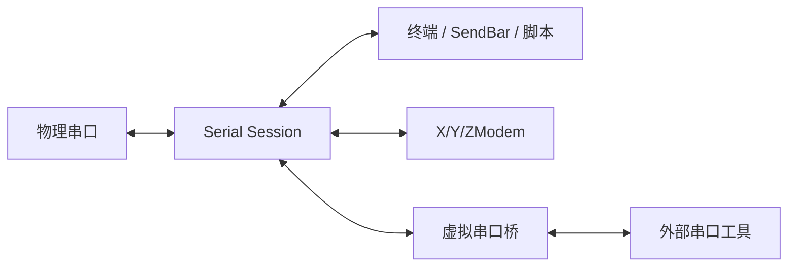

# 串口与设备调试设计

## 目标

串口模块把物理串口连接、文本/HEX 观察、自动化和文件传输整合成一个设备调试 Session，并在需要时把同一物理数据流桥接给外部工具。

## 当前方案

Serial 作为标准终端型协议接入公共 Session/I/O 核心。显示和发送复用终端、SendBar、字符集与脚本能力；X/Y/ZModem 作为传输子系统在活动串口通道上协调独占传输。

物理串口列表只在进入 Serial 配置页时按需刷新，并保留最近一次发现结果供表单立即显示。Windows 端口枚举可能受 SetupAPI、蓝牙设备或第三方驱动影响而变慢，因此枚举必须在后台 blocking worker 中运行，不能阻塞配置 UI。

端点发现同时保留设备身份元数据。USB 串口至少携带 VID/PID、serial number、manufacturer、product，并在 serial number 可用时生成稳定 device identity；UI 展示名和系统端口名仍是瞬时属性，不能把 COM/tty 名称当成未来 same-device reconnect 的唯一身份。蓝牙/PCI/未知串口也保留类型与 system port 元数据，但不伪造不存在的硬件唯一 ID。

虚拟串口是平台能力而不是协议替代品：

- Windows 由受控的 com0com 后端创建端口对，生产安装场景优先通过特权服务执行；
- Linux/macOS 使用进程内 POSIX PTY 桥接，不依赖外部 helper。

桥接只保证字节流转发，不模拟真实 UART 电气特性、调制解调器控制线或所有波特率行为。

## 关键数据流

## 设计边界

- 一个物理串口连接只有一个核心 I/O 所有者，传输模式通过明确 handoff/协调获得通道控制权。
- 虚拟串口创建失败不能让主串口连接的状态变成错误真相。
- 平台提权逻辑不得进入普通 Serial UI/协议语义。
- 自动化发送、编码与日志继续复用公共能力，不建立串口专属第二套实现。
- 当前已经采集设备 identity，但“热插拔后按 stable identity 自动匹配并重连”仍属于 Daily Driver 后续能力；不能把元数据采集宣传成已经完成自动重连。
- 虚拟端口清理必须可处理异常退出和残留资源。

## 代码锚点

- `src/plugins/serial/`
- `src-tauri/src/plugins/serial/`
- `src-tauri/src/virtual_port/`
- `src/components/Terminal/`

## 何时更新本文

修改串口连接模型、虚拟串口后端、通道所有权、传输集成方式或设备数据流时，必须同步更新本文。

共享 X/Y/ZModem 传输生命周期见 [TRANSFER.md](TRANSFER.md)；串口/PTY/电气标准依据见 [终端、串口与自动化知识索引](../knowledge/TERMINAL_SERIAL_AUTOMATION.md)；com0com 的维护细节以 `.agents/skills/tauterm-com0com/SKILL.md` 为准。
