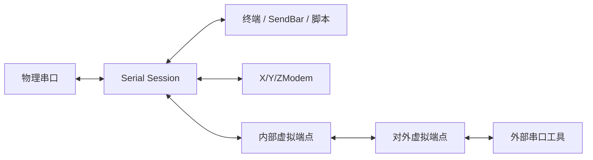

# 串口与设备调试设计

## 目标

串口模块把物理串口连接、文本/HEX 观察、自动化和文件传输整合成一个设备调试 Session，并在需要时把同一物理数据流桥接给外部工具。

## 当前方案

Serial 作为标准终端型协议接入公共 Session/I/O 核心。显示和发送复用终端、SendBar、字符集与脚本能力；X/Y/ZModem 作为传输子系统在活动串口通道上协调独占传输。

物理串口列表只在进入 Serial 配置页时按需刷新，并保留最近一次发现结果供表单立即显示。Windows 端口枚举可能受 SetupAPI、蓝牙设备或第三方驱动影响而变慢，因此枚举必须在后台 blocking worker 中运行，不能阻塞配置 UI。

### 串口端点数据契约

`EndpointInfo.name` 是真正用于连接的系统端点名，例如 `COM5`；`description` 只提供补充说明，不重复 `name`。USB 串口至少携带 VID/PID、serial number、manufacturer、product，并在 serial number 可用时生成稳定 device identity。驱动友好名若仅在末尾重复当前端口号（例如 `Virtual COM Port (COM5)`），展示层会规范化掉该重复后缀，但结构化 identity 中仍保留驱动原始字段。

COM/tty 名称仍是瞬时属性，不能把它当成未来 same-device reconnect 的唯一身份。蓝牙/PCI/未知串口也保留类型与 system port 元数据，但不伪造不存在的硬件唯一 ID。

## 虚拟串口模型

虚拟串口是平台能力而不是协议替代品：

- Windows 由受控的 com0com 后端创建端口对，生产安装场景优先通过特权服务执行；
- Linux/macOS 使用进程内 POSIX PTY 桥接，不依赖外部 helper。

上层统一使用“内部 bridge + 对外 external endpoint”的能力模型。Windows 的 com0com 一对端口中：

- `bridge_path` 只由 TauTerm 桥接线程打开，是内部实现资源，不进入普通串口选择列表，也不进入前端展示契约；
- `external_path` 是用户和其它软件应该打开的端点，例如 `COM21`，状态栏只显示这一端；
- 前端不感知 `CNCA/CNCB`、bus 编号或 Windows 端口对实现细节。

因此一个典型数据流是：

```text
物理 COM6 ⇄ TauTerm Serial Session ⇄ 内部 COM20 ⇄ com0com ⇄ 对外 COM21
```

用户只应看到/使用 `COM6` 和 `COM21`；内部 `COM20` 必须从 TauTerm 的普通 Serial 发现结果中隐藏。

桥接只保证字节流转发，不模拟真实 UART 电气特性、调制解调器控制线或所有波特率行为。

## 虚拟端口所有权与清理

残留资源判断必须建立在明确的所有权上，不能通过“驱动里存在一个 com0com bus”推断它属于 TauTerm。

直连 Windows 后端维护两层状态：

- `active_endpoints`：当前进程仍被活动 Session 持有的端点；
- 持久化 `owned_endpoints`：TauTerm 已创建且仍负责回收的端点，包括 active 和异常退出/权限不足后留下的资源。

严格定义：

```text
orphan = owned_endpoints - active_endpoints
```

由此得到以下生命周期规则：

1. 普通创建成功后立即登记 ownership；提权批量创建会在启动特权子进程前先预登记目标 ownership，并在任一安装失败时于同一批处理中回滚已创建端口。即使特权进程超时或异常终止，可能已创建的资源也仍有 ownership 证据可供后续恢复清理；
2. 创建成功后把 bridge path 注册为内部不可见端点，并将 endpoint 转为 `active`；
3. 正常活动期间，端点同时属于 `owned` 和 `active`，因此绝不是 orphan；
4. 外部程序断开 external endpoint 不改变父 Serial Session 的 ownership，端点仍可再次打开；
5. 父 Serial Session 结束时尝试销毁端口对；销毁成功后同时移除 active/owned 和内部隐藏注册；
6. 如果销毁因权限或系统状态暂时失败，只移除 active、保留 owned，此时才成为可提示的 orphan；
7. 进程异常退出后，新进程没有 active owner，而持久化 owned 仍存在，因此这些端点自然成为可恢复清理的 orphan；
8. 手动“清理残留端口”只能处理已证明属于 TauTerm 且当前非 active 的资源，禁止删除第三方/用户自行创建的 com0com bus；
9. 特权服务模式按 `client_id` 在服务进程内记录自己创建的端点，客户端断开时只清理该客户端资源，不做驱动全局扫除。

持久化状态采用当前唯一 schema，不保留旧版 bus-only 兼容逻辑；预稳定阶段发现旧/损坏 schema 时只备份用于诊断，并重新建立当前模型。

## 关键数据流



## 设计边界

- 一个物理串口连接只有一个核心 I/O 所有者，传输模式通过明确 handoff/协调获得通道控制权。
- 虚拟串口创建失败不能让主串口连接的状态变成错误真相。
- 平台提权逻辑不得进入普通 Serial UI/协议语义。
- 自动化发送、编码与日志继续复用公共能力，不建立串口专属第二套实现。
- 当前已经采集设备 identity，但“热插拔后按 stable identity 自动匹配并重连”仍属于 Daily Driver 后续能力；不能把元数据采集宣传成已经完成自动重连。
- orphan/cleanup 必须基于 TauTerm 所有权证据，绝不以驱动全局枚举结果作为删除授权。

## 代码锚点

- `src/plugins/serial/`
- `src-tauri/src/plugins/serial/`
- `src-tauri/src/virtual_port/`
- `src/components/Layout/StatusBar.tsx`
- `src/hooks/useCom0comStatus.ts`

## 何时更新本文

修改串口连接模型、虚拟串口后端、端点可见性、资源所有权、通道所有权、传输集成方式或设备数据流时，必须同步更新本文。

共享 X/Y/ZModem 传输生命周期见 [TRANSFER.md](TRANSFER.md)；串口/PTY/电气标准依据见 [终端、串口与自动化知识索引](../knowledge/TERMINAL_SERIAL_AUTOMATION.md)；com0com 的维护细节以 `.agents/skills/tauterm-com0com/SKILL.md` 为准。
