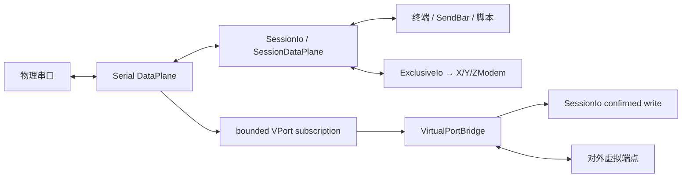

# 串口与设备调试设计

## 目标

串口模块把物理串口连接、文本/HEX 观察、自动化和文件传输整合成一个设备调试 Session，并在需要时把同一物理数据流桥接给外部工具。

## 当前方案

Serial 作为标准终端型协议接入公共 Session/DataPlane 核心。真正的串口 handle 由 `transport::serial` 打开并由 `DataPlaneRuntime` 独占持有；终端显示、SendBar、字符集、脚本、统计和断开都通过 `SessionDataPlane + SessionIo` 复用公共能力。

X/Y/ZModem 不再把物理串口从运行时取出再归还。传输启动时通过 `SessionIo::acquire_exclusive` 获得独占 lease，任务结束后 RAII 释放；底层串口所有权始终留在 DataPlane Runtime，因此普通发送、取消、断开和传输之间不存在第二套端口 ownership。

物理串口列表只在进入 Serial 配置页时按需刷新，并保留最近一次发现结果供表单立即显示。Windows 端口枚举可能受 SetupAPI、蓝牙设备或第三方驱动影响而变慢，因此枚举必须在后台 blocking worker 中运行，不能阻塞配置 UI。

### 插件/UI 职责

Serial 的连接表单、当前参数 schema、参数规范化、校验、会话展示和串口专属状态栏项都由 `src/plugins/serial/` 注册到 PluginRegistry。`ConnectDialog` 只提供通用会话外壳、端点发现挂接和 Session 级能力，不再维护 baud/data bits/parity/stop bits/flow control/virtual-port 等 Serial 专属状态。

`transferEnabled / transferProtocol / sendBarEnabled` 属于通用 Session 能力，只有顶层 Session 配置一份事实源；它们不得再次写入 Serial `params`。Serial `params` 当前只保存协议自身需要的链路、终端显示和虚拟端口策略字段。预稳定阶段不保留旧字段别名或双写兼容层；读入当前 Session 时由插件规范化到当前 schema，未知的旧 Serial 字段不会继续进入运行态。

会话默认名称只在创建时生成一次，例如 `Serial @ COM5`；当前 baud/frame/flow 等链路参数由动态 subtitle 展示。改变显示方式或链路配置不得偷偷改写用户可见的 Session 身份。

### 配置职责与连接语义

串口链路只有一份后端 transport 配置事实：波特率、数据位、校验位、停止位和流控由强类型 `SerialTransportConfig` 解析与校验。校验位、停止位和流控在 Rust 内部使用枚举，不以任意字符串贯穿 driver 实现。Serial 插件不维护第二套后端 DTO；Session 参数里同时存在的终端显示方式、字符集和虚拟串口策略不是 transport 配置，底层串口适配器不得解释这些字段。

参数边界采用 fail-fast：已声明的串口链路字段一旦类型错误或组合非法，连接必须返回配置错误，禁止静默回退到 115200/8N1 后继续打开设备。默认值只用于创建完整的新配置或协议自身明确需要的默认 transport 配置，展示层不得自行猜测缺失参数。

一次 Session connect 对应一次物理端口 open。底层 transport 不做隐藏重试、固定等待或连接成功后的无条件 RX/TX purge；重新连接与 teardown 等待属于 Session 生命周期策略。设备在 open 后立即产生的启动/复位输出属于有效输入，应直接进入 DataPlane startup buffer，而不是被适配器丢弃。串口 read timeout 是 Transport Runtime 的调度参数，不属于持久化用户配置。

### 串口端点数据契约

`EndpointInfo.name` 是真正用于连接的系统端点名，例如 `COM5`；`description` 只提供补充说明，不重复 `name`。USB 串口至少携带 VID/PID、serial number、manufacturer、product，并在 serial number 可用时生成稳定 device identity。驱动友好名若仅在末尾重复当前端口号，展示层会规范化掉重复后缀，但结构化 identity 中仍保留驱动原始字段。

COM/tty 名称是瞬时属性，不能把它当成未来 same-device reconnect 的唯一身份。蓝牙/PCI/未知串口也保留类型与 system port 元数据，但不伪造不存在的硬件唯一 ID。

## 虚拟串口模型

虚拟串口是平台能力而不是协议替代品：

- Windows 由受控的 com0com 后端创建端口对，生产安装场景优先通过特权服务执行；
- Linux/macOS 使用进程内 POSIX PTY 桥接，不依赖外部 helper。

上层统一使用“内部 bridge + 对外 external endpoint”的能力模型。Windows 的 com0com 一对端口中：

- `bridge_path` 只由 TauTerm 桥接线程打开，是内部资源，不进入普通串口选择列表，也不进入前端展示契约；
- `external_path` 是用户和其它软件应该打开的端点，例如 `COM21`；
- 前端不感知 `CNCA/CNCB`、bus 编号或 Windows 端口对实现细节。

典型数据流：

```text
物理 COM6 ⇄ Serial DataPlane ⇄ DataPlaneSubscription ⇄ VirtualPortBridge ⇄ internal endpoint ⇄ external endpoint
                                      ↑
                                  SessionIo confirmed write
```

桥接不再挂在 UI `on_data` 回调，也不再使用两级 `try_send` 写回队列。物理 → 虚拟方向使用独立的**有界 DataPlane subscription**；虚拟 → 物理方向直接通过 `Arc<SessionIo>` 做确认式写入。订阅者若持续落后导致有界 backlog 满，DataPlane 会摘除该消费者，Bridge 把订阅断开作为明确失败上报；禁止为了“继续运行”而静默丢弃已连接透明流中的 chunk。

多个请求的虚拟端点采用原子启动：所有内部 endpoint 必须在 Bridge 注册到 SessionStore 之前同步打开成功，任何一个失败都会判定本次 VPort 启动失败并回滚刚创建的 endpoint 资源。VPort 是可选能力，启动失败只报告 `virtual-port-failed`，不能把已经有效建立的物理 Serial Session 伪装成连接失败。

X/Y/ZModem 获得 Exclusive lease 时 Bridge 不再读取 external endpoint 的新字节，避免消费随后无法写入物理端口的数据；lease 释放后恢复共享桥接。DataPlane subscription 溢出/断开或 virtual → physical 的确认写失败意味着已连接流无法继续保证完整性，Bridge 必须 fail-closed 并暴露错误。

external peer 的存在则是独立生命周期：Unix PTY master 在 slave 尚未被外部工具打开、或外部工具关闭时可能返回 EIO，Windows 虚拟端点也允许对端应用稍后打开或重新连接。此类“当前没有外部 peer”的端点读写错误不会关闭 Bridge；Bridge 保持内部 endpoint 存活并等待外部工具再次连接。没有实际 peer 时当然不存在可保证投递的外部消费者，这与“已连接消费者因内部队列过载而静默丢字节”是不同语义。

桥接只保证字节流转发，不模拟真实 UART 电气特性、调制解调器控制线或所有波特率行为。当前没有 actor-owned 的 DTR/RTS/CTS/DSR 能力，因此状态栏不得显示虚假的 `--` 占位；未来只有在 DataPlane/driver 提供真实控制线 capability 后才能暴露这些状态与控制。

## 虚拟端口所有权与清理

残留资源判断必须建立在明确所有权上，不能通过“驱动里存在一个 com0com bus”推断它属于 TauTerm。

直连 Windows 后端维护两层状态：

- `active_endpoints`：当前进程仍被活动 Session 持有的端点；
- 持久化 `owned_endpoints`：TauTerm 已创建且仍负责回收的端点，包括 active 和异常退出/权限不足后留下的资源。

严格定义：

```text
orphan = owned_endpoints - active_endpoints
```

由此得到以下生命周期规则：

1. 普通创建成功后立即登记 ownership；提权批量创建会在启动特权子进程前预登记目标 ownership，并在明确失败时回滚已创建端口；
2. 创建成功后把 bridge path 注册为内部不可见端点，并将 endpoint 转为 active；
3. 正常活动期间端点同时属于 owned 和 active，因此不是 orphan；
4. 外部程序断开 external endpoint 不改变父 Serial Session ownership；
5. 父 Serial Session 结束时尝试销毁端口对；成功后同时移除 active/owned 和内部隐藏注册；
6. 销毁暂时失败时只移除 active、保留 owned，此时才成为可恢复 orphan；
7. 进程异常退出后新进程没有 active owner，而持久化 owned 仍存在，因此可恢复清理；
8. 手动“清理残留端口”只能处理已证明属于 TauTerm 且当前非 active 的资源，禁止删除第三方/用户自行创建的 com0com bus；
9. 特权服务模式同样使用 ownership 模型，服务重启只恢复/清理有 ownership 证据的 TauTerm orphan；
10. com0com 驱动本身是系统级共享资源，与 TauTerm endpoint ownership 分开处理；无法确认系统级 driver ownership 时必须保留共享驱动。

持久化状态采用当前唯一 schema，不保留旧版 bus-only 兼容逻辑；预稳定阶段发现旧/损坏 schema 时只备份用于诊断，并重新建立当前模型。

## 关键数据流



## 设计边界

- 一个物理串口只有一个 Transport/DataPlane owner；Inline 文件传输通过 exclusive lease 临时获得访问权，不重新打开底层 handle。
- Serial 前端插件拥有自己的当前配置 schema、连接表单、校验、会话展示和专属状态项；通用 Session UI 不硬编码 Serial 字段。
- Session 级 transfer/send-bar 配置只有顶层一份事实源；Serial `params` 不双写这些字段。
- Serial transport 只解析真正消费的链路字段；终端展示与虚拟端口策略不得重新进入串口 driver 配置。
- 串口链路配置错误必须 fail-fast，禁止以默认值掩盖损坏配置。
- Transport open 不承担自动重试和清空输入缓冲等 Session 策略；设备 open 后产生的字节必须进入统一接收链路。
- DataPlane subscriber 必须有界；透明桥接消费者一旦无法跟上必须明确失败，禁止静默丢字节或无界增长内存。
- external virtual peer 可以独立连接/断开/重连；peer 缺席本身不关闭物理 Session 或 Bridge。
- 虚拟串口创建/桥接启动失败不能让主串口连接的状态变成错误真相，并必须回滚本次不可用端点资源。
- 平台提权逻辑不得进入普通 Serial UI/协议语义。
- 自动化发送、编码与日志复用公共 Session 能力，不建立串口专属第二套实现。
- 不展示没有真实后端 capability 的 DTR/RTS/CTS/DSR 等控制线占位状态。
- 当前采集设备 identity，但自动按 stable identity 重连仍是后续能力，不能提前宣传。
- orphan/cleanup 必须基于 TauTerm 所有权证据，不能以驱动全局枚举结果作为删除授权。
- 系统级共享驱动的卸载权限独立于 endpoint ownership。

## 代码锚点

- `src/plugins/serial/`
- `src/core/plugin-registry.ts`
- `src-tauri/src/plugins/serial/`
- `src-tauri/src/transport/serial.rs`
- `src-tauri/src/transport/runtime.rs`
- `src-tauri/src/session/io.rs`
- `src-tauri/src/virtual_port/`
- `src/hooks/useCom0comStatus.ts`

## 何时更新本文

修改串口连接模型、插件配置边界、虚拟串口后端、端点可见性、资源所有权、DataPlane 所有权/订阅策略、传输集成方式或设备数据流时，必须同步更新本文。

共享 X/Y/ZModem 传输生命周期见 [TRANSFER.md](TRANSFER.md)；Transport 语义见 [TRANSPORT_RUNTIME.md](TRANSPORT_RUNTIME.md)；串口/PTY/电气标准依据见 [终端、串口与自动化知识索引](../knowledge/TERMINAL_SERIAL_AUTOMATION.md)。
