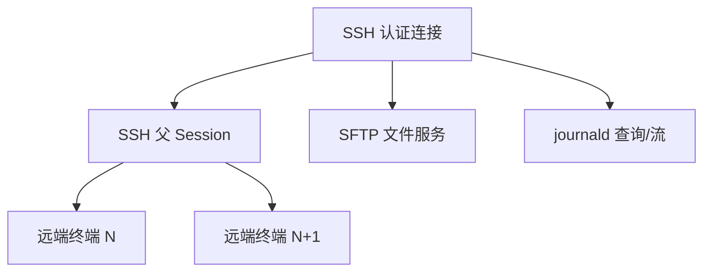

# SSH、SFTP 与远端工程工作流

## 目标

SSH 模块把远端终端、文件管理和远端日志放在同一个认证上下文中，避免每项能力重复建立独立连接和身份状态。

## 当前方案

### 主机身份信任

SSH 使用版本化的本地 `known_hosts.json` 作为主机身份信任源：

- 首次连接：展示 `host:port` 与 SHA-256 fingerprint，用户明确接受后才持久化；
- 已知主机且 fingerprint 一致：自动通过，并更新 `last_seen`；
- 已知主机 fingerprint 变化：默认拒绝，不允许普通“继续”确认静默覆盖旧信任；
- 并发验证以独立 `request_id` 关联，不再用 fingerprint 作为 pending key；
- 通用 `ProtocolAdapter::connect()` 不允许绕过 HostKeyVerifier；SSH 生产连接必须走受信路径。

`known_hosts.json` 只保存公开主机身份信息，不保存密码、私钥或 passphrase。

一个保存的 SSH 配置先建立认证连接，再由父 Session 暴露可创建多个远端 PTY 的通道工厂。公共 Session 核心管理 child terminal 的生命周期和编号，SSH 插件只负责在同一认证上下文中创建远端通道。

SFTP 和 journald 属于 SSH 的侧通道工作流：它们复用已建立的 SSH 身份/连接资源，通过独立的文件或 exec 能力工作，不把文件管理伪装成终端字节流。

持久化 SSH 配置与认证秘密分离：Session/Workspace 只保留 `credential_account`，密码、私钥和 passphrase 由平台安全模块持有。建立连接时后端解析引用并把秘密注入一次连接配置，前端不读取安全存储中的秘密，也没有读取凭据明文的通用 IPC；秘密不会重新写回 Session 状态。加载时发现的旧明文字段直接从持久化文件擦除，旧会话需要重新输入凭据，不执行迁移。

## 关键数据流

## 设计边界

- 身份认证与 host-key 校验属于 SSH 连接边界，不能由前端绕过。
- 多终端共享认证连接，但每个 child terminal 有独立 PTY/I/O 生命周期。
- 文件传输和远端日志通过 side-channel/专用服务实现，不侵入终端流。
- 父配置可以持久化；临时 child terminal 的运行状态不能作为 Workspace 可恢复资源。
- 凭据存储策略由平台安全模块统一负责，SSH 只消费安全凭据接口。

## 代码锚点

- `src/plugins/ssh/`
- `src-tauri/src/plugins/ssh/`
- `src-tauri/src/transfer/sftp_transfer.rs`
- `src-tauri/src/transfer/ssh_file_service.rs`
- `src/components/FileManager/`
- `src/components/JournaldViewer/`

## 何时更新本文

修改 SSH 父子会话、认证连接复用、SFTP/远端日志与 SSH 的资源关系、Workspace 恢复语义时，必须同步更新本文。

SFTP 的公共传输生命周期见 [TRANSFER.md](TRANSFER.md)，SSH/SFTP 的 RFC/上游依据见 [网络协议知识索引](../knowledge/NETWORK_PROTOCOLS.md)。
