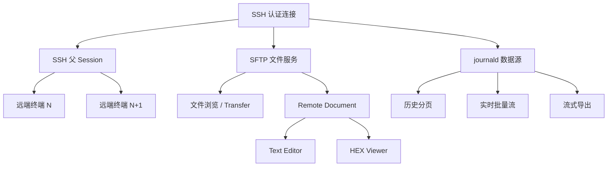

# SSH、SFTP 与远端工程工作流

## 目标

SSH 模块把远端终端、文件管理和远端日志放在同一个认证上下文中，避免每项能力重复建立独立连接和身份状态。

## 当前方案

### 主机身份信任

SSH 使用版本化的本地 `known_hosts.json` 作为主机身份信任源：

- 首次连接：展示 `host:port`、主机密钥算法与 SHA-256 fingerprint，用户明确接受后才持久化；
- 一个 endpoint 可以同时保存多个已经明确接受的 host-key 算法/指纹，不把服务器新增另一种合法算法误判为原密钥发生变化；
- 已知算法且 fingerprint 一致：自动通过，并只更新该算法/指纹记录的 `last_seen`；
- 已知 endpoint 出现新的 host-key 算法：进入独立的 **Additional Key** 状态，界面明确提示该主机已经有其它受信算法；必须再次核对设备身份并确认，不能伪装成“首次见到主机”；
- 同一 host-key 算法的 fingerprint 变化：当前连接始终先拒绝。后端为这次实际观察到的 mismatch 生成一次性 `request_id`；只有对应安全确认对话框仍在有效期内时才能替换该算法的旧信任，替换后必须重新发起连接，不能用任意 host/fingerprint 参数直接覆写信任；
- `known_hosts.json` 使用当前 schema v2。加载时先只读取 schema version：非当前版本或当前版本内容损坏都会隔离原文件，同时写入持久化 blocked marker；以后重启仍保持 fail-closed，不会把被隔离的信任库静默降级成 fresh TOFU。只有用户在主题安全确认框中显式“重置信任库”后才创建空的当前信任库，此后所有主机都必须重新核对 fingerprint；
- endpoint key 对 IPv6 做标准化，不让带/不带方括号的同一地址形成两份信任记录；
- 首次/新增算法确认与 Host Key Changed 替换都以独立 `request_id` 关联，不再用 fingerprint 作为 pending key；
- 通用 `ProtocolAdapter::connect()` 不允许绕过 HostKeyVerifier；SSH 生产连接必须走应用层注册的受信连接 contribution；
- TCP/KEX 网络阶段与用户 Host Key 确认分别计时。网络阶段固定 deadline 不包含用户阅读时间；用户安全决策拥有独立的较长上限，确认完成后 KEX 重新获得完整网络 deadline。确认事件无法送达、用户确认过期、信任存储不可用都 fail-closed。

`known_hosts.json` 只保存公开主机身份信息，不保存密码、私钥或 passphrase。

### 认证与连接建立

SSH 把非敏感连接参数与运行时认证秘密拆开：持久化参数只包含 host / port / username / auth method 与 credential reference，hydrate 后再构造 `SshAuthSecret::Password` 或 `SshAuthSecret::Key`。因此“密码和私钥同时存在”这类无效运行态不能进入协议核心。连接流程直接 move 这份运行时秘密，不为会话名称等展示元数据额外 clone 密码/私钥；秘密对象销毁时主动 zeroize。认证失败仍保留 russh 返回的 `partial_success` 与可继续认证方法信息用于诊断，不能把多阶段认证要求误报成普通密码错误。

RSA 私钥签名算法属于 SSH 协商结果而不是固定配置。服务端提供 `server-sig-algs` 时按协商结果选择 `rsa-sha2-*`；未提供 EXT_INFO 时以 `rsa-sha2-512` 做现代算法 best-effort。服务端若明确只接受旧式 `ssh-rsa`/SHA-1，TauTerm 默认拒绝静默降级。

连接目标始终以独立的 host + port 传给 socket resolver，不通过字符串拼接构造网络地址；错误消息和界面展示再单独格式化 endpoint。IPv6 因此使用 `[host]:port` 展示，但 resolver 接收不带方括号的原始 IPv6 host。

连接建立 future 直接受调用方生命周期管理，不再额外 spawn 一个可能脱离 Tauri 命令生命周期的后台 connect task；命令取消、超时或 Host Key 拒绝都会通过 drop 取消尚未完成的连接过程，不留下孤儿连接任务。父 Session 一旦创建，首个 PTY 注册、运行态快照、DataPlane 激活和瞬时凭据提交被视为同一个连接事务；commit 前任一阶段失败都会统一关闭父 Session，而不是在多个错误分支分别补偿。

认证秘密只存在于瞬时连接配置和平台安全凭据存储中。运行时 SSH 配置的 Debug 输出会主动隐藏密码、私钥和 passphrase，并在对象销毁时清零这些字符串缓冲区；Session/Workspace 仍然只保存凭据引用。

### 会话身份展示

新建 SSH 父会话在未填写自定义名称时，把登录身份固化为默认会话名 `SSH @ <username>`；侧栏第一行始终显示持久化会话名，第二行显示网络目标 `<host>:<port>`。默认会话名只在创建时生成，之后修改主机、端口或用户名不会隐式重写会话名；用户自定义名称同样保持不变。IPv6 目标采用 `[host]:port` 形式，避免地址与端口边界含糊。

一个保存的 SSH 配置先建立认证连接，再由父 Session 暴露可创建多个远端 PTY 的通道工厂。公共 Session 核心管理 child terminal 的生命周期和编号，SSH 插件只负责在同一认证上下文中创建远端通道。SSH `EOF` 是方向性的半关闭，不等同于整个 channel `Close`；收到远端 EOF 后仍允许本端完成必要的写入和关闭握手，本端 shutdown 显式发送 EOF/Close。只有真正 Close 后才拒绝继续 write/resize，不依赖 Rust 对象析构隐式结束协议通道。

`SshRuntime` 的强引用只由 SessionStore 持有的 service / file-transfer / channel-factory capability graph 管理。注册到 `PluginRuntime` 的 `SshAdapter` 自己持有 `SessionRuntimeRegistry<SshRuntime>` 弱索引；该索引不拥有连接、不能延长连接生命周期，失效 weak entry 会被视为运行时不可用并清理。SSH 不使用模块级静态 runtime registry，因此插件实例与其私有运行态索引具有明确 ownership，SessionStore 仍是运行时资源生命周期的单一强 ownership source。

SFTP 和 journald 属于 SSH 的侧通道工作流：它们复用已建立的 SSH 身份/连接资源，通过独立的文件或 exec 能力工作，不把文件管理或日志读取伪装成终端字节流。远程 `$HOME` 也属于文件工作流的辅助元数据，不再阻塞基础 SSH 登录；第一次真正请求文件管理器 home 时才通过独立 exec channel 查询，并在 `SshRuntime` 中缓存。SFTP 文件管理器由启动命令直接取得 `transfer_id`，再用公共传输事件跟踪单次上传/下载，并把“字节已到 100%”与“flush/提交后真正 finished”区分开。文件覆盖使用同目录临时文件 + commit/rollback，目录复制保留空目录，符号链接默认不跟随；具体事件顺序、冲突策略和状态机由 [TRANSFER.md](TRANSFER.md) 统一定义。

### 远程文档查看与编辑

文件管理器把普通文件的“预览”和“编辑”统一为 **Remote Document** 工作流，而不是维护两套弹窗和两套字节/编码状态。双击普通文件或选择“打开”会建立一个前端文档会话；目录继续进入目录，符号链接和特殊文件不进入文档系统。

- 文档以远端原始字节快照为读取真相源。Text/HEX 是同一快照的不同视图；文本工作区进入可编辑状态后，文本 buffer 是唯一可变内容，HEX 视图显示该工作内容按当前保存格式序列化后的真实字节，不维护第二份可变 byte buffer。
- 首次打开最多读取 1 MiB；完整文档上限为 4 MiB。截断快照永远只读，只有显式加载完整文档成功后才允许保存；超过完整文档上限的文件保持有界查看，不允许用前缀覆盖原文件。HEX 为保证渲染成本最多显示 128 KiB。
- 编码自动判断只信任 BOM 与严格 UTF-8；无法严格识别的区域编码不伪造自动识别结果。用户可以显式“重新按某编码打开”，保存编码则是独立格式属性。默认保存保留读取时的 encoding、BOM 与主导 EOL；改变这些属性属于文档修改。
- UTF-8 / UTF-16LE / UTF-16BE 由文档格式显式处理 BOM 与字节序；GB18030、Big5、Shift-JIS、EUC-JP/KR、Windows-1252 使用严格编码，遇到不可映射字符时拒绝保存，不以 `?` 静默替换工程文件内容。
- 文档保存是专用的 SFTP document transaction，不伪装成下载/上传 Transfer 任务，也不占用 `TransferScheduler`。后端先把文本严格序列化到同目录排他临时文件，再完成 flush、权限同步与 commit/rollback。
- 完整打开后版本 token 由 `size + mtime + CRC32(content)` 组成。非强制保存会在写临时文件前和正式 commit 前各验证一次 expected version；远端文件被其他工具修改时返回 conflict，由 UI 明确选择重新加载或覆盖，禁止 silent lost update。
- SSH 断开不会销毁已经打开的 dirty 文档；编辑内容仍留在当前 UI 生命周期中，但保存被禁用。重连后保存仍重新校验远端版本，不因“本地还有编辑内容”绕过并发保护。
- 关闭 dirty 文档统一走共享的二元确认流程：明确询问是否保存，确认只在保存成功后关闭，取消返回编辑器；不再维护“关闭 / 保存 / 取消”三项并列的私有确认卡片。

### journald 日志查看器

远端日志的数据源只由 `src-tauri/src/plugins/ssh/journald.rs` 负责理解 `journalctl` 语义；前端不直接拼接 journalctl 参数，也不自行推断分页方向：

- 历史查询统一使用 **newest → oldest** 顺序。后端以反向输出、inclusive cursor 和 look-ahead 生成页面；`next_cursor` 只有在已经证明存在更老一页时才返回，避免用“本页刚好等于 limit”猜测 `hasMore`。
- 全量导出复用同一分页器，从首次页面向更老 cursor 遍历；导出过程逐页写同目录临时文件，完成后再提交目标文件，不在内存中收集全部日志。
- 实时追踪显式使用“点击开始后产生的新日志”语义，不继承 journalctl 的默认尾部记录；Rust 端先按时间/批大小聚合，再通过批量事件跨 IPC 发送，避免每条日志都触发一次 WebView 边界调用。
- 查询执行器同时收集 stdout、stderr 和远端 exit status，并对响应大小、单条实时记录和查询时长设置上限；远端命令失败不会再被空结果吞掉。
- 原始 journald JSON 以任意 JSON 字段值保存，再额外规范化 timestamp/cursor/message/priority/unit 等常用视图字段；数组、数字、null 或二进制数组不会因为“不是字符串”而使整条记录丢失。
- “文本搜索”和“正则搜索”是显式不同语义。文本模式在客户端转义 PCRE 元字符，正则模式才把用户表达式作为 journalctl grep pattern 传递。
- “仅内核”用 journald 字段 `_TRANSPORT=kernel` 表达，不使用会隐式限制到当前 boot 的 `-k` 快捷参数。
- 实时、历史和导出拥有独立前端生命周期；历史查询通过 generation 丢弃过期响应，实时/导出任务由后端 operation state + notify 管理取消和完成，不用轮询注册表等待任务退出。
- 紧凑列表采用窗口化渲染，完整视图保留按需布局优化；UI 缓冲区有固定上限，日志展示不会无限增长 DOM。

持久化 SSH 配置与认证秘密分离：Session/Workspace 只保留 `credential_account`，密码、私钥和 passphrase 由平台安全模块持有。建立连接时后端解析引用并把秘密注入一次连接配置，前端不读取安全存储中的秘密，也没有读取凭据明文的通用 IPC；秘密不会重新写回 Session 状态。保存 SSH 配置时，明文输入先只形成待提交凭据；Session Library 原子提交成功后才写安全存储，凭据提交失败会在同一 Session Library 文件锁内恢复旧快照。删除 SSH Session 同样在安全凭据清理失败时恢复 Session Library，避免“配置已删但凭据仍孤立”。直接 SSH 连接则只在认证连接建立、父 Session 与首个终端通道均注册成功后提交瞬时凭据；提交失败会关闭尚未公告的运行时 Session，失败连接不会留下新的持久凭据或前端假连接。加载时发现的旧明文字段直接从持久化文件擦除，旧会话需要重新输入凭据，不执行迁移。

## 关键数据流

## 设计边界

- 身份认证与 host-key 校验属于 SSH 连接边界，不能由前端绕过。
- Host Key 信任以 `endpoint + key algorithm + fingerprint` 为核心；同 endpoint 可以信任多个算法，但新增算法必须和首次 TOFU 区分展示，同算法的指纹变化必须先 fail-closed，再通过后端实际 mismatch request 做显式替换。
- 信任库损坏/未知 schema 必须跨重启保持 blocked；只有显式 reset 可以清空信任库，不能自动回退到 fresh TOFU。
- 用户交互等待和网络阶段 timeout 必须是不同生命周期，不能重新把 Host Key 对话框等待时间包进 TCP/KEX 固定超时。
- host 与 port 是结构化网络目标；IPv6 连接不能依赖 `host + ":" + port` 拼接。
- RSA 签名算法优先遵循服务器 `server-sig-algs`，默认不允许静默退回 `ssh-rsa`/SHA-1。
- SSH connect future 必须受发起命令本身的 cancellation 生命周期约束，不创建脱离调用方的孤儿连接任务。
- 多终端共享认证连接，但每个 child terminal 有独立 PTY/I/O 生命周期；远端 EOF 是方向性半关闭，真正 Close 与本端 EOF/Close 握手必须区分。
- SessionStore capability graph 是 SSH 运行时资源的强 owner；任何按协议维护的 session-id lookup 只能是非持有索引，不能形成第二套资源 ownership。
- 文件传输、远程文档和远端日志都通过 side-channel/专用服务实现，不侵入终端流；Remote Document 保存有自己的小文件事务语义，不复用批量 Transfer 状态机。文件服务辅助元数据必须 lazy 获取，不能让未使用的 side capability 增加基础 SSH 建连步骤。
- journald 的 cursor、排序方向、stderr/exit status 与 command-line 参数属于后端数据源实现细节；React 只消费规范化页面/批量事件。
- journald 实时任务的停止必须等后端 operation 完成后才允许同一 Session 重新启动；不要恢复基于固定间隔 polling 或“已在运行中”字符串补偿的旧模型。
- SFTP 浏览/属性/Remote Document 使用 lstat/no-follow 语义识别符号链接；递归下载默认不跟随链接。文档读取只打开普通文件，并在取得远端 handle 后释放 SFTP cache mutex，避免小文件编辑阻塞目录浏览。chmod 只对普通文件/目录开放，避免通过符号链接意外修改目标对象。
- Remote Document 的 truncated snapshot、working text、save format、expected version 与 dirty/conflict 状态必须由文档会话统一拥有；FileManager 只表达 Open 意图，不能重新维护 Preview 专用数据状态。
- Remote Document 保存必须在后端完成严格序列化、expected-version 校验和临时文件 commit/rollback；partial snapshot、编码失败、远端版本冲突或目标类型变化都必须 fail-closed。
- 文件管理器的新建/重命名交互只接受单一文件名，不能把 `/`、`.` 或 `..` 偷渡成移动/跨目录操作；真正的 move 应作为独立操作语义。新建文件使用排他创建，同名对象存在时返回冲突而不是清空原文件。
- Keep Both/Skip 的冲突语义必须在最终 commit 时再次成立；目录 Keep Both 必须创建独立根目录，不允许静默合并到已有目录。文件管理器支持文件与目录上传；目录上传保留空目录并默认跳过本地符号链接/特殊文件。
- 桌面拖放上传使用 Tauri 原生 WebView drag/drop 路径事件，并按窗口 scale factor 把物理坐标映射到 DOM 逻辑坐标；只有文件管理器面板命中的 drop 才接受。拖放路径可能混合文件/目录，因此发生同名冲突时只提供 Keep Both/Skip，不提供目录级危险 Replace。
- 从 SFTP 远端名称派生本地下载路径时，后端逐组件执行跨平台安全验证；Linux 远端合法的反斜杠文件名不能在 Windows 客户端被重新解释成目录分隔符。
- 父配置可以持久化；临时 child terminal 的运行状态不能作为 Workspace 可恢复资源。
- 凭据存储策略由平台安全模块统一负责，SSH 只消费安全凭据接口；运行时配置不能通过 Debug 输出秘密，生命周期结束应主动清理秘密缓冲区。
- Session Library 与安全凭据虽然属于两个物理存储，但保存/删除流程必须通过显式提交与回滚边界保持可恢复一致性；不能先静默覆盖凭据再尝试保存 Session。

## 代码锚点

- `src/plugins/ssh/`
- `src-tauri/src/plugins/ssh/`
- `src-tauri/src/transfer/sftp_transfer.rs`
- `src-tauri/src/transfer/ssh_file_service.rs`
- `src-tauri/src/transfer/sftp_document.rs`
- `src/components/FileManager/`
- `src/components/FileEditor/`
- `src/components/JournaldViewer/`

## 何时更新本文

修改 SSH 父子会话、认证连接复用、SFTP/远端文档/远端日志与 SSH 的资源关系、Workspace 恢复语义时，必须同步更新本文。

SFTP 的公共传输生命周期见 [TRANSFER.md](TRANSFER.md)，SSH/SFTP 的 RFC/上游依据见 [网络协议知识索引](../knowledge/NETWORK_PROTOCOLS.md)。
