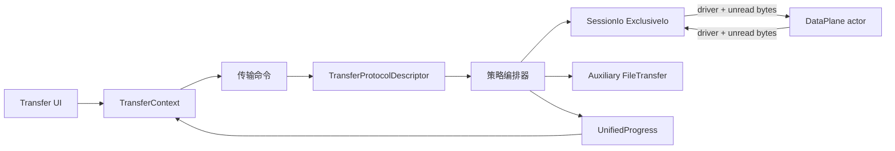

# 文件传输子系统设计

## 目标

传输子系统把串口 X/Y/ZModem 与 SSH/SFTP 等不同资源模型统一成一套“选择协议 → 建立传输上下文 → 进度 → 取消 → 清理”的 Session 级能力，同时保留协议所需的真实资源语义。

## 当前方案

后端存在统一 `FileTransfer` 抽象和统一进度模型。传输协议首先通过 `TransferProtocolDescriptor` 声明执行模式和能力，编排器只消费 descriptor，不再根据协议名字推断资源策略：

- **Inline**：传输通过 `SessionIo::acquire_exclusive` 获取当前 Session DataPlane 的独占 lease，例如串口 X/Y/ZModem；
- **Auxiliary**：复用 Session 的独立协议能力，例如 SSH/SFTP；
- **SeparateConnection**：模型已保留，但当前通用编排器尚未实现该策略。

Descriptor 同时声明 send / receive / batch / directory / overwrite / resume 等能力。当前内建协议由 `TransferProtocolType::descriptor()` 作为单一注册表来源；调用方不得再建立第二套协议名 → 执行模式映射。

Inline 传输不会取得具体 `serialport::SerialPort` 或做协议层 downcast。DataPlane 仍是底层资源的唯一生命周期 owner，但 Exclusive lease 会把当前通用 `Box<dyn BlockingByteStream>` 从共享 actor 临时移动到协议 worker：独占期间普通 Session write/resize 被拒绝，actor 不再持有或读取该 driver，X/Y/ZModem 通过 `TransferIo = Read + Write + Send` 直接执行同一个 driver 的 read/write/flush；任务结束、失败或取消后 drop lease 把 driver 归还 actor，再恢复共享模式。

Exclusive acquire 是无损所有权交接：申请开始后 actor 不再启动新的共享 read；若已有 read 正在进行，则该 read 返回但尚未交付共享订阅者的字节进入 handoff buffer。尚未交给任何订阅者的 startup bytes 也随 driver 一起交给 lease。协议先消费这些 prefetched bytes，再读取 driver。lease 归还时仍未消费的 prefetched bytes 会随 driver 返回 actor 并重新进入共享接收流。Inline 适配层禁止在取得 lease 后无条件清空 RX，避免丢失切换边界已经到达的 `C`、`NAK` 或 ZModem 初始化帧。

编排器负责 setup → execute → cleanup，并统一取消、进度广播、panic/error 清理和 Session 状态恢复。每个 Session 的活动任务准入、精确任务 ID 和取消状态由 `TransferScheduler` 单一拥有；默认 `max_active=1`。Inline 与 Auxiliary 使用同一个共享原子取消令牌，资源占用方式不再决定取消机制；协议循环、用户取消和 Session shutdown 观察同一状态源，不创建每任务一个阻塞 OS 线程做取消桥接。

每个已启动传输分配唯一 `transfer_id`。启动命令返回 `TransferStartAck { transfer_id }`，事件仍保留 `started` 作为观察型广播。统一事件顺序是：

`command accepted/ack → file-transfer:started → file-transfer:progress* → progress broadcaster drain → ExclusiveIo/Auxiliary 资源释放 → Session 状态恢复 → file-transfer:finished`。

辅助传输命令只负责接受并注册后台任务，不能等待整个 SFTP 传输完成；调用方需要等待精确 `transfer_id` 的 `finished`。`session_id` 只标识资源归属，`transfer_id` 才标识一次具体传输。

前端 `TransferContext` 是 started/progress/finished 的唯一监听者，并按 Session 保存 `ManagedTransferTask` 快照；Transmission/FileTransfer 与 SSH 文件管理器只消费这个统一任务存储。发送命令返回 `transfer_id` 后，`TransferContext` 立即把用户本次选择的完整文件清单种入任务为 `pending`，后续协议 progress 再逐项覆盖真实状态。批量 UI 因此不能依赖“协议已经走到第几个文件”来推断用户最初选择了多少文件；即使第一个文件在块 0 阶段失败，其余已选择文件仍必须可见并在终态被解释为未执行/跳过。

## 数据流

## 事件模型

`file-transfer:started` 和 `file-transfer:finished` 分别表示任务正式注册和唯一终态。`file-transfer:progress` 只承载任务执行期间的进度流，并通过显式 `kind` 表达阶段：

- `file_start`
- `progress`
- `file_complete`
- `batch_complete`

不得使用多个 `is_*` 布尔字段组合阶段，也不得使用 `__batch_complete__` 等特殊文件名编码控制事件。`batch_complete` 仍只是协议文件循环完成，不等价于任务终态；真正 completed / failed / cancelled 只由精确匹配 `transfer_id` 的 `file-transfer:finished` 决定。

`file-transfer:finished` 的 `transfer_id`、`protocol`、`cancelled`、`error` 与 `results` 均属于正式事件契约，不以 optional 字段兼容旧事件形态。TauTerm 当前不维护内部文件传输事件的兼容版本。

## 设计边界

- 主字节流同一时间只有一个明确 owner；Inline 传输必须通过 DataPlane exclusive lease 协调。允许 lease 在 Transport 抽象内部移动通用 `BlockingByteStream` 的所有权，但禁止协议层取得具体串口类型、重新打开端口或维护第二套底层资源 owner。
- Exclusive lease 必须同时拥有**物理 driver、未消费输入字节和读写时序**：独占申请后 actor 不再发起新的 read；切换过程中已在途 read 的结果进入 handoff buffer；协议读取 prefetched bytes 后才继续驱动底层资源。禁止退化为 actor 后台 read-ahead，也禁止把每次协议 read/write 重新包装成 actor IPC proxy。
- Exclusive lease 释放时必须把同一个 driver 对象以及仍未消费的 prefetched bytes 归还 DataPlane actor，并在归还确认后才能重新开放共享 admission。失败、取消、panic 与 Session shutdown 都必须有确定的 driver 回收路径。
- Inline 适配层不得在取得 lease 后无条件清空输入；协议只有在协议状态机明确允许时才能有限丢弃噪声或前一阶段残留。
- Exclusive lease 的读必须保留可取消的短超时语义，协议远端无响应时不能无限阻塞任务取消。
- Exclusive 协议 I/O 错误默认属于当前传输，不自动等同于整个 Session transport 断开；任务清理并归还 driver 后，共享模式由下一次真实 I/O 判断设备是否仍可用。
- Session 级传输准入必须经过 `TransferScheduler`；当前默认并发上限为 1，未来并发策略只能演进 Scheduler，不能在 SessionHandle 增加平行状态字段。
- Inline / Auxiliary 只决定资源准入方式；取消统一使用 Scheduler 持有的同一类共享令牌，禁止新增协议专用取消通道或阻塞线程桥接。
- 协议执行模式和能力必须来自 `TransferProtocolDescriptor`；编排器、命令层和 UI 不得分别维护协议名分类表。
- 辅助文件传输 capability 不应阻塞普通终端 I/O。
- 进度、取消和完成事件使用统一模型，协议实现不创造第二套后端事件协议。
- Progress 阶段使用显式 `kind`，禁止通过互斥布尔组合或特殊文件名编码状态。
- 发送批次在启动 ACK 后必须保留完整初始文件清单；progress 只更新清单状态，不负责定义清单本身。任务失败/取消且后端没有逐文件终态时，仍处于 `pending/transferring` 的条目必须收敛为可解释的 `skipped`，不能在终态 UI 中残留 `pending`。
- **100% 是 payload 字节进度，不等价于完整生命周期结束。** 最后一个字节后仍可能存在 flush、metadata、协议收尾和资源释放；真正 `finished` 前 UI 显示 Finalizing。
- SFTP 速率由真实 async I/O 层使用 `Instant` 采样并随进度事件发送；WebView 不以 IPC/React 事件到达时间反推吞吐。
- 正常完成路径必须先排空进度广播队列，再释放传输资源并恢复 Session，最后 emit `finished`。用户收到完成事件时可以立即安全启动下一次传输。
- 辅助文件传输后台 task 使用 start gate：先把 JoinHandle 注册进 SessionStore，再 emit `started`，最后打开 gate，确保会话关闭能够看到并等待已接受任务。
- 批量传输中 failed 必须使最终传输失败；用户取消进入 cancelled；显式覆盖策略产生的 skipped 属于已解析用户意图。
- 失败、取消和 panic 都必须释放 lease/auxiliary resource 并把 Session 恢复到可解释状态。
- `cancel` 优先使用精确 `transfer_id`；Session 不是任务身份。
- 文件路径、覆盖策略、远端路径语义由对应传输实现负责，统一层只携带协议无关 `FileTransferOptions`。
- **SFTP 覆盖事务式提交。** 上传/下载先写同目录 TauTerm 临时文件，完成 write/flush/metadata 后才提交；Replace 使用 backup + rollback，取消/失败不能删除或截断用户原有正式文件。
- SFTP 冲突策略统一为 `replace / skip / keep-both`；KeepBoth/Skip 的不覆盖约束必须落实到提交时刻而不是只做事前 exists 检查。
- 新建远程文件与上传临时文件使用 `CREATE | EXCLUDE`，同名对象存在时失败，不能调用会 truncate 的便利 `create()`。
- SFTP 递归目录上传/下载必须保留空目录；符号链接和特殊文件默认不跟随/不隐式转换。
- 远端名称不能直接作为本地 Path 片段；所有远端派生组件由后端逐段验证跨平台危险字符与保留名。
- 文件管理器成功状态可短暂保留后自动收起；失败/取消状态保留到用户明确关闭；cancelling 不能被迟到 progress 改回 transferring。
- 窄文件管理器状态条通过 container query 自适应，取消/关闭按钮必须始终可达。

## 代码锚点

- `src-tauri/src/kernel/file_transfer.rs`
- `src-tauri/src/kernel/plugin_adapter.rs`
- `src-tauri/src/transfer/orchestrator.rs`
- `src-tauri/src/transfer/protocol.rs`
- `src-tauri/src/transfer/serial_transfer.rs`
- `src-tauri/src/transfer/scheduler.rs`
- `src-tauri/src/session/io.rs`
- `src-tauri/src/transport/runtime.rs`
- `src/context/TransferContext.tsx`
- `src/components/FileTransfer/`
- `src/components/Transmission/`
- `src/types/transfer.ts`

## 何时更新本文

修改传输策略、协议 capability descriptor、ExclusiveIo 所有权、统一进度/取消、批量传输、SFTP/串口编排或传输状态与 Session 生命周期的关系时，必须同步更新本文。

## Role-aware modem configuration

The transfer command boundary uses a tagged `protocolOptions` object rather than flattened modem fields. Sending and receiving are separate Rust/TypeScript unions so a setting owned by one local role cannot silently affect the opposite role. There is no compatibility parser for the removed `blockSize`/checksum/streaming top-level request shape.

- **YMODEM**: the sender may choose 128/1024-byte data blocks; the receiver follows the protocol handshake and does not reuse that sender preference.
- **XMODEM**: sender block size (SOH=128, STX=1024) is independent of checksum negotiation. The receiver controls whether it requests CRC16 with `C`, checksum with `NAK`, or starts in automatic CRC16-with-fallback mode. `G` is not an XMODEM-1K selector.
- **ZMODEM**: the receiver advertises CRC32 capability with `ZRINIT.CANFC32`. Sender `auto` uses CRC32 only when advertised, `crc16` stays on CRC16, and `crc32-required` fails when the peer cannot provide CRC32. Maximum sender data block size is a sender-side limit.

Inline transfer cancellation has one owner: `TransferScheduler` creates and stores the same `Arc<AtomicBool>` token consumed by the running transfer. The obsolete oneshot cancellation compatibility parameter is removed; oneshot channels that remain in the orchestrator are lifecycle start gates, not cancellation state.
