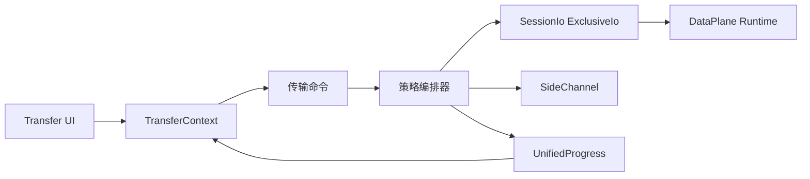

# 文件传输子系统设计

## 目标

传输子系统把串口 X/Y/ZModem 与 SSH/SFTP 等不同资源模型统一成一套“选择协议 → 建立传输上下文 → 进度 → 取消 → 清理”的 Session 级能力，同时保留协议所需的真实资源语义。

## 当前方案

后端存在统一 `FileTransfer` 抽象和统一进度模型，传输编排器按资源占用策略组织生命周期：

- **Inline**：传输通过 `SessionIo::acquire_exclusive` 获取当前 Session DataPlane 的独占 lease，例如串口 X/Y/ZModem；
- **SideChannel**：复用 Session 的独立协议能力，例如 SSH/SFTP；
- **SeparateConnection**：模型已保留，但当前通用编排器尚未实现该策略。

Inline 传输不再移交真实串口或底层 handle。DataPlane Runtime 始终拥有资源，exclusive lease 只临时改变访问权：独占期间普通 Session write 被拒绝，RX 只交给传输 lease；任务结束、失败或取消后 drop lease 即恢复共享模式。X/Y/ZModem 算法只依赖 `TransferIo = Read + Write + Send`，不知道底层是 serialport 还是其它 byte stream。

编排器负责 setup → execute → cleanup，并统一取消、进度广播、panic/error 清理和 Session 状态恢复。每个 Session 的活动任务准入、精确任务 ID 和取消信号由 `TransferScheduler` 单一拥有；默认 `max_active=1`。

每个已启动传输分配唯一 `transfer_id`。启动命令返回 `TransferStartAck { transfer_id }`，事件仍保留 `started` 作为观察型广播。统一事件顺序是：

`command accepted/ack → file-transfer:started → file-transfer:progress* → progress broadcaster drain → ExclusiveIo/SideChannel 资源释放 → Session 状态恢复 → file-transfer:finished`。

SideChannel 命令只负责接受并注册后台任务，不能等待整个 SFTP 传输完成；调用方需要等待精确 `transfer_id` 的 `finished`。`session_id` 只标识资源归属，`transfer_id` 才标识一次具体传输。

前端 `TransferContext` 是 started/progress/finished 的唯一监听者，并按 Session 保存 `ManagedTransferTask` 快照；Transmission/FileTransfer 与 SSH 文件管理器只消费这个统一任务存储。

## 数据流

## 设计边界

- 主字节流同一时间只有一个明确 owner；Inline 传输必须通过 DataPlane exclusive lease 协调，禁止转移真实 transport handle。
- Exclusive lease 的读必须保留可取消的短超时语义，协议远端无响应时不能无限阻塞任务取消。
- Session 级传输准入必须经过 `TransferScheduler`；当前默认并发上限为 1，未来并发策略只能演进 Scheduler，不能在 SessionHandle 增加平行状态字段。
- SideChannel 不应阻塞普通终端 I/O。
- 进度、取消和完成事件使用统一模型，协议实现不创造第二套后端事件协议。
- **100% 是 payload 字节进度，不等价于完整生命周期结束。** 最后一个字节后仍可能存在 flush、metadata、协议收尾和资源释放；真正 `finished` 前 UI 显示 Finalizing。
- SFTP 速率由真实 async I/O 层使用 `Instant` 采样并随进度事件发送；WebView 不以 IPC/React 事件到达时间反推吞吐。
- 正常完成路径必须先排空进度广播队列，再释放传输资源并恢复 Session，最后 emit `finished`。用户收到完成事件时可以立即安全启动下一次传输。
- SideChannel 后台 task 使用 start gate：先把 JoinHandle 注册进 SessionStore，再 emit `started`，最后打开 gate，确保会话关闭能够看到并等待已接受任务。
- `batch_complete` 只是协议批次收尾进度，不是 UI 终态；completed / failed / cancelled 只由精确匹配 `transfer_id` 的 `file-transfer:finished` 决定。
- 批量传输中 failed 必须使最终传输失败；用户取消进入 cancelled；显式覆盖策略产生的 skipped 属于已解析用户意图。
- 失败、取消和 panic 都必须释放 lease/side resource 并把 Session 恢复到可解释状态。
- `cancel` 优先使用精确 `transfer_id`；Session 不是任务身份。
- 文件路径、覆盖策略、远端路径语义由对应传输实现负责，统一层只携带协议无关 `FileTransferOptions`。
- **SFTP 覆盖事务式提交。** 上传/下载先写同目录 TauTerm 临时文件，完成 write/flush/metadata 后才提交；Replace 使用 backup + rollback，取消/失败不能删除或截断用户原有正式文件。
- SFTP 冲突策略统一为 `replace / skip / keep-both`；KeepBoth/Skip 的不覆盖约束必须落实到提交时刻而不是只做事前 exists 检查。
- 新建远程文件与上传临时文件使用 `CREATE | EXCLUDE`，同名对象存在时失败，不能调用会 truncate 的便利 `create()`。
- SFTP 递归目录上传/下载必须保留空目录；符号链接和特殊文件默认不跟随/不隐式转换。
- 远端名称不能直接作为本地 Path 片段；所有远端派生组件由后端逐段验证跨平台危险字符与保留名。
- 文件管理器成功状态可短暂保留后自动收起；失败/取消状态保留到用户明确关闭；cancelling 不能被迟到 progress 改回 transferring。
- 窄文件管理器状态条通过 container query 自适应，取消/关闭按钮必须始终可达。

## 代码锚点

- `src-tauri/src/kernel/file_transfer.rs`
- `src-tauri/src/transfer/orchestrator.rs`
- `src-tauri/src/transfer/protocol.rs`
- `src-tauri/src/transfer/serial_transfer.rs`
- `src-tauri/src/transfer/scheduler.rs`
- `src-tauri/src/session/io.rs`
- `src-tauri/src/transport/runtime.rs`
- `src/context/TransferContext.tsx`
- `src/components/FileTransfer/`
- `src/components/Transmission/`
- `src/types/transfer.ts`

## 何时更新本文

修改传输策略、ExclusiveIo 所有权、统一进度/取消、批量传输、SFTP/串口编排或传输状态与 Session 生命周期的关系时，必须同步更新本文。