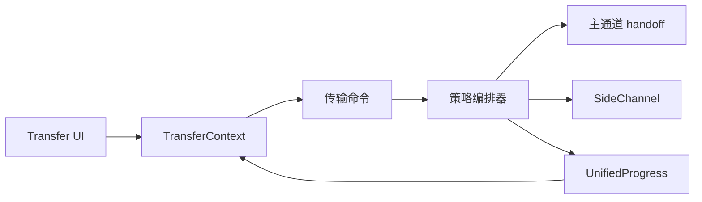

# 文件传输子系统设计

## 目标

传输子系统把串口 X/Y/ZModem 与 SSH/SFTP 等不同资源模型统一成一套“选择协议 → 建立传输上下文 → 进度 → 取消 → 清理”的 Session 级能力，同时避免把协议差异抹平。

## 当前方案

后端存在统一 `FileTransfer` 抽象和统一进度模型，传输编排器按资源占用策略组织生命周期：

- **Inline**：传输临时接管当前 Session 的主 I/O，例如串口 X/Y/ZModem；
- **SideChannel**：复用 Session 的独立侧通道，例如 SSH/SFTP；
- **SeparateConnection**：模型已保留，但当前通用编排器尚未实现该策略。

编排器负责 setup → execute → cleanup，并统一取消、进度广播、panic/error 清理和 Session 状态恢复。

每个已启动传输分配唯一 `transfer_id`。启动命令本身返回 `TransferStartAck { transfer_id }`，事件仍保留 `started` 作为观察型广播。统一事件顺序是：

`command accepted/ack → file-transfer:started → file-transfer:progress* → progress broadcaster drain → Session/资源清理 → file-transfer:finished`。

SideChannel 命令只负责接受并注册后台任务，不能等待整个 SFTP 传输完成；调用方需要等待精确 `transfer_id` 的 `finished`。传输总时长不使用固定墙钟超时判断失败。

`session_id` 只标识所属 Session，`transfer_id` 才标识一次具体传输。前端必须同时匹配二者，不能让旧传输的迟到事件污染随后启动的新传输。

前端 `TransferContext` 维护通用传输状态；Transmission/FileTransfer 组件负责协议选择、文件选择、聚合进度和逐文件结果，不拥有后端通道生命周期。SSH 文件管理器的紧凑状态条使用同一公共事件模型，但以 `preparing / transferring / finalizing / cancelling / completed / failed / cancelled` 状态机表达生命周期。

## 数据流

## 设计边界

- 主 I/O 同一时间只能有一个明确 owner；Inline 传输必须通过 handoff/归还机制协调。
- SideChannel 不应阻塞普通终端 I/O。
- 进度、取消和完成事件使用统一模型，协议实现不再各自创造第二套后端事件协议。
- **100% 是 payload 字节进度，不等价于完整生命周期结束。** 最后一个字节写入后仍可能存在 flush、metadata/协议收尾和批次提交；前端在真正 `finished` 前必须显示 Finalizing/“正在完成”，不能把 100% 当作完成。
- SFTP 速率由真实 async I/O 层使用高精度 `Instant` 采样并随进度事件发送；WebView 不得再以 IPC/React 事件到达时间反推吞吐。没有可靠样本时显示“—”，传输完成后不显示虚假的 `0 KB/s`。
- 进度节流不得重复发送同一个最终 100% 样本；只有最后字节尚未被节流器发送时才补尾部样本。
- 正常完成路径必须先排空进度广播队列，再释放传输资源/Session 占用，最后 emit `finished`。这样 `file_complete` / `batch_complete` 不会落在 `finished` 之后，用户收到完成事件时也可以立即安全启动下一次传输。
- `batch_complete` 只是协议批次收尾进度，不是 UI 终态；通用 `TransferContext` 与文件管理器都必须以精确匹配 `transfer_id` 的 `file-transfer:finished` 作为 completed / failed / cancelled 的唯一终态来源。
- 批量传输中 **failed** 必须使最终传输失败；用户取消必须进入 cancelled。由显式覆盖策略产生的 **skipped** 属于已解析的用户意图，不等同于取消。
- 失败、取消和 panic 都必须保证资源清理并恢复 Session 到可解释状态。
- `cancel` 优先使用精确 `transfer_id`；Session 只是资源归属，不是任务身份。不存在活动 SideChannel 任务时不能伪造“取消成功”。
- 文件路径、覆盖策略、远端路径语义由对应传输实现负责，统一层只携带协议无关的 `FileTransferOptions`。
- **SFTP 覆盖必须事务式提交。** 上传/下载先写目标同目录的 TauTerm 临时文件，完成 write/flush/metadata 后才提交到正式路径；Replace 时先把已有目标改名为临时 backup，提交失败必须回滚 backup。取消/失败只能清理本次临时产物，绝不能删除或截断用户原有正式文件。
- SFTP 冲突策略统一为 `replace / skip / keep-both`；单文件 Save As 使用精确 destination path，不能只传父目录后重新采用远端原文件名。KeepBoth/Skip 的“不覆盖”约束必须落实到**提交时刻**而不是只做事前 exists 检查：本地文件使用同文件系统 hard-link 排他占位，远端使用 SFTP v3 no-overwrite rename 语义并在失败后重新确认目标。
- 新建远程文件与上传临时文件使用 `CREATE | EXCLUDE`，同名对象存在时必须失败，不能调用会 truncate 的便利 `create()`。
- SFTP 递归目录复制必须保留空目录。目录 KeepBoth 会先用排他 `create_dir` 原子保留独立根目录，不能把第二份内容静默 merge 进已有目录；目录 Replace 在已有目标时明确拒绝，避免把“替换”偷换成高风险递归覆盖。符号链接和非常规文件类型是显式条目类型；默认不跟随符号链接，避免递归穿出用户选择的目录树。
- SFTP chmod 只允许普通文件与目录，并保留 POSIX mode 中的文件类型位；符号链接/特殊文件不提供 chmod，因为 v3 不存在可普遍依赖的 no-follow chmod 操作。
- **远端名称不能直接作为本地 Path 片段。** 目录树/批量下载中所有远端派生组件必须在后端逐段验证，拒绝 `.`、`..`、`/`、反斜杠、NUL、Windows 保留字符/设备名等跨平台危险名称；只有单文件 Save As 的显式用户选择路径可以作为精确 destination。WebView 不负责拼接远端目录名到本地根路径。
- 文件管理器成功状态可短暂保留后自动收起；鼠标悬停必须暂停自动收起。失败/取消状态必须保留到用户明确关闭。
- 窄文件管理器状态条用 `filemanager` CSS container 自适应：取消/关闭按钮永远可达；宽度不足时先隐藏实时速度，再重排进度信息，不允许用横向滚动解决布局。
- Serial 与 SSH 模块文档描述“为什么使用传输”，本文描述“传输本身如何被公共系统管理”。

## 代码锚点

- `src-tauri/src/kernel/file_transfer.rs`
- `src-tauri/src/transfer/`
- `src/context/TransferContext.tsx`
- `src/components/FileTransfer/`
- `src/components/Transmission/`
- `src/types/transfer.ts`

## 何时更新本文

修改传输策略、通道 handoff、统一进度/取消、批量传输、SFTP/串口编排或传输状态与 Session 生命周期的关系时，必须同步更新本文。
