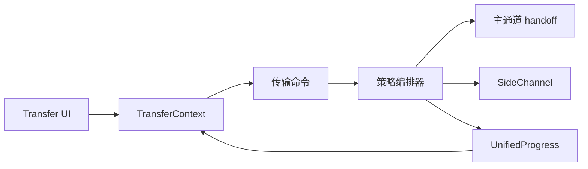

# 文件传输子系统设计

## 目标

传输子系统把串口 X/Y/ZModem 与 SSH/SFTP 等不同资源模型统一成一套“选择协议 → 建立传输上下文 → 进度 → 取消 → 清理”的 Session 级能力，同时避免把协议差异抹平。

## 当前方案

后端存在统一 `FileTransfer` 抽象和统一进度模型，传输编排器按资源占用策略组织生命周期：

- **Inline**：传输临时接管当前 Session 的主 I/O，例如串口 X/Y/ZModem；
- **SideChannel**：复用 Session 的独立侧通道，例如 SSH/SFTP；
- **SeparateConnection**：模型已保留，但当前通用编排器尚未实现该策略。

编排器负责 setup → execute → cleanup，并统一取消、进度广播、panic/error 清理和 Session 状态恢复。

前端 `TransferContext` 维护当前传输状态；Transmission/FileTransfer 组件负责协议选择、文件选择、聚合进度和逐文件结果，不拥有后端通道生命周期。

## 数据流

## 设计边界

- 主 I/O 同一时间只能有一个明确 owner；Inline 传输必须通过 handoff/归还机制协调。
- SideChannel 不应阻塞普通终端 I/O。
- 进度、取消和完成事件使用统一模型，协议实现不再各自创造第二套前端状态机。
- 失败、取消和 panic 都必须保证资源清理并恢复 Session 到可解释状态。
- 文件路径、覆盖策略、远端路径语义由对应传输实现负责，统一层不猜测协议规则。
- Serial 与 SSH 模块文档描述“为什么使用传输”，本文描述“传输本身如何被公共系统管理”。

## 代码锚点

- `src-tauri/src/kernel/file_transfer.rs`
- `src-tauri/src/transfer/`
- `src/context/TransferContext.tsx`
- `src/components/FileTransfer/`
- `src/components/Transmission/`
- `src/types/transfer.ts`

## 何时更新本文

修改传输策略、通道 handoff、统一进度/取消、批量传输、SFTP/串口编排或传输状态与 Session 生命周期的关系时，必须同步更新本文。
