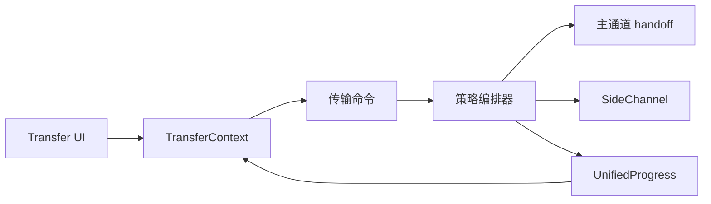

# 文件传输子系统设计

## 目标

传输子系统把串口 X/Y/ZModem 与 SSH/SFTP 等不同资源模型统一成一套“选择协议 → 建立传输上下文 → 进度 → 取消 → 清理”的 Session 级能力，同时避免把协议差异抹平。

## 当前方案

后端存在统一 `FileTransfer` 抽象和统一进度模型，传输编排器按资源占用策略组织生命周期：

- **Inline**：传输临时接管当前 Session 的主 I/O，例如串口 X/Y/ZModem；
- **SideChannel**：复用 Session 的独立侧通道，例如 SSH/SFTP；
- **SeparateConnection**：模型已保留，但当前通用编排器尚未实现该策略。

编排器负责 setup → execute → cleanup，并统一取消、进度广播、panic/error 清理和 Session 状态恢复。

每个已启动传输分配唯一 `transfer_id`。统一事件顺序是：

`file-transfer:started → file-transfer:progress* → progress broadcaster drain → Session/资源清理 → file-transfer:finished`。

`session_id` 只标识所属 Session，`transfer_id` 才标识一次具体传输。前端必须同时匹配二者，不能让旧传输的迟到事件污染随后启动的新传输。

前端 `TransferContext` 维护通用传输状态；Transmission/FileTransfer 组件负责协议选择、文件选择、聚合进度和逐文件结果，不拥有后端通道生命周期。SSH 文件管理器的紧凑状态条使用同一公共事件模型，但以 `preparing / transferring / finalizing / cancelling / completed / failed / cancelled` 状态机表达生命周期。

## 数据流

## 设计边界

- 主 I/O 同一时间只能有一个明确 owner；Inline 传输必须通过 handoff/归还机制协调。
- SideChannel 不应阻塞普通终端 I/O。
- 进度、取消和完成事件使用统一模型，协议实现不再各自创造第二套后端事件协议。
- **100% 是 payload 字节进度，不等价于完整生命周期结束。** 最后一个字节写入后仍可能存在 flush、metadata/协议收尾和批次提交；前端在真正 `finished` 前必须显示 Finalizing/“正在完成”，不能把 100% 当作完成。
- SFTP 速率由真实 async I/O 层使用高精度 `Instant` 采样并随进度事件发送；WebView 不得再以 IPC/React 事件到达时间反推吞吐。没有可靠样本时显示“—”，传输完成后不显示虚假的 `0 KB/s`。
- 进度节流不得重复发送同一个最终 100% 样本；只有最后字节尚未被节流器发送时才补尾部样本。
- 正常完成路径必须先排空进度广播队列，再释放传输资源/Session 占用，最后 emit `finished`。这样 `file_complete` / `batch_complete` 不会落在 `finished` 之后，用户收到完成事件时也可以立即安全启动下一次传输。
- `batch_complete` 只是协议批次收尾进度，不是 UI 终态；通用 `TransferContext` 与文件管理器都必须以精确匹配 `transfer_id` 的 `file-transfer:finished` 作为 completed / failed / cancelled 的唯一终态来源。
- 批量传输只有**全部文件成功**才允许最终 `success=true`；任一 failed 必须使最终传输失败，任一 skipped/用户取消必须进入 cancelled 语义。
- 失败、取消和 panic 都必须保证资源清理并恢复 Session 到可解释状态。
- 文件路径、覆盖策略、远端路径语义由对应传输实现负责，统一层不猜测协议规则。
- 文件管理器成功状态可短暂保留后自动收起；鼠标悬停必须暂停自动收起。失败/取消状态必须保留到用户明确关闭。
- 窄文件管理器状态条用 `filemanager` CSS container 自适应：取消/关闭按钮永远可达；宽度不足时先隐藏实时速度，再重排进度信息，不允许用横向滚动解决布局。
- Serial 与 SSH 模块文档描述“为什么使用传输”，本文描述“传输本身如何被公共系统管理”。

## 代码锚点

- `src-tauri/src/kernel/file_transfer.rs`
- `src-tauri/src/transfer/`
- `src/context/TransferContext.tsx`
- `src/components/FileTransfer/`
- `src/components/Transmission/`
- `src/types/transfer.ts`

## 何时更新本文

修改传输策略、通道 handoff、统一进度/取消、批量传输、SFTP/串口编排或传输状态与 Session 生命周期的关系时，必须同步更新本文。
