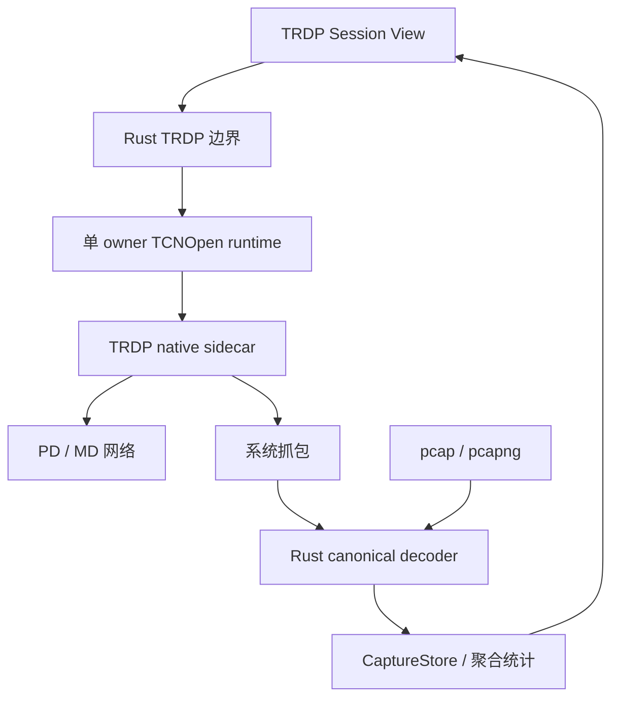

# TRDP 模块设计

## 目标

TRDP 是面向铁路/工业调试的第一方 custom Session。它同时覆盖主动 Node 和被动 Monitor，但必须把“运行时发报”和“离线分析”保持为不同安全边界。

## 当前方案

### Node

Node 可以承载 PD 与 MD 对象。Rust 侧为启用的网络 Link 管理 native runtime，所有 TCNOpen 生命周期操作进入单一运行时 owner，避免多个线程并发驱动同一 native 状态。

对象 Start/Stop/Send、实时抓包以及 MD Confirm 都属于运行时操作，只有 Session 真正 Connected 后才允许执行。连接状态以 native open 的结果为准，helper 异常退出会让 Session 回到 Disconnected。

### Monitor 与分析

Monitor 的实时抓包通过 native sidecar 调用系统抓包能力，上送 raw frame；Rust 使用同一套 canonical decoder 处理实时帧和离线 pcap/pcapng，并在 Rust 侧保存有上限的 CaptureStore、聚合 Flow/序列/间隔/Jitter 统计。React 只获取聚合结果和分页报文，不把有限 UI 预览当成全量数据。

离线 pcap/pcapng、XML、Dataset 和 Workspace 分析可以在 Session 未连接时使用，因为它们不需要主动网络运行时。

TRDP custom view 同时按 Pane 宽度和高度适配：2×2 分屏中的短 Pane 使用紧凑密度，Overview 利用双列卡片减少纵向空白，Monitor 的简单抓包设置保持可读的双列布局；复杂对象编辑和长表仍保留明确的局部/内容滚动，不通过隐藏功能换取适配。

### 配置与安全语义

Workspace 使用严格版本化 schema。Link A/B 表示网络路径，冗余组是独立业务概念，不把 A/B 隐式等同于主/备。

SDT 相关信息可以被识别和保留，但 TauTerm 不声明 SDTv2/SDTv4 安全验证或安全认证能力。

## 关键数据流

## 设计边界

- 前端不能通过“写入 sidecar stdin 成功”推断业务操作成功；native 请求必须有可关联结果。
- 主动运行时动作要求 Connected，离线分析不要求连接。
- MD Confirm 只能针对当前 Node runtime 实际拥有的可确认 transaction。
- 完整抓包和统计的权威数据在 Rust，不把大文件/全量帧长期放进 React state。
- helper 路径和抓包动态库加载必须遵守受控信任路径。
- vendored TCNOpen 的上游版本和 downstream patch 管理属于构建供应链，不由 UI 配置覆盖。

## 代码锚点

- `src/plugins/trdp/`
- `src-tauri/src/plugins/trdp.rs`
- `src-tauri/src/plugins/trdp/`
- `src-tauri/vendor/tcnopen/`
- `scripts/bootstrap-trdp.*`
- `scripts/prepare-service-bin.js`

## 何时更新本文

修改 Node/Monitor 责任、native runtime ownership、连接判定、抓包数据所有权、XML/Dataset/Workspace 模型、A/B/冗余语义或安全边界时，必须同步更新本文。

IEC/TCNOpen 依据与版本边界见 [TRDP 标准知识索引](../knowledge/TRDP.md)；TCNOpen 的许可证/patch provenance 见根 `THIRD_PARTY_LICENSES.md` 与 `src-tauri/vendor/tcnopen/SOURCE.json`。
