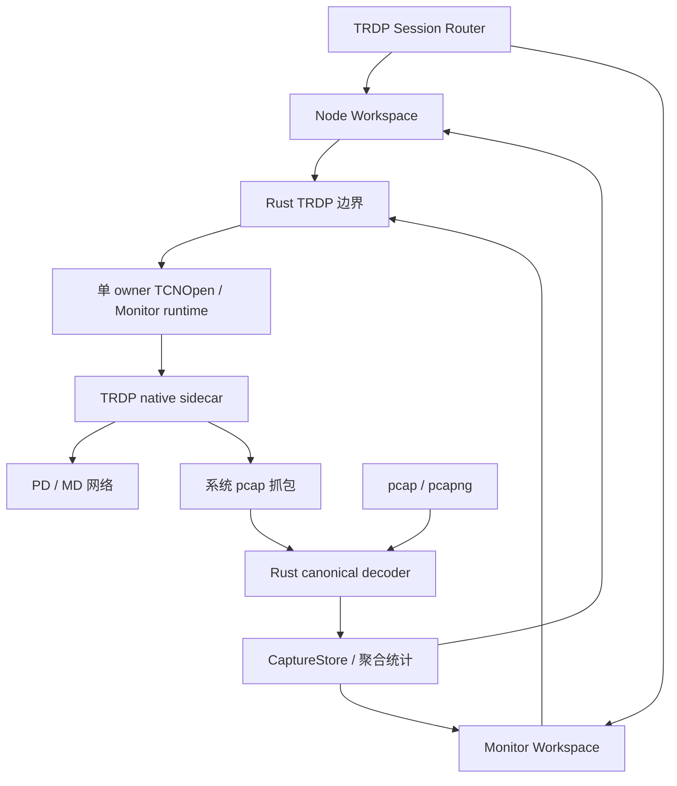

# TRDP 模块设计

## 目标

TRDP 是面向铁路/工业调试的第一方 custom Session。它同时覆盖主动 Node 和被动 Monitor，但必须把“运行时发报”和“被动抓包/离线分析”保持为不同安全边界。

## 当前方案

### Node

Node 可以承载 PD 与 MD 对象。Rust 侧为启用的网络 Link 管理 native runtime，所有 TCNOpen 生命周期操作进入单一运行时 owner，避免多个线程并发驱动同一 native 状态。

对象 Start/Stop/Send、实时抓包以及 MD Confirm 都属于运行时操作，只有 Session 真正 Connected 后才允许执行。连接状态以 native open 的结果为准，helper 异常退出会让 Session 回到 Disconnected。

Node 工作区拥有主动对象配置与控制；总览、PD、MD、分析四个页面中的 PD/MD 页面可以创建和编辑 Publisher、Subscriber、Request、Listener、Notify 等主动对象。

### Monitor 与分析

Monitor 是独立的被动工作区，不复用 Node 的主动对象编辑页面。它固定提供“总览 / PD / MD / 分析”四个页面：总览用于确认抓包链路、过滤器和流量摘要；PD/MD 分别按协议族查看捕获到的 Flow 与 Packet；分析页保留完整 Flow、Packet、报文检查器和 XML Dataset 解码。Monitor 的 PD/MD 页面只表达已观察到的网络流量，不提供 Publisher/Subscriber/Request/Listener/Notify 等主动发送控件。

Monitor 的实时抓包通过 native sidecar 调用系统 pcap 兼容抓包能力，上送 raw frame；Rust 使用同一套 canonical decoder 处理实时帧和离线 pcap/pcapng，并在 Rust 侧保存有上限的 CaptureStore、聚合 Flow/序列/间隔/Jitter 统计。React 只获取聚合结果和分页报文，不把有限 UI 预览当成全量数据。

抓包接口 A/B、是否启用 B、自动/自定义 BPF filter 与 TRDP 端口属于 Monitor Session 配置，在创建/编辑会话时持久化；工作区消费这份配置启动实时抓包，不再维护一套只存在于当前 React 实例中的临时抓包配置。Windows 使用系统安装的 Npcap/wpcap，Linux/macOS 使用系统 libpcap；TauTerm 不捆绑这些系统抓包运行库。

离线 pcap/pcapng、XML 和 Dataset 分析可以在 Session 未连接时使用，因为它们不需要主动网络运行时。实时抓包仍要求 Monitor Session 已连接，并在首次抓包时按需启动 monitor sidecar。

TRDP custom view 在插件边界先按 Session 模式路由到 Node 或 Monitor 工作区，避免把两种责任混在同一交互页面；通用 Custom renderer 仍以 `pluginId + sessionId` 作为视图实例身份，保证不同 Session 的页面、筛选、选中项和临时分析状态彼此隔离。Workspace 在本次应用运行期间按 Session ID 保留已经打开且仍有运行意义的非终端视图，因此从 TRDP 切换到其它会话、清空其 Pane 或把它移动到另一个 Pane 时，不会因为视图卸载而停止 Monitor 抓包或 Node 运行对象；切回同一 Session 时仍停留在原来的总览/PD/MD/分析页面和本次运行期 UI 状态。应用重启后不恢复这些临时 UI 状态，也不会自动恢复抓包或连接。

这种视图保活只是展示连续性，不改变 TRDP 的运行时所有权：实时抓包、Node 对象和 native sidecar 的权威生命周期仍由 TRDP Session runtime 控制；完整抓包数据仍以 Rust CaptureStore 为准。未来即使 Workspace 改变渲染策略，协议后台任务也不应以 Pane 可见性作为启动/停止条件。

TRDP custom view 同时按 Pane 宽度和高度适配：2×2 分屏中的短 Pane 使用紧凑密度，宽单 Pane 与 2×2 都优先利用双列 Overview 卡片减少纵向空白；顶部总览/PD/MD/分析导航保持固定几何，不因 selected/hover 改变尺寸。Analysis 的 Flow/Packet 采用同构标题栏和等宽列，表格按角色决定最小宽度与滚动策略；空分析页只展示数据源与空表，选中真实报文后再出现报文检查器。复杂对象编辑和有数据的长表仍保留明确的局部/内容滚动，不通过隐藏有效功能换取适配。

### 配置与安全语义

Workspace 使用严格版本化 schema，只属于 Node 主动对象工作流。Link A/B 表示网络路径，冗余组是独立业务概念，不把 A/B 隐式等同于主/备；Monitor 的 Capture A/B 同样只表示两条观察链路。

SDT 相关信息可以被识别和保留，但 TauTerm 不声明 SDTv2/SDTv4 安全验证或安全认证能力。

## 关键数据流

## 设计边界

- 前端不能通过“写入 sidecar stdin 成功”推断业务操作成功；native 请求必须有可关联结果。
- Node 主动运行时动作要求 Connected；Monitor 实时抓包要求 Connected；离线分析不要求连接。
- Monitor 是被动观察面，不允许复用 Node 的主动对象编辑/发送动作。
- 切换 Pane/Session 只改变 TRDP 视图可见性，不是停止抓包、停止对象或释放 runtime 的生命周期事件。
- MD Confirm 只能针对当前 Node runtime 实际拥有的可确认 transaction；Monitor 捕获到的 `Mq` 不获得 Confirm 能力。
- 完整抓包和统计的权威数据在 Rust，不把大文件/全量帧长期放进 React state。
- helper 路径和抓包动态库加载必须遵守受控信任路径。
- vendored TCNOpen 的上游版本和 downstream patch 管理属于构建供应链，不由 UI 配置覆盖。

## 代码锚点

- `src/plugins/trdp/`
- `src/renderers/CustomRenderer.tsx`
- `src-tauri/src/plugins/trdp.rs`
- `src-tauri/src/plugins/trdp/`
- `src-tauri/native/trdp_bridge_capture.c`
- `src-tauri/vendor/tcnopen/`
- `scripts/bootstrap-trdp.*`
- `scripts/prepare-service-bin.js`

## 何时更新本文

修改 Node/Monitor 责任、模式路由、native runtime ownership、连接判定、抓包配置/数据所有权、运行期视图连续性、XML/Dataset/Workspace 模型、A/B/冗余语义或安全边界时，必须同步更新本文。

IEC/TCNOpen 依据与版本边界见 [TRDP 标准知识索引](../knowledge/TRDP.md)；TCNOpen 的许可证/patch provenance 见根 `THIRD_PARTY_LICENSES.md` 与 `src-tauri/vendor/tcnopen/SOURCE.json`。
