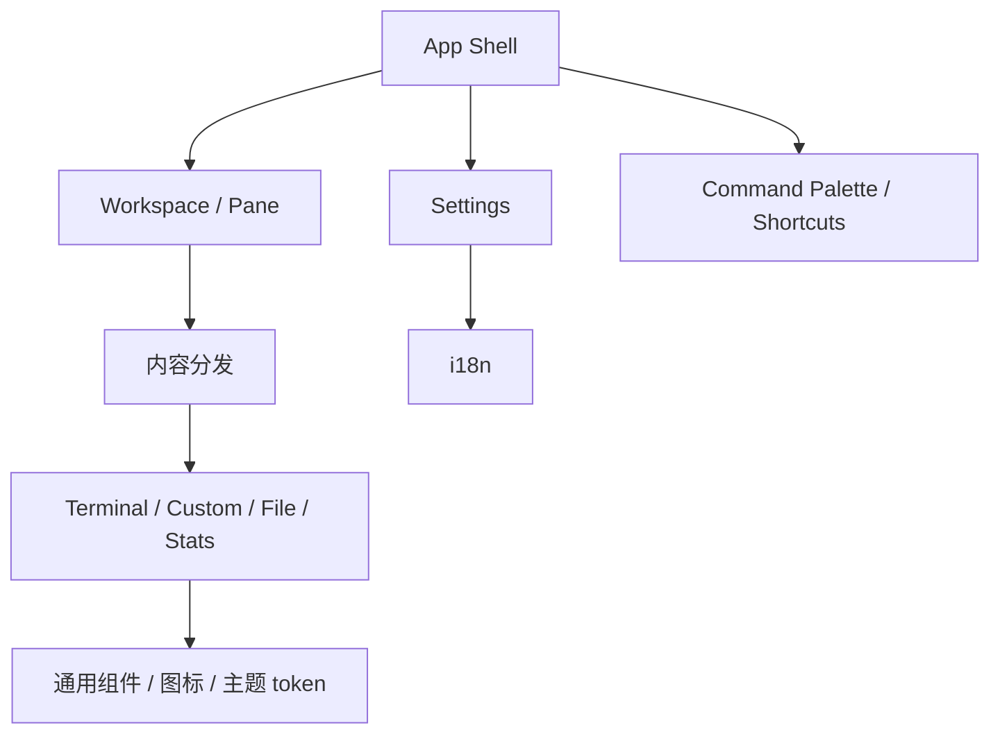

# 前端基础与应用壳设计

## 目标

前端基础层负责把所有 Session 和工具组织成一个一致的桌面工作台：应用壳、内容分发、通用 renderer、设置、国际化、快捷键、命令面板和共享 UI 上下文都属于这一层。

协议页面可以有自己的业务 UI，但不应各自建立一套应用导航、设置、翻译或快捷键机制。

## 当前方案

React 应用由全局上下文和通用组件组成：

- `App.tsx` 负责桌面应用壳与顶层组合；
- `TabContentDispatcher` / Workspace 将 Session 映射到 Pane；
- renderer 层统一承载 Terminal、Custom、文件浏览和统计类内容；
- Settings 集中管理外观、语言、日志、安全、快捷键和版本信息；
- i18next 维护 `en-US` / `zh-CN` 两套对齐 key；
- Shortcut Registry 和 Command Palette 共享稳定 action id；
- Terminal renderer 明确拥有剪贴板交互：默认 `Ctrl+Shift+C / Ctrl+Shift+V` 进入可配置 action，`Ctrl+C / Ctrl+V` 保留给 PTY；兼容 `Ctrl+Insert / Shift+Insert` 与 macOS `Meta+C / Meta+V`；
- 所有终端粘贴入口统一经 xterm `paste()`；当内容包含多条实际内容行且当前终端未启用 Bracketed Paste Mode（DECSET 2004）时先进入安全确认预览，右键复制/粘贴/全选/清屏完成后恢复终端焦点；
- 通用组件与图标系统供协议模块复用；
- ErrorBoundary、`window.error` 与 `unhandledrejection` 通过统一诊断桥进入 Rust System Log，并进行重复错误节流；公共错误页只消费 i18n key；
- Windows/Linux 的真实 TauTerm WebView 使用稳定 `data-testid` 合同通过外部 `tauri-driver` 执行最小运行时 smoke，测试自动化不进入生产运行时插件边界。

主题的材质、颜色和动画规范不在本文复制，唯一实现规范仍是 `.agents/skills/tauterm-theme/SKILL.md`。

## 关键关系

## 设计边界

- 协议模块声明内容与能力，不直接拥有整个应用导航。
- 用户语言、快捷键和设置项必须通过公共 registry/context 管理。
- Terminal 的控制键语义与应用快捷键必须显式分层：普通 `Ctrl+C / Ctrl+V` 不应被通用 WebView 剪贴板逻辑隐式劫持；应用级复制/粘贴必须由 TauTerm 宿主明确路由。设置页不得把 `Ctrl+C`、`Ctrl+V`、`Ctrl+Insert`、`Shift+Insert` 重新绑定给其它动作。
- 终端粘贴不能绕过 xterm 直接调用 Session `onData`；安全确认只针对“至少两行非空内容且 Bracketed Paste Mode 未开启”的情况，避免普通单行粘贴或已由终端程序保护的多行粘贴产生不必要摩擦。
- 中英文翻译 key 必须保持结构一致，不能让某个插件只在一个语言文件中增加公共 key；全局错误兜底不得退回硬编码单语文案。
- renderer 只负责表现稳定的内容类型，不应吞并协议生命周期。
- 主题视觉合同只在 theme skill 维护；模块文档只描述结构所有权。
- About 页面不复制 README 的产品 Description，避免第二份品牌定位来源。

## 代码锚点

- `src/App.tsx`
- `src/components/TabContentDispatcher.tsx`
- `src/components/Settings/`
- `src/components/CommandPalette/`
- `src/renderers/`
- `src/i18n/`
- `src/shortcuts/`
- `src/components/common/`

## 何时更新本文

修改应用壳、内容适配模型、renderer 类型、设置架构、i18n 组织、快捷键/命令注册或公共 UI 所有权时，必须同步更新本文。
