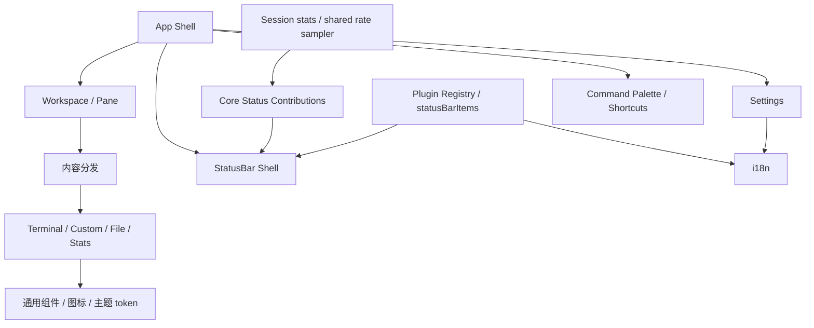

# 前端基础与应用壳设计

## 目标

前端基础层负责把所有 Session 和工具组织成一个一致的桌面工作台：应用壳、内容分发、通用 renderer、设置、国际化、快捷键、命令面板、底边状态栏和共享 UI 上下文都属于这一层。

协议页面可以有自己的业务 UI，但不应各自建立一套应用导航、设置、翻译、快捷键或独立状态栏机制。

## 当前方案

React 应用由全局上下文和通用组件组成：

- `App.tsx` 负责桌面应用壳与顶层组合；
- `TabContentDispatcher` / Workspace 将 Session 映射到 Pane；
- renderer 层统一承载 Terminal、Custom、文件浏览和统计类内容；Pane 是显示槽位而不是 Session 实例身份，`CustomRenderer` 以 `pluginId + sessionId` 给插件视图建立 React identity，同一 Pane 被重新分配到另一个 custom Session 时必须重建插件视图，不能把组件本地状态泄漏给新的 Session；
- Session 列表与 Pane Header 采用统一的双层身份模型：第一行 `Session.name` 是稳定、可显式重命名的会话身份，默认名称仅在创建时计算一次；第二行是当前配置摘要，允许随 host/port/串口/角色等参数变化。协议默认名与摘要优先由 `PluginRegistration.sessionPresentation` 声明，应用壳不重复维护协议格式；
- Settings 集中管理外观、语言、日志、安全、快捷键和版本信息；
- i18next 维护 `en-US` / `zh-CN` 两套公共资源；协议插件可通过 `PluginRegistration.locales` 注册自己的双语资源，Plugin Registry 在注册时把资源注入同一个 i18n 实例，协议专属文案因此不需要堆进全局 locale；
- Shortcut Registry 和 Command Palette 共享稳定 action id；
- Terminal renderer 明确拥有剪贴板交互：默认 `Ctrl+Shift+C / Ctrl+Shift+V` 进入可配置 action，`Ctrl+C / Ctrl+V` 保留给 PTY；兼容 `Ctrl+Insert / Shift+Insert` 与 macOS `Meta+C / Meta+V`；
- Terminal renderer 的 xterm 实例只在宿主节点仍连接到文档且具有非零可测量尺寸后创建。`open` 后的初始 fit、Pane/窗口 resize、字体变化、Pane 重新激活和 imperative `fit()` 全部进入同一个 RAF 合并调度器；ResizeObserver 只负责请求调度，不直接同步调用 FitAddon。cleanup 会先取消待执行 RAF、断开 observer/listener、清除 resize timer，再释放 xterm，确保 React StrictMode 的开发期 effect 探测、隐藏 Pane 和快速切换不会让已销毁 renderer 继续读取 dimensions；
- 所有终端粘贴入口统一经 xterm `paste()`；当内容包含换行且当前终端未启用 Bracketed Paste Mode（DECSET 2004），或粘贴内容超过 5 KiB 字符时，先进入安全确认预览；右键复制/粘贴/全选/清屏完成后恢复终端焦点；
- 所有二元确认流程统一使用 `src/components/common/ConfirmDialog.tsx`：Portal、主题外壳、动画、ARIA、焦点陷阱、焦点恢复与动作布局只维护一份，动作文案固定消费 `common.cancel` / `common.confirm`（中文“取消 / 确认”）；文件删除、会话删除、清空日志、终端安全粘贴与 SSH 首次主机密钥均不得自行创建另一套二元确认弹窗；
- 可理解且可撤销的专业配置风险优先使用就地非阻塞提示；例如 TFTP 的“非回环监听 + 允许写入 + 允许覆盖”只显示行内 warning，不占用 `ConfirmDialog`；
- 多项互斥业务决策（例如文件冲突 Replace / Keep Both / Skip Existing）仍使用自己的业务选项标签与独立 Cancel，不伪装成二元确认；
- 通用组件与图标系统供协议模块复用；互斥 Tab / 模式 / 筛选器只消费主题 SSOT 定义的共享 selector 类，业务组件不再各自维护按钮高度、padding 与切换位移动画；
- 原生 checkbox / radio 的可视几何由 `src/styles/selection-controls.css` 全局统一，避免被表格或表单的通用 `input` 尺寸规则放大；协议页面只负责其布局位置，开关型布尔值继续复用全局 `.liquid-glass-toggle`，不在业务 CSS 中再造另一套选择控件；
- 右侧可折叠工具面板使用 CSS 布局状态完成展开/收起，不为装饰性高度动画持续挂载 ResizeObserver；
- ErrorBoundary、`window.error` 与 `unhandledrejection` 通过统一诊断桥进入 Rust System Log，并进行重复错误节流；公共错误页只消费 i18n key；
- Windows/Linux 的真实 TauTerm WebView 使用稳定 `data-testid` 合同通过外部 `tauri-driver` 执行最小运行时 smoke，测试自动化不进入生产运行时插件边界；
- 底边 `StatusBar` 是应用唯一常驻状态带：全局组件只负责 surface、左右区域、排序与响应式收缩，不解释 Serial/SSH/Modbus/TRDP 等协议字段；左侧表达当前活跃 Session 的运行上下文，右侧由应用壳独占，保留版本、更新器等应用级状态；
- 协议专属运行信息统一通过 `PluginRegistration.statusBarItems` 注入左侧。状态项 ID 在插件注册时校验唯一，宿主渲染 key 自动加入 plugin namespace；插件 API 不提供右侧对齐入口，避免协议模块把应用级区域变成第二套状态栏；
- 状态项视觉统一复用 `StatusBarPrimitives` 提供的 Text / Badge / Indicator / Action / Group。插件可以组合运行态内容，但不各自复制 padding、badge、action、focus 与颜色规则；复杂编辑仍回到 Session 工作区；
- StatusBar 不复制 Pane Header 已经稳定展示的会话标题，也不把配置页字段整段搬进状态栏。优先显示连接健康、当前运行目标、活动、吞吐和最近结果等“运行时事实”；连接健康与文件传输 Activity 在视觉上正交表达，传输期间连接指示仍保持已连接语义；
- StatusBar 响应式收缩使用 `priority + overflow policy`，而不是依赖容器末端随机裁切：`preserve` 项始终保留，`early` 辅助项最先隐藏，其余项按高/中/低 priority 随窗口变窄逐级隐藏；
- 通用 stream 状态（文本/Hex 模式、编码、TX/RX 字节与速率）只属于真正拥有 terminal/send-bar 数据流语义的插件。`custom` 协议工作台不会因为 `params` 存在就被默认标成“文本 / UTF-8”，其状态由插件自己贡献；
- TX/RX 短窗口速率从 Session 累计字节统计通过共享 `useSessionTrafficRate` 派生，StatusBar Shell 不再自行维护采样器；需要同一 presentation-rate 语义的轻量 UI 应复用该 hook，而不是复制滑动窗口计算；
- Session Data Log 在状态栏只展开当前活跃 Session 的文件与字节数；其它后台记录只用数量摘要表达，避免多 Session 文件名横向占满整个底栏；
- 版本入口使用真实 button 语义，所有状态栏交互项必须支持键盘 focus；脉冲类状态遵循 `prefers-reduced-motion`。

主题的材质、颜色和动画规范不在本文复制，唯一实现规范仍是 `.agents/skills/tauterm-theme/SKILL.md`。

## 关键关系

## StatusBar 信息架构

StatusBar 是辅助观察面，不是第二个工具栏或缩小版配置页。

左侧区段按优先级组织：

1. 当前 Session 的连接健康与 endpoint；
2. 插件声明的高价值运行上下文，例如协议类型/角色、当前目标、Watch/传输运行态、最近事务结果；
3. 通用 Activity 与运行时间；
4. 只对适用内容类型出现的数据模式、编码与吞吐；
5. 低频告警和日志状态。

右侧只放应用级状态，例如版本与更新器。协议模块在类型层面没有右侧状态项入口。

插件 `statusBarItems` 必须保持低交互、低噪声：它们声明可见性、priority、overflow policy 与内容节点；内容优先由共享 primitive 组成。`preserve` 只用于不能丢失的核心身份或应用状态，插件辅助指标不得滥用它阻止响应式收缩。

## 设计边界

- 协议模块声明内容与能力，不直接拥有整个应用导航。
- Pane 的布局/显示身份与 Session 的业务身份必须分离：Pane 可以切换 Session，但 custom renderer 不得复用前一个 Session 的 React 本地状态；需要跨切换保留的状态必须由明确的 Session-scoped store 持有，而不是依赖组件实例偶然存活。
- 会话配置更新、连接/重连事件只能刷新动态参数与运行态，不得重新生成已存在根会话的 `Session.name`；名称变化必须来自显式重命名或编辑名称字段。协议若需要不同的默认身份或第二行摘要，应扩展自己的 `sessionPresentation`，而不是在 `SessionSidebar` 中增加协议分支。
- 用户语言、快捷键和设置项必须通过公共 registry/context 管理。
- 插件专属翻译资源由 `PluginRegistration.locales` 与插件代码共同所有；`en-US` / `zh-CN` 必须同时提供同一组 key。全局公共文案继续只属于 `src/i18n/locales/`，不得把协议专属大块文案反向塞回公共资源。
- 二元确认框的组件所有权属于 `components/common/ConfirmDialog`；调用方只声明 title / message / children / intent，不允许覆盖“取消 / 确认”按钮文案，也不允许回退到浏览器原生 `alert()/confirm()/prompt()`。非阻塞结果反馈统一使用全局 Toast。
- Terminal 的控制键语义与应用快捷键必须显式分层：普通 `Ctrl+C / Ctrl+V` 不应被通用 WebView 剪贴板逻辑隐式劫持；应用级复制/粘贴必须由 TauTerm 宿主明确路由。设置页不得把 `Ctrl+C`、`Ctrl+V`、`Ctrl+Insert`、`Shift+Insert` 重新绑定给其它动作。
- Terminal 的 DOM 生命周期必须先于 xterm renderer 生命周期：禁止在隐藏/零尺寸容器上 `open()`，禁止在 ResizeObserver、设置 effect 或 imperative API 中绕过统一调度直接调用 `FitAddon.fit()`，也禁止通过关闭 React StrictMode 掩盖 effect cleanup 竞态。
- 终端粘贴不能绕过 xterm 直接调用 Session `onData`；换行风险在 Bracketed Paste Mode 开启时可免提示，但超过 5 KiB 的大粘贴始终需要确认，以降低误粘贴导致远端/串口被大量灌入数据或 UI 短时阻塞的风险。打开右键菜单不得预读系统剪贴板，只有用户明确执行 Paste 动作后才允许读取；待确认内容只属于当时的 active Terminal，切换 Pane/Session 或断开连接必须取消。
- checkbox / radio 属于选择控件，不参与文本输入框和下拉框的统一高度规则；组件局部 CSS 可以调整对齐和间距，但不得重写其可视宽高、disabled/focus 语义或建立协议私有皮肤。
- 中英文翻译 key 必须保持结构一致，不能让某个插件只在一个语言资源中增加 key；全局错误兜底不得退回硬编码单语文案。
- renderer 只负责表现稳定的内容类型，不应吞并协议生命周期。
- StatusBar Shell 不增加 `if pluginId === ...` 式协议分支，不读取 SSH 认证、Modbus Unit、TRDP Mode 等协议私有字段；具体协议状态语义只属于插件贡献。
- StatusBar 插件贡献只能进入左侧 Session 区；右侧应用级区域不能被插件扩展。
- StatusBar 不得通过高频请求拉取大对象；插件状态项只读取轻量 summary/cursor 状态，不搬运完整历史、文件列表或地址空间。
- StatusBar 的共享 primitive 是状态栏视觉和交互语义的唯一 owner；协议 CSS 不再建立另一套 badge/action 皮肤。
- 响应式隐藏必须遵循 priority/overflow contract，不能恢复成简单 `overflow:hidden` 后依赖 DOM 顺序随机截断信息。
- 主题视觉合同只在 theme skill 维护；模块文档只描述结构所有权和信息职责。
- About 页面不复制 README 的产品 Description，避免第二份品牌定位来源。

## 代码锚点

- `src/App.tsx`
- `src/components/TabContentDispatcher.tsx`
- `src/components/Layout/StatusBar.tsx`
- `src/components/Layout/StatusBarItems.tsx`
- `src/components/Layout/StatusBarPrimitives.tsx`
- `src/components/Layout/sessionPresentation.ts`
- `src/hooks/useSessionTrafficRate.ts`
- `src/components/Terminal/Terminal.tsx`
- `src/core/plugin-registry.ts`
- `src/components/Settings/`
- `src/components/CommandPalette/`
- `src/renderers/`
- `src/i18n/`
- `src/shortcuts/`
- `src/styles/selection-controls.css`
- `src/components/common/`

## 何时更新本文

修改应用壳、内容适配模型、renderer 类型/实例身份、Terminal/xterm 生命周期、设置架构、i18n 组织、共享选择控件、插件 locale/status-bar/session-presentation 扩展、底边状态栏信息职责、快捷键/命令注册或公共 UI 所有权时，必须同步更新本文。
