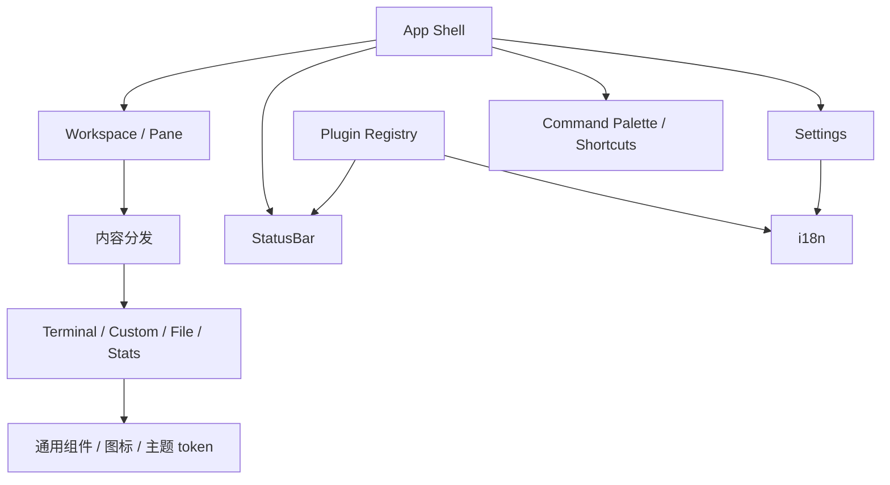

# 前端基础与应用壳设计

## 目标

前端基础层负责把所有 Session 和工具组织成一个一致的桌面工作台：应用壳、内容分发、通用 renderer、设置、国际化、快捷键、命令面板、底边状态栏和共享 UI 上下文都属于这一层。

协议页面可以有自己的业务 UI，但不应各自建立一套应用导航、设置、翻译、快捷键或独立状态栏机制。

## 当前方案

React 应用由全局上下文和通用组件组成：

- `App.tsx` 负责桌面应用壳与顶层组合；
- `TabContentDispatcher` / Workspace 将 Session 映射到 Pane；
- renderer 层统一承载 Terminal、Custom、文件浏览和统计类内容；
- Settings 集中管理外观、语言、日志、安全、快捷键和版本信息；
- i18next 维护 `en-US` / `zh-CN` 两套公共资源；协议插件可通过 `PluginRegistration.locales` 注册自己的双语资源，Plugin Registry 在注册时把资源注入同一个 i18n 实例，协议专属文案因此不需要堆进全局 locale；
- Shortcut Registry 和 Command Palette 共享稳定 action id；
- Terminal renderer 明确拥有剪贴板交互：默认 `Ctrl+Shift+C / Ctrl+Shift+V` 进入可配置 action，`Ctrl+C / Ctrl+V` 保留给 PTY；兼容 `Ctrl+Insert / Shift+Insert` 与 macOS `Meta+C / Meta+V`；
- 所有终端粘贴入口统一经 xterm `paste()`；当内容包含换行且当前终端未启用 Bracketed Paste Mode（DECSET 2004），或粘贴内容超过 5 KiB 字符时，先进入安全确认预览；右键复制/粘贴/全选/清屏完成后恢复终端焦点；
- 所有二元确认流程统一使用 `src/components/common/ConfirmDialog.tsx`：Portal、主题外壳、动画、ARIA、焦点陷阱、焦点恢复与动作布局只维护一份，动作文案固定消费 `common.cancel` / `common.confirm`（中文“取消 / 确认”）；文件删除、会话删除、清空日志、终端安全粘贴、SSH 首次主机密钥与 TFTP 暴露风险均不得自行创建另一套二元确认弹窗；
- 多项互斥业务决策（例如文件冲突 Replace / Keep Both / Skip Existing）仍使用自己的业务选项标签与独立 Cancel，不伪装成二元确认；
- 通用组件与图标系统供协议模块复用；互斥 Tab / 模式 / 筛选器只消费主题 SSOT 定义的共享 selector 类，业务组件不再各自维护按钮高度、padding 与切换位移动画；
- 右侧可折叠工具面板使用 CSS 布局状态完成展开/收起，不为装饰性高度动画持续挂载 ResizeObserver；
- ErrorBoundary、`window.error` 与 `unhandledrejection` 通过统一诊断桥进入 Rust System Log，并进行重复错误节流；公共错误页只消费 i18n key；
- Windows/Linux 的真实 TauTerm WebView 使用稳定 `data-testid` 合同通过外部 `tauri-driver` 执行最小运行时 smoke，测试自动化不进入生产运行时插件边界；
- 底边 `StatusBar` 是应用唯一常驻状态带：左侧表达当前活跃 Session 的运行上下文，右侧保留版本、更新器等应用级状态；协议专属运行信息通过 `PluginRegistration.statusBarItems` 注入，而不是继续把协议判断写进全局组件；
- StatusBar 不复制 Pane Header 已经稳定展示的会话标题，也不把配置页字段整段搬进状态栏。优先显示连接状态、当前运行目标、正在进行的自动化/传输和最近一次结果等“运行时事实”；低价值信息在窄窗口中按 priority 先被裁剪；
- 通用 stream 状态（文本/Hex 模式、编码、TX/RX 字节与速率）只属于真正拥有 terminal/send-bar 数据流语义的插件。`custom` 协议工作台不会因为 `params` 存在就被默认标成“文本 / UTF-8”，其状态由插件自己贡献。

主题的材质、颜色和动画规范不在本文复制，唯一实现规范仍是 `.agents/skills/tauterm-theme/SKILL.md`。

## 关键关系

## StatusBar 信息架构

StatusBar 是辅助观察面，不是第二个工具栏或缩小版配置页。

左侧区段按优先级组织：

1. 当前 Session 的连接状态与 endpoint；
2. 插件声明的高价值运行上下文，例如协议角色、当前目标、Watch/传输运行态、最近事务结果；
3. 只对适用内容类型出现的链路参数、运行时间、数据模式、编码与吞吐；
4. 低频告警和日志状态。

右侧只放应用级状态，例如版本与更新器。协议模块不得在右侧建立自己的第二套状态区。

插件 `statusBarItems` 必须保持低交互、低噪声：它们用于快速确认运行态，复杂编辑仍回到对应 Session 工作区。StatusBar 本身仍由应用壳统一拥有表面和布局，插件只提供内容节点。

## 设计边界

- 协议模块声明内容与能力，不直接拥有整个应用导航。
- 用户语言、快捷键和设置项必须通过公共 registry/context 管理。
- 插件专属翻译资源由 `PluginRegistration.locales` 与插件代码共同所有；`en-US` / `zh-CN` 必须同时提供同一组 key。全局公共文案继续只属于 `src/i18n/locales/`，不得把协议专属大块文案反向塞回公共资源。
- 二元确认框的组件所有权属于 `components/common/ConfirmDialog`；调用方只声明 title / message / children / intent，不允许覆盖“取消 / 确认”按钮文案，也不允许回退到浏览器原生 `alert()/confirm()/prompt()`。非阻塞结果反馈统一使用全局 Toast。
- Terminal 的控制键语义与应用快捷键必须显式分层：普通 `Ctrl+C / Ctrl+V` 不应被通用 WebView 剪贴板逻辑隐式劫持；应用级复制/粘贴必须由 TauTerm 宿主明确路由。设置页不得把 `Ctrl+C`、`Ctrl+V`、`Ctrl+Insert`、`Shift+Insert` 重新绑定给其它动作。
- 终端粘贴不能绕过 xterm 直接调用 Session `onData`；换行风险在 Bracketed Paste Mode 开启时可免提示，但超过 5 KiB 的大粘贴始终需要确认，以降低误粘贴导致远端/串口被大量灌入数据或 UI 短时阻塞的风险。打开右键菜单不得预读系统剪贴板，只有用户明确执行 Paste 动作后才允许读取；待确认内容只属于当时的 active Terminal，切换 Pane/Session 或断开连接必须取消。
- 中英文翻译 key 必须保持结构一致，不能让某个插件只在一个语言资源中增加 key；全局错误兜底不得退回硬编码单语文案。
- renderer 只负责表现稳定的内容类型，不应吞并协议生命周期。
- StatusBar 全局组件只理解应用壳和通用内容能力，不继续增加 `if pluginId === ...` 式协议分支；具体协议的状态语义属于插件贡献。
- StatusBar 不得通过高频请求拉取大对象；插件状态项只读取轻量 summary/cursor 状态，不搬运完整历史、文件列表或地址空间。
- 主题视觉合同只在 theme skill 维护；模块文档只描述结构所有权和信息职责。
- About 页面不复制 README 的产品 Description，避免第二份品牌定位来源。

## 代码锚点

- `src/App.tsx`
- `src/components/TabContentDispatcher.tsx`
- `src/components/Layout/StatusBar.tsx`
- `src/core/plugin-registry.ts`
- `src/components/Settings/`
- `src/components/CommandPalette/`
- `src/renderers/`
- `src/i18n/`
- `src/shortcuts/`
- `src/components/common/`

## 何时更新本文

修改应用壳、内容适配模型、renderer 类型、设置架构、i18n 组织、插件 locale/status-bar 扩展、底边状态栏信息职责、快捷键/命令注册或公共 UI 所有权时，必须同步更新本文。
