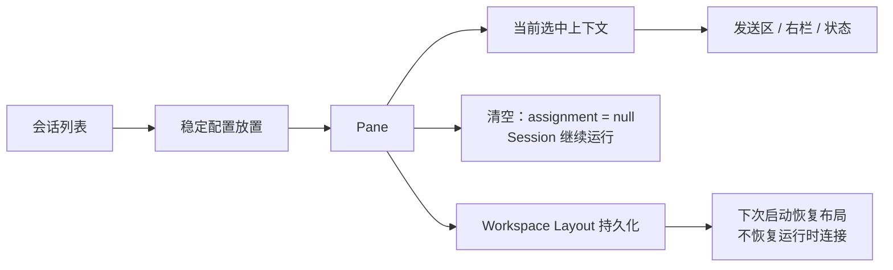

# Workspace 与分屏设计

## 目标

Workspace 是 TauTerm 的工程上下文容器。长期它不仅回答“在哪里显示”，还应回答“这个工程任务由哪些 Session、命令、脚本、解码器、记录配置和标记共同组成”。

当前已经交付的是 Workspace 的 **Layout 层**：1–4 Pane 的稳定放置、选择和恢复。Layout 不负责替用户恢复真实网络连接或进程。

## 当前方案

当前 Workspace Layout 使用 1–4 个 Pane 组成的分割树。每个 Pane 保存稳定 Session 配置的放置关系，选中的 Pane 决定右侧上下文、发送区等辅助 UI 的当前对象。Pane 数量上限由 `src/core/split-layout.ts` 的 `MAX_WORKSPACE_PANES` 统一定义，UI、布局运算和持久化校验不得各自维护副本。

布局数据和运行时连接严格分离：应用重启后可恢复 Pane 树、分割比例和配置引用，但 Session 仍保持断开，等待用户显式连接。

非终端插件的“断连后是否仍展示工作台”属于插件能力，而不是 Workspace 对具体协议的硬编码。`PluginRegistration.workspace.availability` 默认语义为 `connected`；像 TFTP、iPerf 这类客户端任务可独立于常驻服务端运行的工具显式声明 `always`。这类 Session 在未连接时仍渲染完整 custom view，“连接/断开”只管理插件常驻运行时或服务端，不决定工作台本身是否存在。

当前 Layout 只是未来 `TauWorkspace` 的一个字段，而不是完整 Workspace 数据模型。目标模型：

```text
TauWorkspace
├─ identity / version
├─ sessions[]
├─ layout
├─ assets
│  ├─ command_sets[]
│  ├─ scripts[]
│  ├─ auto_reply_rules[]
│  ├─ highlights[]
│  ├─ decoders[]
│  └─ recording_profiles[]
└─ metadata
```

安全凭据永远不进入 Workspace；这里只能保存 credential reference。

Pane Header 是 Pane 级操作的正式边界；会话内容区的右键行为属于 Session。需要连接运行时才能展示内容的未连接 Session 继续使用统一占位页，并提供一致的连接/配置/删除直觉；声明 `workspace.availability = "always"` 的离线工作台则保持真实内容可交互，Workspace 不再用“未连接”状态覆盖它的内容区域。公共会话操作始终可从左侧 Session 卡片和 Pane Header 到达，不能因为是 custom view 就失去公共操作。占位页的未连接会话菜单复用公共 `ContextMenu` 的外部点击关闭机制；由于菜单通过 React Portal 渲染，Workspace 祖先节点不得再用冒泡 `mousedown` 提前关闭该菜单，否则会在菜单项 `click` 执行前打断操作。

在多 Pane Workspace 中，Pane Header 通过可见的 `…` 按钮和右键打开同一套公共 `ContextMenu`，提供以下结构操作：

- **清空分屏**：只把该 Pane 的 assignment 设为 `null`，不关闭、不删除、不重连 Session，也不改变 Split Tree 或比例；若清空的是 selected Pane，则当前 UI Session 上下文变为真正的 `null`，发送区、右栏和状态上下文随之退出会话态。
- **向右分屏 / 向下分屏**：作为可发现的标准入口；Pane 四个自由边缘的 hover 触发仍保留，用于更快地选择左/右/上/下方向。
- **均分当前分屏**：只把目标 Pane 的直接父 Split 恢复为 50/50，不改动更外层 Split。
- **关闭分屏**：删除 Pane 并折叠失去意义的父 Split；Session 生命周期不受影响。

“清空分屏”和“关闭分屏”必须保持为两个不同状态转换：前者保留 Pane，仅解除 Pane → Session 显示绑定；后者删除 Pane 本身。打开非 selected Pane 的 Pane 菜单不应为了显示菜单而先切换当前 Session，上述动作直接作用于目标 Pane。

## 交互与数据流



## 分屏质量矩阵

CI 的 `check:split-layout` 与 `check:product-integrity` 共同守住结构级不变量；视觉 E2E 仍在未来稳定 WebView fixture 后补充。

| 布局 | 结构合同 | 内容合同 |
|---|---|---|
| 1 Pane | 单 Pane 无额外 Header inset | Terminal/Custom 均填满工作区 |
| 横向 2 Pane | 50/50 初始几何，可拖动且保留最小 Pane 尺寸 | 自定义视图按 Pane 宽度响应 |
| 纵向 2 Pane | 50/50 初始几何 | 高度不足时由内容视图自己滚动 |
| 2×2 | 四个 0.5×0.5 Pane，不复制同一 Session | TFTP/iperf/TRDP/Network 主操作仍可达 |
| 断连恢复 | Layout 恢复但不自动建立运行时 | `connected` 工作区显示统一占位；`always` 工作区保持客户端/离线工具可用 |

结构级 UI 合同：

- `SplitView.paneSurface` 是命名 size container（`session-pane`）；
- custom view 的 Pane surface 本身 `overflow: hidden`，滚动由 TFTP/iperf/TRDP/Network 等内容视图拥有，避免同轴双滚动；
- Pane Header 的 24px 内容 inset 与实际 header 几何保持一致；
- Pane Header 在紧凑的单行高度内显示“会话名称 · 会话摘要”，名称仍是主身份；摘要与左侧同一 Session 卡片第二行共用一套派生规则（SSH host:port、TRDP 链路/抓包接口、Network client 本端地址等都保持一致），空间不足时整体省略，不增加 Header 高度；
- Pane Header 的 `…` 与右键菜单复用公共 `ContextMenu`，边界定位、键盘导航、焦点恢复和主题材质只维护一份实现；
- TRDP 顶部 tab strip 高度固定，hover/selected 不改变兄弟按钮几何；
- TRDP Analysis 在窄 Pane 下从双列折叠为单列；
- TFTP/iperf 在窄 Pane 下将多列配置折叠为纵向布局；它们声明离线工作台能力后，断连不应退回统一空占位。

## 设计边界

- Pane 是显示容器，不拥有协议连接。
- Workspace 是工程资产容器；Layout 只是 Workspace 的一个子对象。
- Session 是工程状态，不因 Pane 清空或关闭就自动断开、删除配置或丢失终端现场。
- `PaneId -> SessionId | null` 是 Layout 的正式状态模型；空 Pane 不使用空字符串或其它伪 Session ID 表示。
- 布局恢复只能引用稳定配置；临时 child session 必须归一到可恢复的父配置或被丢弃。
- 断连内容可见性由 `PluginRegistration.workspace` 声明；`SplitView` 只消费通用策略，不允许增加 TFTP、iPerf 或其它 built-in plugin ID 分支。
- 分屏尺寸不足时，内容必须按 Pane 的真实宽度与高度响应式重排或进入明确的内部滚动，不能让控制项变得不可达；custom Session 自己拥有滚动边界，Pane surface 不再叠加第二层同轴滚动。
- Pane 级菜单只作用于 Pane chrome；内容区交互不得误触清空或关闭 Pane。
- 视觉材质、圆角和主题动画由主题规范统一定义，本文只记录结构和交互所有权。

## 代码锚点

- `src/core/split-layout.ts`
- `src/core/workspace-layout.ts`
- `src/context/SplitLayoutContext.tsx`
- `src/components/Layout/`
- `src/App.tsx`

## 何时更新本文

修改 Pane 数量/树模型、选择上下文、清空/关闭 Pane、拖拽分割、Workspace 持久化格式、恢复策略、Pane/Session 操作边界或插件断连工作台可见性时，必须同步更新本文。
