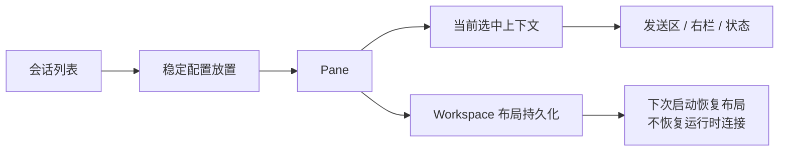

# Workspace 与分屏设计

## 目标

Workspace 让多个工程 Session 可以同时存在于一个稳定工作区中。它负责“在哪里显示、当前操作谁、下次启动如何恢复布局”，但不负责替用户恢复真实网络连接或进程。

## 当前方案

Workspace 使用 1–4 个 Pane 组成的分割树。每个 Pane 保存稳定 Session 配置的放置关系，选中的 Pane 决定右侧上下文、发送区等辅助 UI 的当前对象。

布局数据和运行时连接严格分离：应用重启后可恢复 Pane 树、分割比例和配置引用，但 Session 仍保持断开，等待用户显式连接。

Pane Header 是 Pane 级操作的边界；会话内容区的右键行为属于 Session。未连接的不同会话类型应提供一致的连接/配置/删除直觉，不能因为是 custom view 就失去公共会话操作。

## 交互与数据流

## 设计边界

- Pane 是显示容器，不拥有协议连接。
- Session 是工程状态，不因 Pane 关闭就自动删除配置。
- 布局恢复只能引用稳定配置；临时 child session 必须归一到可恢复的父配置或被丢弃。
- 分屏尺寸不足时，内容必须可滚动或响应式重排，不能让控制项变得不可达。
- Pane 级右键菜单只作用于 Pane chrome；内容区交互不得误触关闭 Pane。
- 视觉材质、圆角和主题动画由主题规范统一定义，本文只记录结构和交互所有权。

## 代码锚点

- `src/core/split-layout.ts`
- `src/core/workspace-layout.ts`
- `src/context/SplitLayoutContext.tsx`
- `src/components/Layout/`
- `src/App.tsx`

## 何时更新本文

修改 Pane 数量/树模型、选择上下文、拖拽分割、Workspace 持久化格式、恢复策略、Pane/Session 操作边界时，必须同步更新本文。
