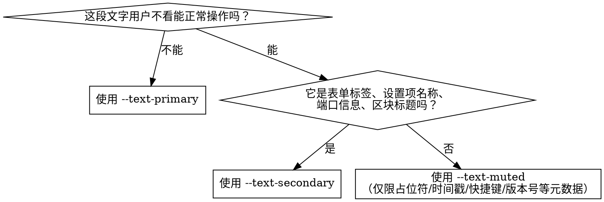

# TauTerm 主题开发指南

## 核心原则

**永远不要硬编码颜色值。** 所有颜色、模糊、阴影、边框都必须通过 CSS 自定义属性引用。

## 主题令牌速查

### Level 1 — 全局常量（不随主题变化）

这些令牌在 `:root` 中定义，所有组件直接使用：

```css
/* 在组件 CSS 中使用 */
font-family: var(--font-ui);        /* Inter 等无衬线字体 */
font-family: var(--font-mono);      /* JetBrains Mono 等宽字体 */
border-radius: var(--radius-lg);    /* 圆角: xs(4) sm(12) md(12) lg(16) xl(24) 2xl(24) full(9999) */
padding: var(--spacing-md);         /* 间距: xs(4) sm(8) md(12) lg(16) xl(24) 2xl(32) */
transition: all var(--transition-fast); /* 过渡: fast(150ms) normal(300ms) */
transition: all var(--transition-button); /* 按钮过渡: 0.3s cubic-bezier(0.4, 0, 0.2, 1) */
transition: all var(--transition-input);  /* 输入框过渡: 0.3s ease */
transition: all var(--transition-knob);   /* 切换开关滑块过渡: 200ms ease */
z-index: var(--z-panel);            /* 层级: sidebar(10) panel(20) overlay(30) toast(50) */
blur: var(--blur-xs);               /* 4px — 遮罩层背景模糊（全局常量） */
```

### 圆角语义层级（v3.1）

TauTerm 使用 4+1 层圆角体系，元素按视觉层级选用对应的圆角令牌：

| 语义层级 | 令牌 | 值 | 适用场景 |
|---------|------|-----|---------|
| **Frame** | `--radius-xl`, `--radius-2xl` | 24px | 弹窗、模态框、设置页容器、命令面板 — "宏大、温润的容器" |
| **Panel** | `--radius-lg` | 16px | 终端视口、卡片面板、**以及布局 chrome 表面（工具栏、侧边栏、状态栏、发送栏、传输面板）** — "严谨的功能区" |
| **Control** | `--radius-sm`, `--radius-md` | 12px | 按钮、输入框、选择框、列表项、导航项 — "精致的操作控件" |
| **Pill** | `--radius-full` | 9999px | 切换开关、徽章、状态指示点 — "聚焦的视觉点" |
| **Micro** | `--radius-xs` | 4px | 滚动条滑块、快捷键小提示、微小标签 — 实用微型层级 |

> **0px 例外**：仅当元素外边缘紧贴屏幕或父容器边缘时使用。如全屏终端视口（无圆角）、搜索栏贴合终端角部（`border-radius: 0 0 0 var(--radius-md)`）、活跃指示条触碰侧边栏左边缘（`border-radius: 0 var(--radius-xs) var(--radius-xs) 0`）。
>
> **布局间隙中的圆角**：布局 chrome 表面之间通过 `app-root` 的 `gap: 6px` / `padding: 6px` 产生均匀负空间，使各表面的 16px 圆角完整呈现。表面之间紧贴的边缘（如侧边栏右边缘与终端左边缘之间的 ResizeHandle 分隔区），圆角被 `overflow: hidden` 自然裁切为直线，符合 0px 例外规则。

### Level 2 — 主题令牌（3 套主题各自定义）

```css
/* ── 背景 ── */
background: var(--bg-base);         /* 页面底色 */
background: var(--bg-secondary);    /* 次级背景 */
	/* WARNING: 以下区块背景令牌已废弃 — 布局表面统一使用 .liquid-glass + var(--glass-fill) */
	/* background: var(--block-toolbar-bg);   @deprecated */
	/* background: var(--block-sidebar-bg);   @deprecated */
	/* background: var(--block-terminal-bg);  @deprecated */
	/* background: var(--block-sendbar-bg);   @deprecated */
	/* background: var(--block-statusbar-bg); @deprecated */

/* ── 文字 ── */
color: var(--text-primary);         /* 主文字 */
color: var(--text-secondary);       /* 辅助文字 */
color: var(--text-muted);           /* 弱化文字 */

/* ── 强调 ── */
color: var(--accent-primary);       /* 主强调色 */
background: var(--accent-gradient); /* 强调渐变（按钮等） */
box-shadow: 0 0 10px var(--accent-glow); /* 发光效果 */
color: var(--text-on-accent);       /* 强调色上的文字色（三套主题均为 #fff） */

/* ── 玻璃面板 ── */
border: 1px solid var(--glass-border-default);    /* v3 默认边框（推荐） */
border: 1px solid var(--glass-border);            /* v2 兼容别名 */
border-top: 1px solid var(--glass-border-top);    /* 顶部高光 */
border-left: 1px solid var(--glass-border-left);  /* 左侧次高光 */
box-shadow: var(--glass-shadow-outer);            /* 外阴影 */
box-shadow: var(--glass-shadow-inner);            /* 内高光 */
background: var(--glass-fill);                    /* 玻璃填充渐变 v3（推荐） */
background: var(--glass-bg);                      /* v2 兼容别名 */
backdrop-filter: blur(var(--glass-blur)) saturate(var(--glass-blur-saturate)); /* 玻璃模糊 + 饱和度 */

/* ── 玻璃按钮 ── */
background: var(--glass-button-bg);
border: 1px solid var(--glass-button-border);
/* hover */
background: var(--glass-button-hover-bg);
border-color: var(--glass-button-hover-border);

/* ── 玻璃输入框 ── */
background: var(--glass-input-bg);
border: 1px solid var(--glass-input-border);
box-shadow: var(--glass-input-shadow-inner);
/* focus */
border-color: var(--glass-input-focus-border);
box-shadow: ..., var(--glass-input-focus-glow);

/* ── 状态色 ── */
color: var(--color-success);        /* 成功 */
color: var(--color-error);          /* 错误 */
color: var(--color-warning);        /* 警告 */
color: var(--color-info);           /* 信息 */

/* ── 弹窗/下拉 ── */
background: var(--dialog-bg);            /* 弹窗背景 */
background: var(--select-option-bg);     /* select option 背景 */
box-shadow: var(--dialog-shadow);        /* 弹窗阴影 */
/* select 箭头颜色使用 var(--select-arrow) 令牌，三套主题各自定义 */
```

### v2 → v3 令牌迁移对照表

为保证界面统一，所有组件必须使用 v3 主令牌。以下 v2 别名令牌均已废弃，仅保留定义以保证向后兼容：

| v2 已弃用令牌 | v3 替代令牌 | 说明 |
|-------------|-----------|------|
| `--block-toolbar-bg` | `.liquid-glass` + `var(--glass-fill)` | 布局表面统一使用全局类 |
| `--block-sidebar-bg` | `.liquid-glass` + `var(--glass-fill)` | 布局表面统一使用全局类 |
| `--block-terminal-bg` | `.liquid-glass` + `var(--glass-fill)` 或 `var(--dialog-bg)`（浮动面板） | 布局表面统一使用全局类 |
| `--block-sendbar-bg` | `.liquid-glass` + `var(--glass-fill)` | 布局表面统一使用全局类 |
| `--block-statusbar-bg` | `.liquid-glass` + `var(--glass-fill)` | 布局表面统一使用全局类 |
| `--glass-bg` | `--glass-fill` | 玻璃填充渐变（v3 主令牌） |
| `--glass-border` | `--glass-border-default` | 玻璃边框（v3 主令牌） |

> **检查命令**：提交前运行以下 grep 确保无残留 v2 令牌：
> ```bash
> grep -rn '\-\-glass-border[^-]' src/ --include='*.css' --include='*.tsx'
> grep -rn '\-\-glass-bg[^-]' src/ --include='*.css' --include='*.tsx'
> grep -rn '\-\-block-' src/ --include='*.css' --include='*.tsx'
> ```

## 组件开发规范

### CSS Module 组件

```css
/* [CORRECT] 正确：全部使用令牌（v3 主令牌优先） */
.myComponent {
  background: var(--glass-fill);
  border: 1px solid var(--glass-border-default);
  border-radius: var(--radius-md);  /* 12px — Control tier */
  color: var(--text-primary);
  padding: var(--spacing-md);
}

.myComponent:hover {
  background: var(--glass-bg-hover);
  border-color: var(--glass-border-hover);
}

/* [INCORRECT] 错误：硬编码颜色 */
.myComponent {
  background: rgba(0, 0, 0, 0.2);   /* 浅色主题下看不出来 */
  border: 1px solid #fff;            /* 浅色主题下看不到 */
  color: #888;                       /* 固定色不随主题变 */
}
```

### 内联 Style 组件

```tsx
// [CORRECT] 正确
<div style={{
  backgroundColor: "var(--bg-base)",
  color: "var(--text-secondary)",
  border: "1px solid var(--glass-border-default)",
}} />

// [INCORRECT] 错误
<div style={{
  backgroundColor: "#0a0a1a",    // 硬编码深色
  color: "#888",                  // 不随主题变
  border: "1px solid rgba(0,255,255,0.15)", // v2 teal 遗留色
}} />

// WARNING: 例外：极少数场景可以硬编码
color: "#fff";                     // 在强调渐变按钮上（总是白色文字）
background: "#4285F4";             // Google 光球颜色（设计特征）
background: "#EA4335";             // Google 光球颜色（设计特征）
background: "#FBBC05";             // Google 光球颜色（设计特征）
background: "#34A853";             // Google 光球颜色（设计特征）
// 所有状态色必须使用 var(--color-*) token，不要硬编码 #34d399 / #eab308
```

### 新增弹窗

```css
.dialog {
  background: var(--dialog-bg);
  border: 1px solid var(--glass-border-default);
  border-radius: var(--radius-xl);  /* 24px — Frame tier */
  box-shadow: var(--shadow-glass), var(--dialog-shadow);
  backdrop-filter: blur(var(--glass-blur));
  -webkit-backdrop-filter: blur(var(--glass-blur));
}
```

### 新增 select 下拉

**推荐方式：直接使用全局 `.liquid-glass-input` class + 少量 select 特有样式**

```css
/* CSS Module — 仅保留 select 特有属性 + 组件级尺寸 */
.select {
  appearance: none;
  -webkit-appearance: none;
  width: 100%;
  padding: 6px 28px 6px 10px;
  border-radius: var(--radius-md);  /* 12px — Control tier */
  font-size: var(--text-sm);
  font-family: var(--font-ui);
  cursor: pointer;
  background-image: var(--select-arrow);
  background-repeat: no-repeat;
  background-position: right 10px center;
}
.select option {
  background: var(--select-option-bg);
  color: var(--text-primary);
}
```

```tsx
// JSX — `.liquid-glass-input` 全局类提供 bg/border/color/shadow/focus/hover/disabled
<select className={`${styles.select} liquid-glass-input`}>
  <option value="a">A</option>
</select>
```

> `.liquid-glass-input` 已提供：`background`、`border`、`box-shadow`、`color`、`outline`、
> `:focus` 发光、`:hover` 边框、`:disabled` 透明度。CSS Module 只需写 select 特有属性和组件级尺寸。

**select 箭头 data URI 令牌**：`--select-arrow` 包含完整的 SVG data URI，各主题通过 fill 颜色适配：

| 主题 | 箭头颜色 |
|------|---------|
| google-glow | `%239494b8`（#9494b8，弱化文字色） |
| obsidian | `%23909090`（#909090） |
| frosted | `%23556270`（#556270，石板灰） |

### 状态着色背景（color-mix 模式）

使用 `color-mix(in srgb, var(--color-*) N%, transparent)` 创建主题自适应的状态着色背景。这是错误提示框、警告横幅、成功标记和信号徽章的规范写法：

```css
/* [CORRECT] 正确 — 三套主题自适应 */
.errorBanner {
  background: color-mix(in srgb, var(--color-error) 10%, transparent);
  border: 1px solid color-mix(in srgb, var(--color-error) 30%, transparent);
  color: var(--color-error);
}
.warningBanner {
  background: color-mix(in srgb, var(--color-warning) 6%, transparent);
  border-left: 3px solid var(--color-warning);
}
.successBadge {
  background: color-mix(in srgb, var(--color-success) 12%, transparent);
}
.dangerHover:hover {
  background: color-mix(in srgb, var(--color-error) 12%, transparent);
  color: var(--color-error);
}
.signalActive {
  color: var(--accent-primary);
  background: color-mix(in srgb, var(--accent-primary) 10%, transparent);
}

/* [INCORRECT] 错误 — 深色背景值在浅色主题下失效 */
.errorBanner {
  background: rgba(255, 71, 87, 0.1);   /* 仅 google-glow 有效 */
}
```

### 新增切换开关

规范的自定义液态玻璃切换开关模式（替换原生 checkbox）：

```css
/* 隐藏原生 checkbox */
.toggleCheck {
  position: absolute;
  opacity: 0;
  width: 0;
  height: 0;
}

/* 自定义轨道 */
.toggleTrack {
  position: relative;
  width: 30px;
  height: 17px;
  background: var(--glass-input-bg);
  border: 1px solid var(--glass-input-border);
  border-radius: var(--radius-full);
  box-shadow: var(--glass-input-shadow-inner);
  transition: all var(--transition-button);
  flex-shrink: 0;
}

/* 滑块（::after 伪元素） */
.toggleTrack::after {
  content: "";
  position: absolute;
  top: 2px;
  left: 2px;
  width: 11px;
  height: 11px;
  border-radius: var(--radius-full);  /* 9999px — Pill tier */
  background: var(--text-muted);
  transition: all var(--transition-button);
  box-shadow: var(--shadow-sm);
}

/* 选中态：轨道填充强调渐变 + 发光 */
.toggleCheck:checked + .toggleTrack {
  background: var(--accent-gradient);
  border-color: transparent;
  box-shadow: 0 0 10px var(--accent-glow);
}

/* 选中态：滑块变色并右移 */
.toggleCheck:checked + .toggleTrack::after {
  left: 15px;
  background: var(--text-primary);
}

/* 禁用态 */
.toggleCheck:disabled + .toggleTrack {
  opacity: 0.35;
  cursor: not-allowed;
}
```

```tsx
// JSX 用法：
<label className={styles.repeatLabel}>
  <input
    type="checkbox"
    className={styles.toggleCheck}
    checked={enabled}
    onChange={(e) => setEnabled(e.target.checked)}
    disabled={!isConnected}
  />
  <div className={styles.toggleTrack} />
  <span className={styles.toggleText}>⟳</span>
</label>
```

> **唯一规范模式**：项目中所有切换开关统一使用 checkbox-hack 模式（隐藏原生 checkbox + `<div className={styles.toggleTrack} />`）。SendBar（`repeatCheck`）、ConnectDialog（`checkboxLabel`）、ZmodemConfigForm（`toggleLabel`）均使用相同 CSS 令牌和尺寸（30×17px 轨道、11px 滑块、`var(--accent-gradient)` 激活态、`var(--accent-glow)` 发光），差异仅在于 CSS Module 类名前缀。禁止使用 button + span 的自定义 toggle 模式——该类已从 ZmodemConfigForm 中移除并统一为 checkbox-hack 模式。

### 状态指示点

标准状态指示点尺寸为 **7px**（参考 `SessionSidebar.module.css` `.statusDot` 和 `ConnectionStatusDot.module.css` `.dot`）。

状态色必须通过 CSS Module 类控制（而非内联 `style`），使用 `.dotConnected` / `.dotDisconnected` 等变体类组合：

```css
.dot {
  width: 7px; height: 7px;
  border-radius: var(--radius-full);  /* 9999px — Pill tier */
  flex-shrink: 0;
}
.dotConnected {
  background: var(--color-success);
  box-shadow: 0 0 6px var(--color-success);
}
.dotDisconnected {
  background: var(--color-error);
  box-shadow: 0 0 6px var(--color-error);
}
```

```tsx
// JSX：通过类组合切换状态色，禁止内联 style
<span className={`${styles.dot} ${isConnected ? styles.dotConnected : styles.dotDisconnected}`} />
```

例外：`StatusBar.module.css` 使用 6px 指示点，因 StatusBar 文字基准为 9-10px（微文本层级）——这是有效例外，非必须统一。


## 全局 CSS 工具类

以下全局 class 由 `global.css` 提供，可在任何组件中直接使用。**所有视觉层（背景、边框、阴影、模糊）必须由全局类接管，CSS Module 仅保留布局属性**：

| Class | 用途 |
|-------|------|
| `.liquid-glass` | 完整液态玻璃面板效果（含 SVG 噪点纹理 + 不对称高光边框 + 多层阴影）。**适用于：弹窗、面板、下拉菜单、以及所有布局 chrome 表面（工具栏、侧边栏、状态栏、终端视口、发送栏）** |
| `.liquid-glass-card` | 液态玻璃卡片（继承 `glass-fill` 填充 + 不对称高光边框，使用 `shadow-elevated` 卡片阴影）。**适用于：所有嵌套在 `.liquid-glass` 内部的高度 ≥50px 的内层卡片（模式选择卡、设置面板内卡片、统计面板卡片、聚合进度卡等）**。无 `backdrop-filter`（父 Surface 已提供）、无 `::before` 噪声、无 `position: relative` 约束。**注意**：高度 <50px 的微型元素（如文件列表行、传输摘要条等）应使用 Mini-Card 模式（见下文）在 CSS Module 中用 `var(--shadow-sm)`（6px）+ 3D 不对称边框自行定义 |
| `.liquid-glass-button` | 液态玻璃按钮（半透明底 + 悬浮上浮 + 阴影增强）。**适用于：所有次要按钮、图标按钮、选项按钮** |
| `.liquid-glass-input` | 液态玻璃输入框（暗色内凹底 + focus 蓝色辉光）。**适用于：所有 `<input>`、`<textarea>`、`<select>` 元素** |
| `.liquid-primary-button` | 炫彩主动作按钮（全息渐变 + `gradient-shift` 动画 + 玻璃模糊） |
| `.glass-overlay` | 模态覆盖层：fixed 定位 + 半透明蒙版背景 + flex 居中。**适用于：** 弹窗背景、设置页背景、拖拽覆盖层。注意：不含 `z-index`，各使用场景在 CSS Module 中自行设置 |
| `.glow-orb` | 光球（用于 GoogleGlowBackground 中的 4 个流动光球） |

### 玻璃表面二级体系

TauTerm 的玻璃表面分为两个层级，按元素是否直接面对页面背景选择：

| 层级 | Class | 阴影 | backdrop-filter | ::before 噪声 | position | 适用场景 |
|------|-------|------|-----------------|---------------|----------|---------|
| **Surface** | `.liquid-glass` | `--glass-shadow-outer` + `--glass-shadow-inner` (40px) | blur(25-35px) | SVG 噪点纹理 | `relative` | 布局 chrome 表面（侧边栏、工具栏、终端视口、状态栏、发送栏、传输面板）、弹窗/模态框 |
| **Card** | `.liquid-glass-card` | `--shadow-elevated` (16px) | 无 | 无 | `static` | 内层卡片（聚合进度卡、模式选择卡、设置面板内卡片、统计面板卡片等） |
| **Mini-Card** | *(CSS Module 模式)* | `--shadow-sm` (6px) | 无 | 无 | `static` | 极小型信息条/标签（传输面板摘要等 ~30-50px，非交互卡片） |

**选择规则**：
- 元素直接面对页面背景或构成独立视觉区域（最外层玻璃表面） → `.liquid-glass`
- 元素嵌套在另一个 `.liquid-glass` 表面内部（内层卡片） → `.liquid-glass-card`
- 极小型元素（~30-50px）嵌套在 `.liquid-glass` 内部 → Mini-Card 模式（见下文）
- **禁止**在 `.liquid-glass` 内部再次使用 `.liquid-glass` — 会导致 40px 阴影叠加 + backdrop-filter 堆叠 + 噪声纹理三重叠加，产生不协调的视觉效果
- `.liquid-glass-card` 无 `position: relative`，因此也可用于 `position: absolute` 或 `position: fixed` 元素（而 `.liquid-glass` 不可）

```css
/* 典型用法：外层 Surface + 内层 Card */
<div className={`${styles.panel} liquid-glass`}>
  {/* 面板内容 */}
  <div className={`${styles.innerCard} liquid-glass-card`}>
    {/* 内层卡片 — 16px 卡片阴影，无模糊叠加 */}
  </div>
</div>
```

### Mini-Card 模式（微型卡片 CSS 规范）

嵌套在 `.liquid-glass` 内部的极小型元素（~30-50px）不应使用 `.liquid-glass-card` — 16px 阴影在微型元素上过重。应使用 Mini-Card 模式，在 CSS Module 中自行定义：

```css
/* Mini-Card 模式 — 微型行/标签元素（~30-50px）
   使用 glass-fill + 3D 不对称边框高光 + 最轻阴影 tier */
.miniCard {
  background: var(--glass-fill);
  border: 1px solid var(--glass-border-default);
  border-top: 1px solid var(--glass-border-top);    /* 3D 不对称高光 — 顶边更亮 */
  border-left: 1px solid var(--glass-border-left);  /* 3D 不对称高光 — 左侧次亮 */
  border-radius: var(--radius-sm);                   /* 12px — Control tier */
  box-shadow: var(--shadow-sm);                      /* 6px — 微型元素最轻阴影 */
}
```

此模式确保微型元素与 `.liquid-glass-card` 共享相同的 3D 视觉语言（不对称边框高光），但使用适配其尺寸的 6px 阴影。适用场景：
- TransmissionPanel 文件摘要条（`.fileSummary`）
- PerFileList 文件列表行（`.row`）—— ~35px，与同面板其他微型元素一致
- 其他 <50px 高度的非交互信息条/标签元素

```css
/* 典型用法：组合 CSS Module class + 全局 tool class */
<button className={`${styles.myBtn} liquid-primary-button`}>Send</button>
<div className={`${styles.myPanel} liquid-glass`}>Content</div>
<input className={`${styles.myInput} liquid-glass-input`} />
```

### 布局表面

布局 chrome 表面（工具栏、侧边栏、状态栏、终端视口、发送栏、传输面板）必须使用 `.liquid-glass` 全局类获取统一的玻璃效果。
CSS Module 中仅保留布局属性（display、height、padding、gap、overflow 等）和 **`border-radius: var(--radius-lg)`（16px，Panel tier）**，不得手写 `background`、`backdrop-filter`、`border`、`box-shadow`：

```css
/* [CORRECT] 正确：CSS Module 仅保留布局属性 + Panel tier 圆角 */
.toolbar {
  display: flex;
  align-items: center;
  height: 36px;
  padding: 0 var(--spacing-md);
  flex-shrink: 0;
  user-select: none;
  border-radius: var(--radius-lg);  /* 16px — Panel tier */
}

/* [INCORRECT] 错误：CSS Module 中手写玻璃视觉效果 */
.toolbar {
  background: var(--block-toolbar-bg);         /* 应由 .liquid-glass 接管 */
  backdrop-filter: blur(var(--blur-medium));    /* 应由 .liquid-glass 接管 */
  border-bottom: 1px solid var(--glass-border-default); /* 应由 .liquid-glass 接管 */
}
```

```tsx
// JSX：组合 CSS Module 类 + 全局 glass 类
<div className={`${styles.toolbar} liquid-glass`}>
```

### position:absolute / position:fixed 元素

`.liquid-glass` 全局类强制 `position: relative`（为 `::before` 噪点纹理提供定位上下文），因此**不可用于**已设置 `position: absolute` 或 `position: fixed` 的元素。这些浮动元素需在 CSS Module 中自行维护玻璃属性，使用 v3 主令牌：

```css
/* [CORRECT] 正确：浮动搜索栏/下拉面板/Toast，自行维护玻璃效果 */
.floatingPanel {
  position: absolute; /* 或 fixed */
  background: var(--dialog-bg);          /* 浮动面板使用 dialog 背景 */
  backdrop-filter: blur(var(--glass-blur));
  -webkit-backdrop-filter: blur(var(--glass-blur));
  border: 1px solid var(--glass-border-default);
  border-radius: var(--radius-md);
  box-shadow: var(--shadow-glass), var(--dialog-shadow);
}

/* [CORRECT] 也可使用 glass-fill 渐变作为背景 */
.floatingGlass {
  position: absolute;
  background: var(--glass-fill);         /* v3 渐变 */
  backdrop-filter: blur(var(--glass-blur));
  border: 1px solid var(--glass-border-default);
}

/* [INCORRECT] 错误：浮动元素上使用 .liquid-glass（会覆盖 position） */
```

### 共享 CSS Module 模式

当多个组件使用完全相同的 CSS Module 样式时，应提取到共享目录避免代码重复：

```
protocol-config/forms/
├── shared/
│   └── ProtocolOptionForm.module.css   ← 共享样式
├── XmodemConfigForm.tsx                ← import from "./shared/..."
└── YmodemConfigForm.tsx                ← import from "./shared/..."
```

```tsx
// 各组件统一引用共享 CSS Module
import styles from "./shared/ProtocolOptionForm.module.css";
```

> **注意**：`ZmodemConfigForm.module.css` 与 `ProtocolOptionForm.module.css` 使用相同的 `.form` / `.group` / `.groupLabel` 结构类，但 Zmodem 表单的 `.row` / `.toggleLabel` / `.toggleTrack` 模式与 Xmodem/Ymodem 的 `.btnRow` / `.optionBtn` 模式不同（toggle 开关 vs 选项按钮）。切换开关使用统一的 checkbox-hack 模式（隐藏原生 checkbox + toggleTrack div），与 SendBar / ConnectDialog 一致。如果未来出现更多使用 toggle 模式的协议表单，可考虑提取共享的 `.form` / `.group` 结构到 shared 目录。

### 渲染器 CSS Module 模式

渲染器组件（`src/renderers/` 下的 `FileBrowserRenderer`、`StatsDashboardRenderer` 等）必须遵循与主组件相同的样式规范：使用 CSS Module + 全局 Token，**禁止内联 `React.CSSProperties` 对象**。

```tsx
// [CORRECT] 正确：导入 CSS Module，通过 className 引用样式
import styles from "./StatsDashboardRenderer.module.css";
// ...
<div className={styles.container}>
  <span className={styles.title}>标题</span>
</div>

// [INCORRECT] 错误：内联 style 对象含硬编码数值
const styles: Record<string, React.CSSProperties> = {
  container: { padding: 16, fontSize: 12 },  // 硬编码，不随主题变
};
<div style={styles.container}>
```

```css
/* [CORRECT] 正确：渲染器 CSS Module — 全部使用 Token */
.container {
  flex: 1;
  padding: var(--spacing-lg);
  background: var(--bg-base);
}
.title {
  font-size: var(--text-lg);
  color: var(--text-primary);
}
```

### 布局栏对齐规范

所有布局 chrome 条（工具栏、侧边栏、状态栏、发送栏、传输面板）遵循统一的对齐约定：

- 使用 `display: flex; align-items: center;` — 所有子元素在交叉轴方向**垂直居中**，绝不使用 `flex-end` 或 `flex-start`
- 使用固定 `height`（Toolbar: 36px, StatusBar: 26px, SendBar: 40px），不使用 `min-height` — flex 容器应具有确定的尺寸
- 条内按钮/输入/选择控件统一垂直方向 `padding`（如 `4px 8px`），确保所有控件高度一致且文本基线对齐
- 子元素组（如 `.actions`）内部同样使用 `align-items: center`

```css
/* [CORRECT] 正确：布局栏对齐规范 */
.sendBar {
  display: flex;
  align-items: center;  /* 垂直居中，非 flex-end */
  height: 40px;         /* 固定高度，非 min-height */
  gap: 6px;
  padding: 6px 8px;
}
.toolbar {
  display: flex;
  align-items: center;
  height: 36px;
  padding: 0 var(--spacing-md);
}
.statusBar {
  display: flex;
  align-items: center;
  height: 26px;
}

/* [INCORRECT] 错误：flex-end 导致控件底部参差不齐 */
.sendBar {
  align-items: flex-end;
  min-height: 40px;
}
```

> **约定值速查**：Toolbar = 36px, StatusBar = 26px, SendBar = 40px。Panel 类（侧边栏、传输面板）因内容可变，使用 `height: 100%` / `flex: 1` 撑满父容器即可。

### 字号令牌规范

所有 `font-size` 值必须遵循令牌层级。除微文本（8px/9px/10px）外，禁止使用原始 `px` 值：

| 令牌 | rem 值 | ≈px (16px base) | 使用场景 |
|------|--------|-----------------|---------|
| `--text-xs` | `0.7rem` | ≈11px | 辅助标签、搜索框、工具栏按钮、细微控件 |
| `--text-sm` | `0.78rem` | ≈12px | 次要文本、列表项名称、表单标签 |
| `--text-base` | `0.85rem` | ≈13px | 正文、导航项、设置选项、描述文本 |
| `--text-md` | `0.95rem` | ≈15px | 标题、图标按钮、较大控件 |
| `--text-lg` | `1.1rem` | ≈18px | 面板标题、弹窗标题 |
| `--text-xl` | `1.25rem` | ≈20px | 大标题（少用） |

**微文本例外**：状态栏信息（8px/9px/10px）、徽章（8px）、极简标签（9px）等因功能需要极小字号的场景，可使用原始 `px` 值。这是字号设计体系中的"micro"层级，不存在对应的 rem 令牌。

微文本例外的完整清单（实际使用场景）：

| 字号 | 文件 | 类名/场景 |
|------|------|---------|
| 8px | `StatusBar.module.css` | `.signalDot`、`.modeBadge` — 状态栏微标签 |
| 9px | `StatusBar.module.css` | `.paramText`、`.uptimeText`、`.statItem` — 状态栏等宽数据 |
| 9px | `TransmissionPanel.module.css` | `.sectionLabel` — 分区标题 |
| 9px | `CommandPalette.module.css` | `.groupTitle` — 分组标题 |
| 10px | `StatusBar.module.css` | `.bar` 基础字号 — 状态栏基准 |
| 10px | `TransmissionPanel.module.css` | `.fileSummary`、`.errorBox`、`.placeholder` 等 — 面板摘要/错误 |
| 10px | `SettingsPage.module.css` | `.settingDesc` — 设置描述 |

```css
/* [CORRECT] 正确：使用令牌 */
font-size: var(--text-sm);       /* 12px → token — 次要文本 */
font-size: var(--text-base);     /* 13px → token — 正文 */
font-size: var(--text-xs);       /* 11px → token — 细微控件 */

/* [CORRECT] 正确：微文本例外，使用 px */
font-size: 10px;                 /* 状态栏信息、文件摘要 — micro 层级 */
font-size: 9px;                  /* Section 标签、参数文本 — micro 层级 */
font-size: 8px;                  /* 极小徽章 — micro 层级 */

/* [INCORRECT] 错误：11px 及以上不使用令牌 */
font-size: 14px;                 /* 应使用 var(--text-md) */
font-size: 13px;                 /* 应使用 var(--text-base) */
font-size: 12px;                 /* 应使用 var(--text-sm) */
font-size: 11px;                 /* 应使用 var(--text-xs) */
```

## 文字颜色语义层级

三个文字颜色令牌构成清晰的语义层级。选择令牌时依据**该文字对用户操作的重要性**，而非单纯按视觉强弱：

| 令牌 | 语义 | 适用场景 |
|------|------|---------|
| `--text-primary` | **主文字** | 正文内容、活动项名称、标题、文件名、选中态按钮标签——用户视线首先落到的文字 |
| `--text-secondary` | **次要文字** | 表单标签、设置标签、按钮标签（默认态）、状态栏信息、端口/端点信息、区块标题、导航项、描述文字——用户操作需要阅读的功能性标签 |
| `--text-muted` | **弱化文字** | 占位符、时间戳、快捷键提示、文件大小元数据、版本号、禁用态——纯辅助性信息，即使不看也不影响操作 |

### 选择规则



> **经验法则**：如果不确定用 `--text-secondary` 还是 `--text-muted`，选 `--text-secondary`。文字宁可稍亮，不可看不清。

## 对比度要求

所有文字颜色令牌必须满足 WCAG AA 可访问性标准：

| 要求 | 标准 | 适用 |
|------|------|------|
| WCAG AA 正常文字 | ≥ 4.5:1 | 所有 ≥12px 文字 |
| WCAG AA 大文字 | ≥ 3:1 | ≥18px 或 ≥14px 加粗 |
| TauTerm 推荐标准 | ≥ 5.5:1 | 微文本（8-10px）因字号极小，需更高对比度 |

三套主题的 `--text-muted` 已调整至稳固通过 WCAG AA：

| 主题 | 背景 | text-muted | 对比度 | text-secondary | 对比度 |
|------|------|-----------|--------|---------------|--------|
| google-glow | `#080808` | `#9494b8` | ~6.3:1 [CORRECT] | `#aaaacc` | ~8.5:1 [CORRECT] |
| obsidian | `#030303` | `#909090` | ~6.7:1 [CORRECT] | `#a6a6a6` | ~10:1 [CORRECT] |
| frosted | `#f8fafc` | `#556270` | ~5.9:1 [CORRECT] | `#3d4f61` | ~7.5:1 [CORRECT] |

> **新增主题时的对比度自查**：使用浏览器 DevTools 或在线对比度计算器验证 `--text-muted` 与 `--bg-base` 的对比度 ≥ 4.5:1（推荐 ≥ 5.5:1），`--text-secondary` 与 `--bg-base` 的对比度 ≥ 7:1。

## 检查清单

新组件合入前自查：

- [ ] 所有 `color` / `background` / `border-color` / `box-shadow` / `font-size` 使用 `var(--xxx)` 令牌。`font-size`: ≥11px 必须使用 `--text-*` 令牌，仅微文本（8/9/10px）可使用原始 px 值
- [ ] 没有 `#xxx` 硬编码（除少数例外场景）
- [ ] 没有 `rgba(0,0,0,x)` 或 `rgba(255,255,255,x)` 硬编码
- [ ] `border-radius` 使用正确的语义层级：Frame→xl/2xl(24px)、Panel→lg(16px)、Control→md/sm(12px)、Pill→full(9999px)、Micro→xs(4px)。硬编码的 `50%`/`2px` 等应替换为对应 token。边缘接触元素使用 0px
- [ ] 弹窗/浮层使用了 `var(--dialog-bg)` 背景 + `backdrop-filter: blur()`
- [ ] select option 使用了 `var(--select-option-bg)`
- [ ] 切换 3 套主题都能正常显示
- [ ] 状态着色背景使用 `color-mix(in srgb, var(--color-*) N%, transparent)` — 禁止硬编码 rgba
- [ ] `z-index` 使用 `var(--z-*)` 令牌 — 禁止裸数字
- [ ] `backdrop-filter` 模糊值使用 `var(--blur-*)` 或 `var(--glass-blur)` 令牌
- [ ] 遮罩/蒙版背景使用 `var(--overlay-bg)` — 禁止硬编码黑色
- [ ] `transition` 值使用 `var(--transition-*)` 令牌 — 禁止硬编码 `0.3s ease`、`0.2s` 等
- [ ] 所有 `<select>` 和 `<input>` 元素使用全局 `liquid-glass-input` class 获取基础视觉，CSS Module 仅保留组件级差异化属性（尺寸、箭头、option）
- [ ] 自定义 SVG data URI（如 select 箭头）的硬编码填充色需在注释中注明
- [ ] 布局表面（工具栏、侧边栏、状态栏、终端视口、发送栏）使用 `liquid-glass` 全局类 — 禁止在布局 chrome 上手写 `background` / `backdrop-filter` / `border` / `box-shadow`
- [ ] 内层卡片嵌套在 `.liquid-glass` 表面内部 → 使用 `.liquid-glass-card` 全局类；极小型元素（~30-50px）→ 使用 Mini-Card 模式（`var(--shadow-sm)` + 3D 不对称边框）
- [ ] 玻璃表面元素有 3D 不对称边框高光（`border-top: var(--glass-border-top)`, `border-left: var(--glass-border-left)`）— 不得只用平面 `border: 1px solid var(--glass-border-default)`，除非是 Tab、下拉菜单项等非卡片元素
- [ ] 布局栏使用 `align-items: center` + 固定 `height`（Toolbar=36px, StatusBar=26px, SendBar=40px），内部控件统一垂直 padding 以保证水平对齐
- [ ] 无 v2 别名令牌残留：`--glass-bg` → `--glass-fill`，`--glass-border` → `--glass-border-default`，`--block-*` → 全局 `.liquid-glass` 类。提交前运行 `grep -rn '\-\-glass-border[^-]\|\-\-glass-bg[^-]\|\-\-block-' src/ --include='*.css' --include='*.tsx'` 验证
- [ ] 无含硬编码数值的 `style={}` 内联对象 — 所有组件和渲染器统一使用 CSS Module + Token

> **注意**：`tokens.css` 中定义的 `--glass-noise-frequency` 目前未被 `global.css` 的噪点 SVG 实际使用（三套主题的 `baseFrequency` 差异微乎其微，统一为 0.8）。新增主题时不需定义此令牌。
>
> **禁用态透明度规范**：禁用态透明度由全局类统一管理 — 按钮 `opacity: 0.5`（`.liquid-glass-button` / `.liquid-primary-button`），输入框/选择框 `opacity: 0.4`（`.liquid-glass-input`）。CSS Module 中无需重复定义。
>
> **区块背景令牌废弃**：`--block-toolbar-bg`、`--block-sidebar-bg`、`--block-terminal-bg`、`--block-sendbar-bg`、`--block-statusbar-bg` 已废弃。布局表面统一使用 `.liquid-glass` 全局类获取 `var(--glass-fill)` 背景渐变。tokens.css 中保留这些令牌定义以保证向后兼容，但新代码不得引用。
>
> **`.liquid-glass` 定位约束**：`.liquid-glass` 强制设置 `position: relative` 以为 `::before` 噪点纹理提供定位上下文。因此 **不可**用于已设置 `position: absolute` 或 `position: fixed` 的元素（如右键菜单、浮动搜索栏、Toast 通知、绝对定位的下拉面板）。这些元素需在 CSS Module 中自行维护 `background` / `border` / `box-shadow` / `backdrop-filter` 属性。
>
> **全局按钮/输入框默认圆角**：`.liquid-glass-button` 和 `.liquid-glass-input` 默认设置 `border-radius: var(--radius-md)`（12px，Control tier）。CSS Module 可覆盖为其他层级值（如 Panel 的 `--radius-lg` / Frame 的 `--radius-xl`），模块 CSS 后加载自动获得更高优先级。

## 三套主题色板速览

### 核心令牌（v3 主令牌）

| 令牌 | google-glow | obsidian | frosted |
|------|------------|----------|---------|
| `--bg-base` | `#080808` | `#030303` | `#f8fafc` |
| `--text-primary` | `#e0e0ff` | `#e6e6e6` | `#1e293b` |
| `--text-secondary` | `#aaaacc` | `#a6a6a6` | `#3d4f61` |
| `--text-muted` | `#9494b8` | `#909090` | `#556270` |
| `--glass-fill` | `linear-gradient(135deg, rgba(255,255,255,0.08) 0%, rgba(255,255,255,0.02) 100%)` | `linear-gradient(135deg, rgba(20,20,25,0.6) 0%, rgba(5,5,10,0.4) 100%)` | `linear-gradient(135deg, rgba(255,255,255,0.7) 0%, rgba(255,255,255,0.4) 100%)` |
| `--glass-border-default` | `rgba(255,255,255,0.15)` | `rgba(255,255,255,0.05)` | `rgba(148,163,184,0.35)` |
| `--glass-blur` | `25px` | `30px` | `35px` |
| `--glass-noise-opacity` | `0.04` | `0.05` | `0.03` |
| `--glass-blur-saturate` | `100%` | `120%` | `150%` |
| `--accent-primary` | `#4285F4` | `#4285F4` | `#3b82f6` |
| `--dialog-bg` | `rgba(15,15,30,0.95)` | `rgba(8,8,12,0.97)` | `rgba(255,255,255,0.92)` |
| `--select-option-bg` | `#12122a` | `#0a0a12` | `#ffffff` |
| `--overlay-bg` | `rgba(0,0,0,0.5)` | `rgba(0,0,0,0.6)` | `rgba(0,0,0,0.2)` |
| `--bg-orb-opacity` | `0.65` | `0.45` | `0.35` |
| `--bg-orb-blur` | `120px` | `140px` | `140px` |
| `--bg-orb-blend` | `screen` | `screen` | `multiply` |
| `--text-on-accent` | `#fff` | `#fff` | `#fff` |

### 辅助令牌（跨组件共享的状态与层级令牌，所有 3 套主题各自定义）

这些令牌不是临时兼容层，而是被大量组件引用的稳定 API。它们与 v3 主令牌共同构成完整的设计系统。

| 辅助令牌 | 说明 |
|---------|------|
| `--glass-bg` | WARNING: **已弃用** — v2 别名，请使用 `--glass-fill` |
| `--glass-bg-hover` / `--glass-bg-active` | 悬浮/激活态背景 |
| `--glass-border` | WARNING: **已弃用** — v2 别名，请使用 `--glass-border-default` |
| `--glass-border-hover` / `--glass-border-focus` | 悬浮/聚焦态边框 |
| `--blur-light` / `--blur-medium` / `--blur-heavy` | 分级模糊值（8px / 16-20px / 24-35px） |
| `--shadow-glass` / `--shadow-elevated` / `--shadow-sm` | 分级阴影系统 |
| `--bg-secondary` | 次级背景色 |
| `--text-on-accent` | 强调色上的文字色（三套主题均为 `#fff`） |
